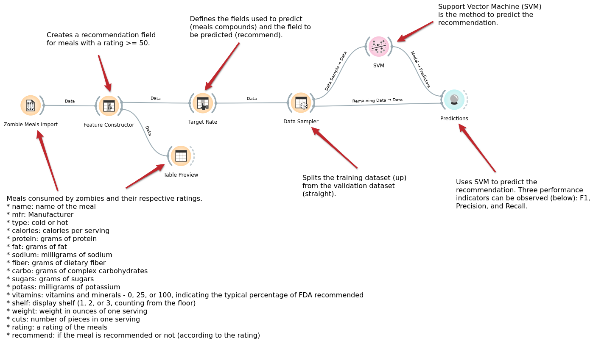

# Data Flow, Componentes e Regras de Associação
*Lab de Componentização e Reúso de Software 31/07/2021*

# Zombie Meals

Estude o exemplo construído Orange no diretório:
* [orange/](orange/)

Especificamente o arquivo `zombie-meals.ows` que carrega o arquivo `zombie-meals-recommend.csv` (pode ser necessário reconfigurar o caminho de entrada do arquivo no Orange).

O Zombie Meals é um arquivo que mostra uma lista de comidas prontas vendidas em supermercados para zumbis, sua composição e a média da nota dada pelos zumbis para a refeição (rating).

Esquema da tabela:
* name: name of the meal
* mfr: Manufacturer
* type: cold or hot
* calories: calories per serving
* protein: grams of protein
* fat: grams of fat
* sodium: milligrams of sodium
* fiber: grams of dietary fiber
* carbo: grams of complex carbohydrates
* sugars: grams of sugars
* potass: milligrams of potassium
* vitamins: vitamins and minerals - 0, 25, or 100, indicating the typical percentage of FDA recommended
* shelf: display shelf (1, 2, or 3, counting from the floor)
* weight: weight in ounces of one serving
* cuts: number of pieces in one serving
* rating: a rating of the meals

O workflow usa o recurso de `Feature Constructor` para criar uma coluna `recommended` que indica se o produto será recomendado (`Y`es ou `N`o). Produtos são recomendados se o seu rating for maior ou igual a 50. Foi usado o seguinte tipo de expressão no `Feature Constructor`:

~~~
"y" if rating >= 50 else "n"
~~~

Isso pode ser interpretado da seguinte maneira:
~~~
Se rating >= 50:
  assume “y”
Caso contrário
  assume “n”
~~~

Você pode montar a sua própria expressão substituindo os valores (“y” e “n”) e a expressão (`rating` >= 50).

# Tarefa 1 - Workflow para Recomendação de Zombie Meals

Faça modificações no workflow com o intuito de explorar diferentes possibilidades de customização de componentes e de substituição de componentes. As seguintes customizações são recomendadas:

* modificar o método de predição - atualmente é o Support Vector Machine (SVN)
  * experimente outros métodos disponíveis na aba Model, como Tree e Logistic Regression
  * analise o desempenho a partir dos valores de F1, Precision e Recall (valores maiores são melhores)
* mude o critério de recomendação mudando a expressão
* modifique as features que você vai analisar para recomendação (quanto menos melhor)

Esta tarefa será submetida na forma de um arquivo Orange mais uma captura da imagem (png) do workflow, conforme template: [/resources/templates/2021/lab01/](/resources/templates/2021/lab01/).

# Tarefa 2 - Projeto de Composição para Venda e Recomendação

Considere um cenário em que o workflow que você construiu na tarefa anterior está dentro de um componente, como ilustra a figura a seguir:

Considere o tema de Marketplace da disciplina. Elabore um diagrama compondo componentes que represente um fluxo a ser executado dentro deste marketplace. O fluxo representa o processo de aquisição de uma refeição virtualmente, que vai desde a escolha da refeição, a recomendação de outras refeições a partir de informações como:
* refeições que o cliente já comprou e a nota (rating) que ele atribuiu;
* refeições que todos os clientes compraram e notas atribuídas por eles.

Utilize o template disponível em [Lab01 - Diagramas de Referência](https://docs.google.com/presentation/d/1IhAWAsFgr6BzGNJaxioeBQJi8DySzrPVL1D8iMw7l9I/edit?usp=sharing) para elaborar o modelo.

Descreva textualmente como o processo se desenvolve entre os componentes e o que será transmitido de um componente para outro em cada interface.

Submeta a imagem (png) do seu modelo e o texto conforme template: [/resources/templates/2021/lab01/](/resources/templates/2021/lab01/).
