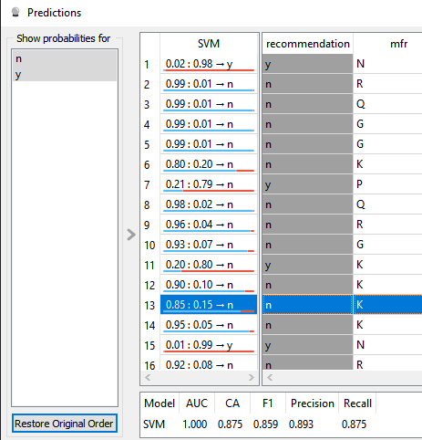
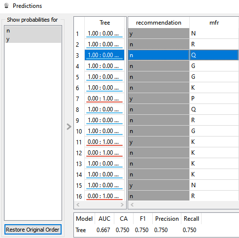
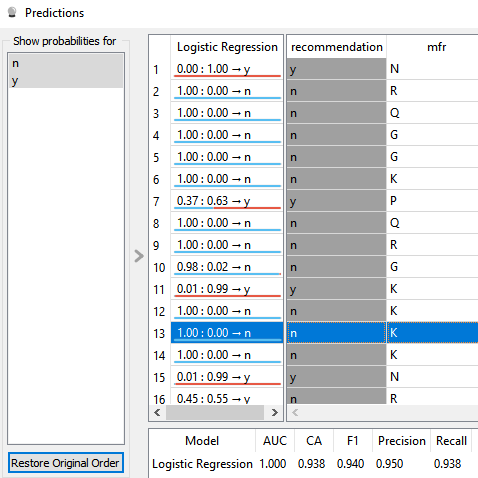
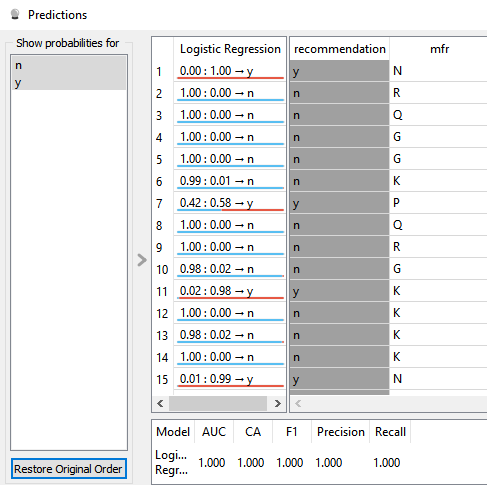
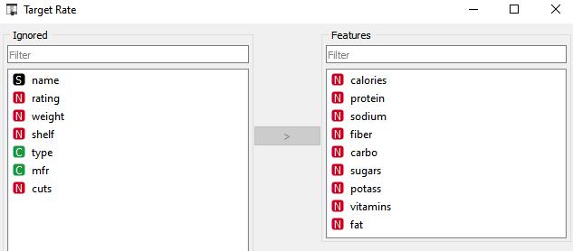
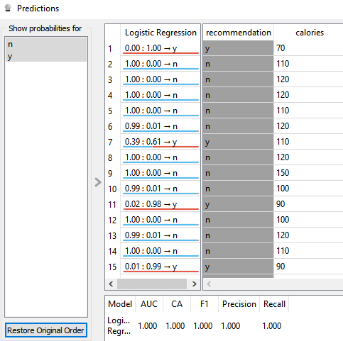
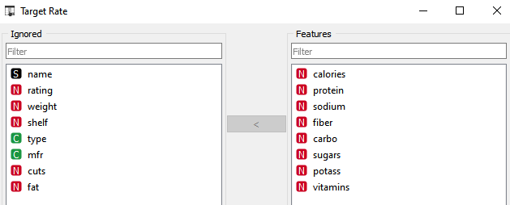
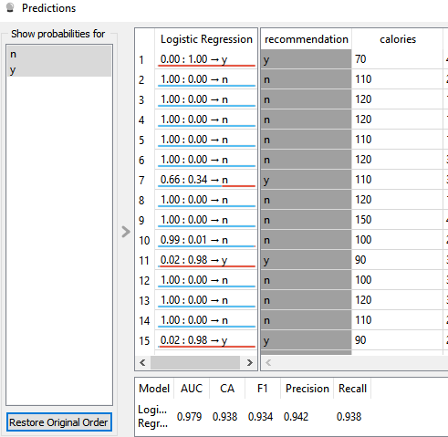
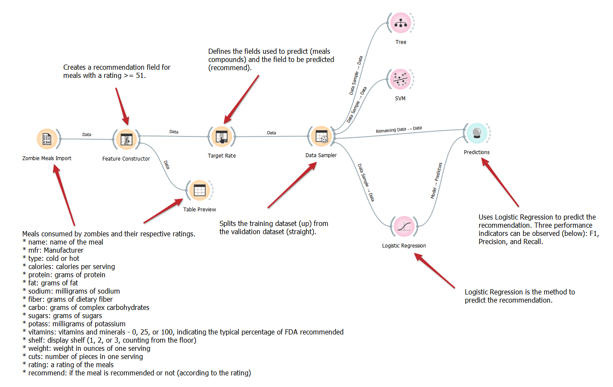

**Trabalho da disciplina Componentização e reuso de componentes**

Nome: André Luiz da Cruz Moreira (aluno avulso/extensão)
Professor: André Santanchè
Trabalho: labs/2021/01-dataflow/2021 
Tarefa: 1 - Workflow para Recomendação de Zombie Meals

**1)Modificando os métodos utilizados para fazer a predição obtemos diferentes resultados:**

A utilização do SVM como método de predição, como originalmente estabelecido no projeto leva aos resultados expostos na figura 1.

  

Figura 1 - Resultado da predição usando o método SVG

A utilização do método de predição denominado Tree, como sugerido, leva aos resultados expostos na figura 2.

  

 
Figura 2 - Resultado da predição usando o método Tree

A utilização do Logistic Regression como método de predição, como sugerido, leva aos resultados expostos na figura 3.

  

 
Figura 3 - Resultado da predição usando o método Logistic Regression

De acordo com a documentação do scikit learning: "All scorer objects follow the convention that higher return values are better than lower return values." 

Ou seja, quanto maiores os valores de F1, Precision e Recall, melhor é avaliado o resultado decorrente da aplicação do modelo.

Dessa forma, para os dados do experimento em questão, o método Logostic Regression se mostrou mais apropriado.

Referências:
Metrics and scoring: quantifying the quality of predictions (https://scikit-learn.org/stable/modules/model_evaluation.html):

**2) Mudanças na expressão e impactos na precisão**

Em função da maior precisão, adotamos a partir de agora, o método Linear Regression para as análises efetuadas.

Uma modificação extremamente simples na expressão usada como critério para que o a recomendação fosse positiva teve bastante impacto na precisão.

Mudando a expressão para o indicado abaixo, a precisão da predição aumenta significativamente, conforme mostrado na figura 4.

    "y" if rating >= 51 else "n"

  

 
Figura 4 - Mudança na precisão da predição Linear Regression mudando a expressão para "y" if rating >= 51 else "n" 

3) Seleção dos parâmetros utilizados na predição

Eliminando os parâmetros potencialmente pouco relevantes para a decisão de recomendação, conforme mostrado na figura 5, o resultado da recomendação não se modifica, conforme pode ser visto na figura 6.
Comparando com o resultado da figura 4, vê-se o mesmo resultado qualitativo, porém com uma breve melhora na margem positiva da predição do alimento 7.

  

 
Figura 5 - Remoção de parâmetros pouco significativos para a predição 

  

 
Figura 6 -  Resultado da predição após a remoção de parâmetros pouco significativos  

Removendo o parâmetro "fat" na predição, conforme mostrado na figura 7, faz com que alimento 7 passe a não mais ser recomendado, como pode ser visto na figura 8.

  

 
Figura 7 - Remoção de parâmetros pouco significativos para a predição 

  

 
Figura 8 -  Resultado da predição após a remoção do parâmetro "fat"  

A figura 9 mostra o diagrama da solução do Orange após as alterações solicitadas.

Para facilitar a experimentação com os diferentes tipos de predição e a comparação dos respectivos resultados, optou-se por deixar as duas opções testadas, ou seja, SVN e Tree no diagrama porém se conectar a próxima etapa do data flow, bastando remover a conexão do componente Logistic Regression com o componente Predictions e inserindo uma conexão entre este e o componente usando o modelo de predição desejado como alternativa.

  

 
Figura 9 -  Diagrama da solução proposta usando Logistic Regression e permitindo, mediante fácil edição a alteração do modelo a ser adotado

O arquivo ows pode ser encontrado em: [zombi-meals.ows](./orange/zombie-meals.ows)

