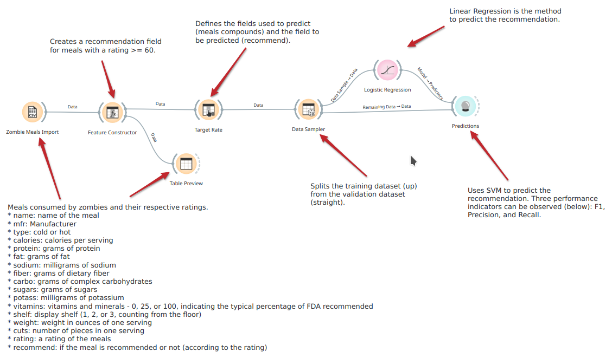
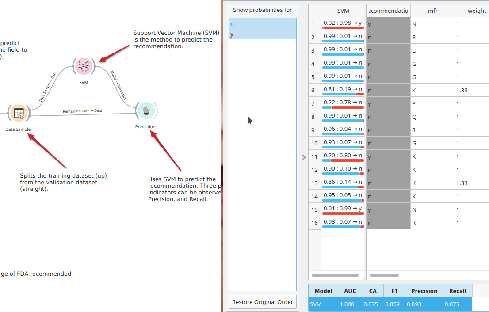
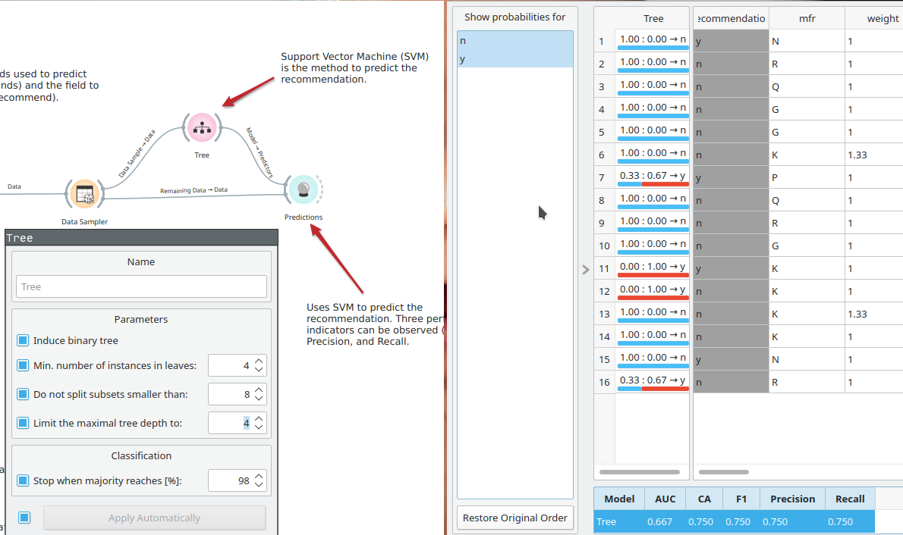
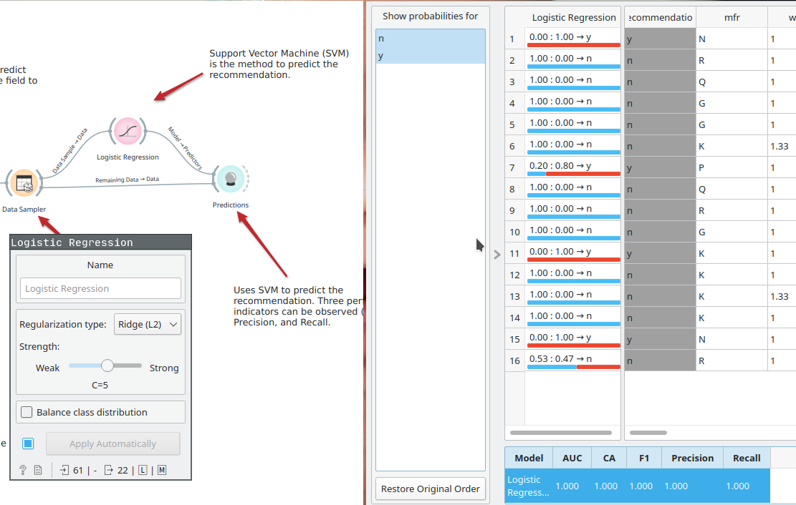
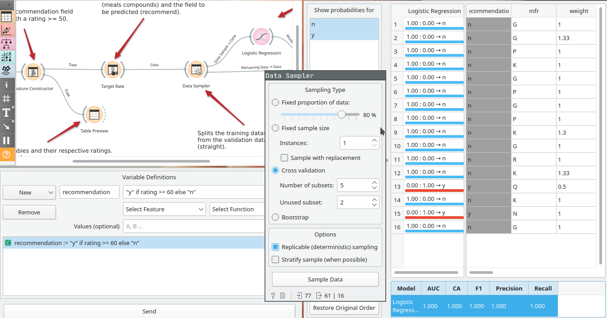
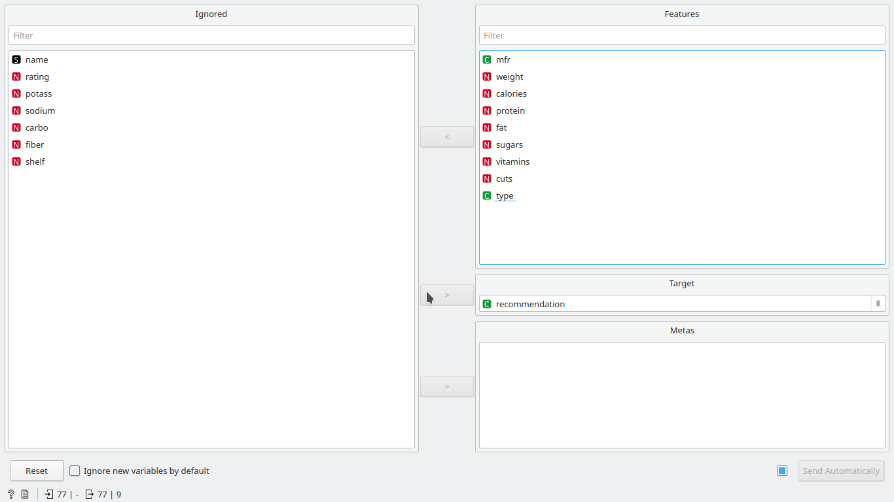
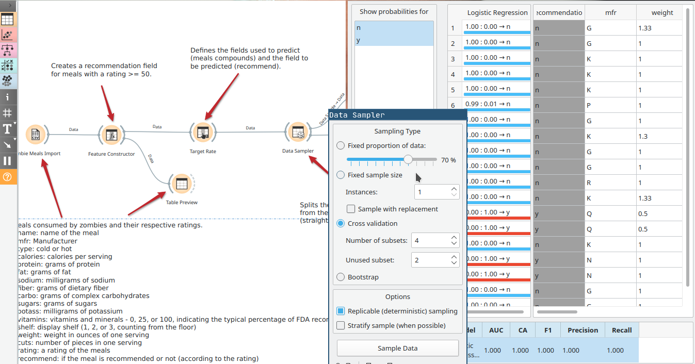

# Aluno

* `Carlos Nihelton (ex150295)`

# Tarefa 1 - Workflow para Recomendação de Zombie Meals

## Imagem do Projeto

Abaixo a representação final do projeto aberto no Orange.

## Arquivo do Projeto

O arquivo orange final depois das iterações demonstradas abaixo [pode ser abaixado neste link](orange/zombie-meals.ows)

## Histórico de Alterações

O workflow de recomendação original modelava as predições a partir de SVM, com um desempenho `F1=0.859`, `Precision=0.893` e `Recall=0.875`. Isso pode ser constatado na figura a
seguir (os indicadores de desempenho do modelo estão representados em destaque na parte inferior direita da imagem):

Ao substituir o componente SVM do modelo para um Tree, pode-se observar uma degradação no desempenho, isto é, os indicadores caem notavelmente (no máximo
atingindo 0.750 nos experimentos realizados), mesmo
com diferentes ajustes dos parâmetros do componente de predição. É o
cenário ilustrado na próxima imagem (novamente os indicadores estão apresentados em destaque na parte inferior direita da imagem):

Migrar para regressão logística trouxe uma melhora nos indicadores de desempenho, esta que ainda pôde ser maximizada ao ajustar o coeficiente de força para `C=5`,
mantendo-se o tipo de regularização em `Ridge(L2)`,
condição que resultou em `F1=Precision=Recall=1.000`. Este cenário está representado na imagem a seguir:

O elevado desempenho do modelo permitiu elevar o critério de recomendação, alterando a consideração do *rating* de 50 para 60 no *Feature Constructor*. Isso causou uma perda de desempenho que
acabou por ser recuperada ao se ajustar o *Data Sampler* para `número de subsets = 5`  e `subsets não utilizados = 2`. Com esse ajuste os indicadores voltaram
para o valor de `1.000`. A figura seguinte demonstra o momento em que os parâmetros do data sampler foram ajustados:

Por fim, o último refinamento realizado no modelo foi a redução das features utilizadas para a inferência, o que degradou ligeiramente o
desempenho do modelo, alteração compensada com novo ajuste no número de subsets do *Data Sampler* de 5 para 4. Com isso, novamente o modelo volta a desempenhar
com `F1=Precision=Recall=1.000`. As features removidas foram selecionadas tendo em mente o fato que o paladar de zumbis não aprecia fibras e sais minerais, mas
depende fortemente de proteínas e vitaminas para nutrir a matéria em decomposição que compõe os seus corpos. O resultado dessa remoção e posterior ajuste no
*Data Sample* estão representados nas próximas duas imagens, as últimas dessa seção.

# Tarefa 2 - Projeto de Composição para Venda e Recomendação

## Diagrama de Componentes

## Texto Explicativo
