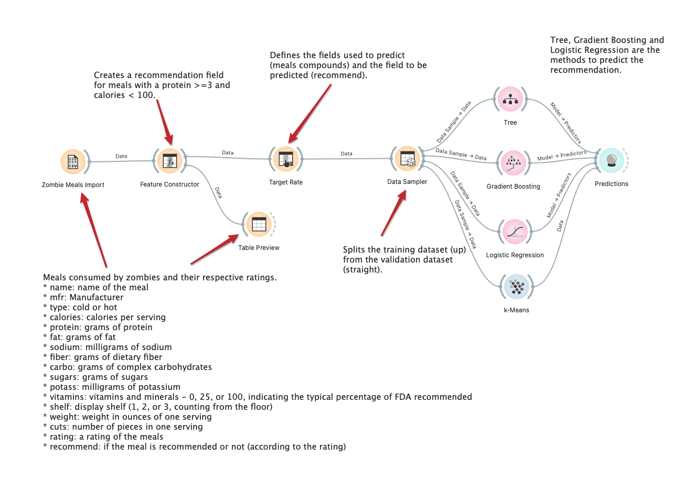
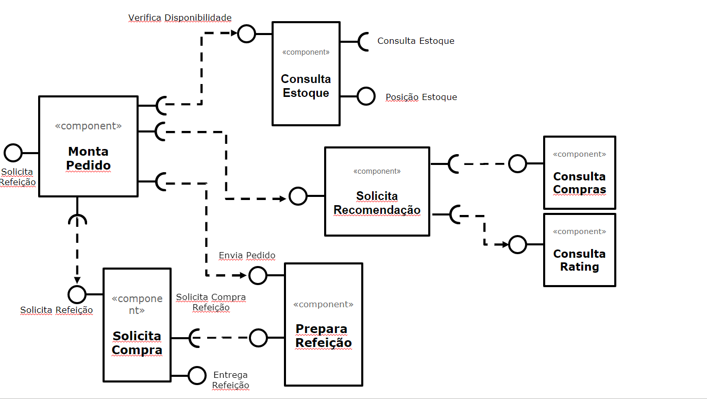

# Modelo para Apresentação do Lab01 - Data Flow

Estrutura de pastas:

~~~
├── README.md  <- arquivo apresentando a tarefa
│
├── images     <- arquivos de imagens usadas no documento
│
└── orange     <- arquivos do Orange
~~~

# Aluno
* Nome: Érmiston Luiz Reis Tavares 
* Matricula: ex150303

# Tarefa 1 - Workflow para Recomendação de Zombie Meals

## Imagem do Projeto

## Arquivo do Projeto
[Link do projeto do Orange](orange/zombie-meals.ows)

# Tarefa 2 - Projeto de Composição para Venda e Recomendação

## Diagrama de Componentes

## Texto Explicativo

1. Usuário entra no sistema.
2. O sistema verifica no estoque antes de mostrar os pratos disponíveis.
3. O sistema mostra os pratos disponíveis de acordo com as ultimas compras e avaliações.
4. O sistema envia o pedido do usuário.
5. O pedido é enviado para compra.
6. A compra é efetuada.
7. A refeição é entregue.