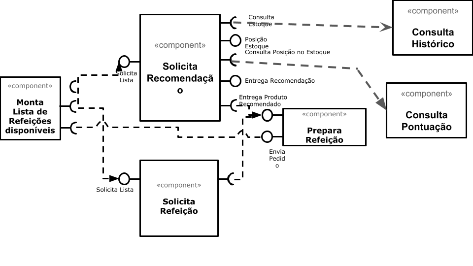

# Aluno

- Nome: Gabriel Rodrigues Modesto
- RA: 150365

# Tarefa 1 - Workflow para Recomendação de Zombie Meals

## Imagem do Projeto

## Arquivo do Projeto
[Link do projeto Orange](orange/zombie-meals.ows)

# Tarefa 2 - Projeto de Composição para Venda e Recomendação

## Diagrama de Componentes

## Texto Explicativo

1. Montagem do pedido é feita
2. Usuário pode escolher entre solicitar o pedido ou uma recomendação
3. Solicitando o pedido já é montado sua refeição
4. Solicitando a recomendação é visto o histórico e/ou a pontuação do prato
5. O histórico é visto para montar uma recomendação de acordo com preferências históricas do usuário
6. A pontuação é vista para montar uma recomendação de acordo com preferências dos demais