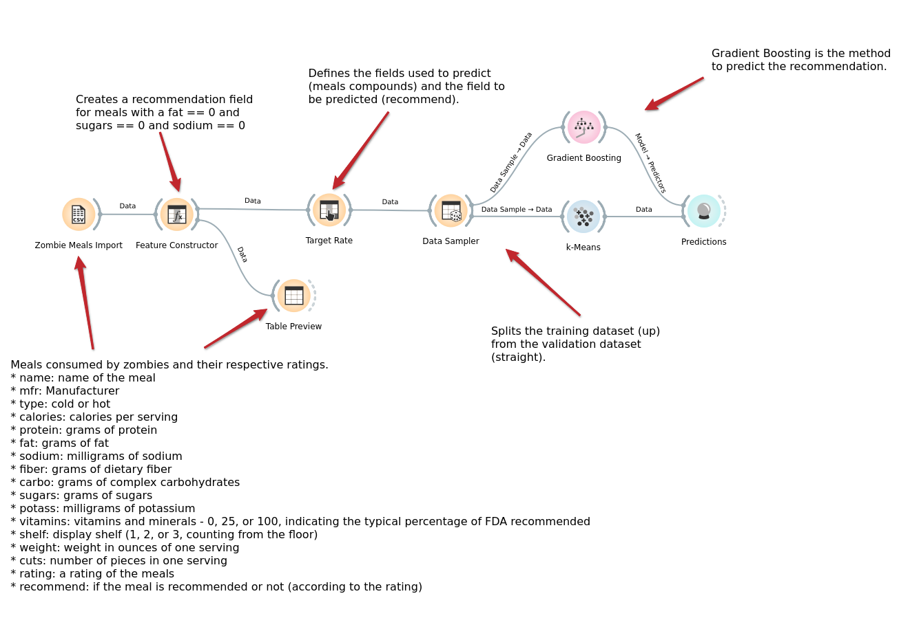
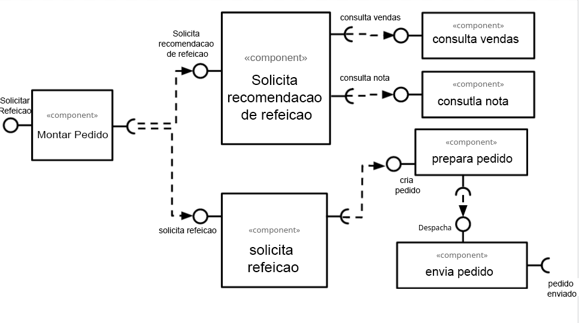

# Lab01 - Data Flow

Estrutura de pastas:

~~~
├── README.md  <- arquivo apresentando a tarefa
│
├── images     <- arquivos de imagens usadas no documento
│
└── orange     <- arquivos do Orange
~~~

# Aluno
* `Gustavo Henrique Souza Silva Doll`

# Tarefa 1 - Workflow para Recomendação de Zombie Meals

## Imagem do Projeto

## Arquivo do Projeto
[Link do projeto do Orange](orange/atividade1_GustavoDoll.ows)

# Tarefa 2 - Projeto de Composição para Venda e Recomendação

## Diagrama de Componentes

## Texto Explicativo

> 

O diagrama representar um fluxo de pedido de uma refeicao. Inicialmente temos o componente "Montar pedido" que fica responsavel por mandar uma recomendacao de refeicao para o modulo "Solicita recomendacao de refeicao", sendo o cliente responsavel por aceitar ou nao essa recomendacao.

Esse modulo de recomendacao utiliza um modelo de predicao que usa os proprios dados obtidos das vendas fornecidos pelo modulo "Consulta vendas" e suas respectivas notas pelo modulo "consulta nota".

Apos escolher a refeicao a mesma e enviada para o modulo "solicita refeicao" que ficara responsavel por efetuar o pagamento e criar o pedido apos a confirmacao do pagamento e envia-lo para o modulo "preparar pedido".

E por fim esse modulo tem como objetivo preparar o pedido e envia-lo para o modulo "envia pedido" para realizar o envio do pedido ao cliente.       