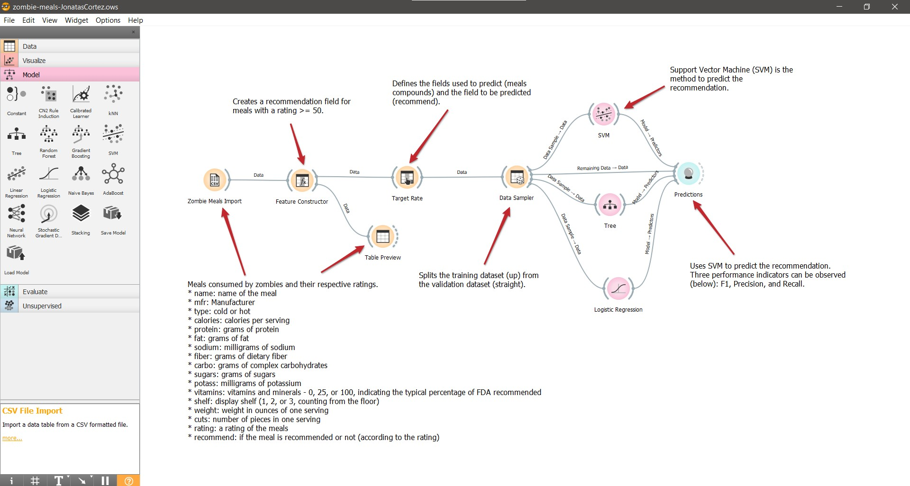
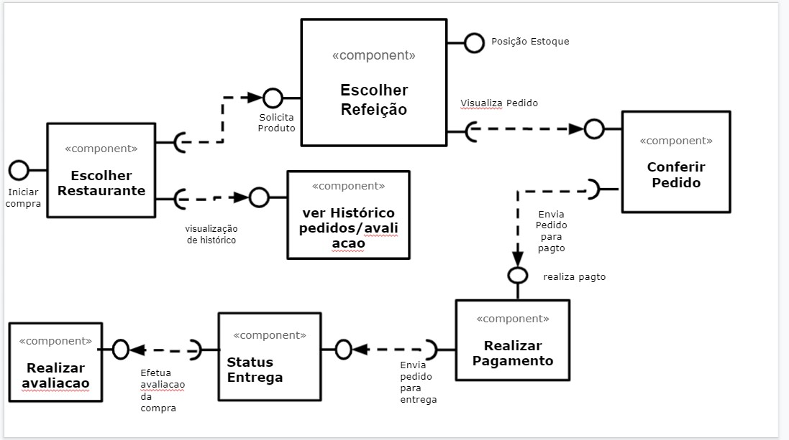

# Modelo para Apresentação do Lab01 - Data Flow

Estrutura de pastas:

~~~
├── README.md  <- arquivo apresentando a tarefa
│
├── images     <- arquivos de imagens usadas no documento
│
└── orange     <- arquivos do Orange
~~~

# Aluno
* `Jonatas Laureano da Silva Cortez`

# Tarefa 1 - Workflow para Recomendação de Zombie Meals

## Imagem do Projeto
> Coloque uma imagem da captura de tela com o projeto do Orange (veja exemplo abaixo).

## Arquivo do Projeto
> [/orange](orange/zombie-meals-JonatasCortez.ows).

# Tarefa 2 - Projeto de Composição para Venda e Recomendação

## Diagrama de Componentes

> Imagem (`PNG`) do diagrama de componentes (veja exemplo abaixo).

## Texto Explicativo

> Texto explicando diagrama, conforme especificação do laboratório.
> 
> O zumbi faz login na plataforma, seleciona o restaurante através do componente "Escolher Restaurante"  
> e o constructor Feature irá lhe apresentar de forma automática uma lista de restaurantes para que
> zumbi faça a sua escolha e também poderá conferir histórico de pedidos e avaliações através do componente "ver Histórico de pedido/Avaliação". 
> Após escolher o restaurante, o zumbi escolhe sua refeição através do componente "Selecionar Refeição"
> após escolher a refeição é direcionado automáticamente para o componente "Conferir Pedido" estando tudo certo, 
> é direcionado para componente "Realizar pagamento" após realizar o pagamento, zumbi pode acompanhar o seu pedido através do compenente 
> "Status Entrega" e depois que receber o seu pedido poderá realizar a avaliacao através do componente "Realizar Avaliacao"