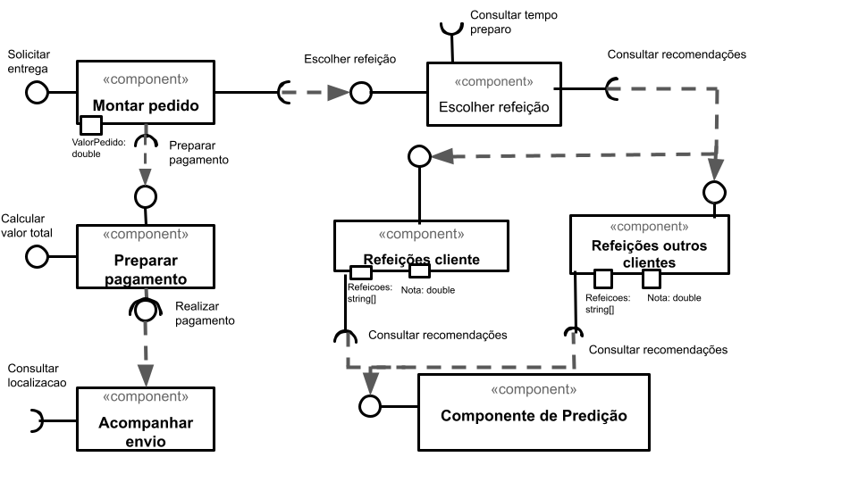

# Aluno
* `Leonardo Martins de Oliveira`

# Tarefa 1 - Workflow para Recomendação de Zombie Meals

## Imagem do Projeto
> 

## Arquivo do Projeto
> [Link arquivo Orange](orange/zombie-meals.ows).

# Tarefa 2 - Projeto de Composição para Venda e Recomendação

## Diagrama de Componentes

## Texto Explicativo

> O usuário acessa a tela para montar pedido. Essa tela consome o retorno do componente "Escolher Refeição". No momento de escolher refeição aparecem duas linhas, sendo uma responsável por mostrar as refeições do usuário (bem avaliadas) e a outra responsável por exibir refeições bem avaliadas de outros clientes.
> Ambos os componentes irão consumir os dados obtidos pelo "Componente de Predição". Para a filtragem no componente de predição é fornecido como filtros uma lista de refeiçoes e notas. 
> Ao finalizar o pedido o usuário é encaminhado para a tela de pagamento, que recebe como parametro para filtro o valor do pedido. O componente "Preparar pagamento" será o responsável por realizar o calculo total do pedido.
> Após o pagamento realizado, o cliente poderá ou não consultar a localização através do método "Consultar Localização", disponibilizado no componente "Acompanhar Envio"
