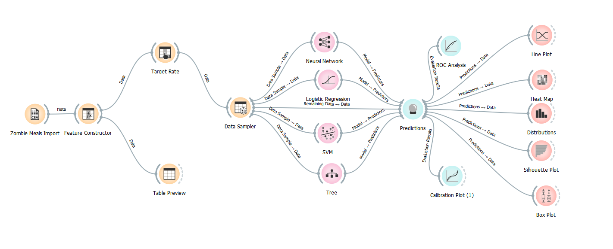
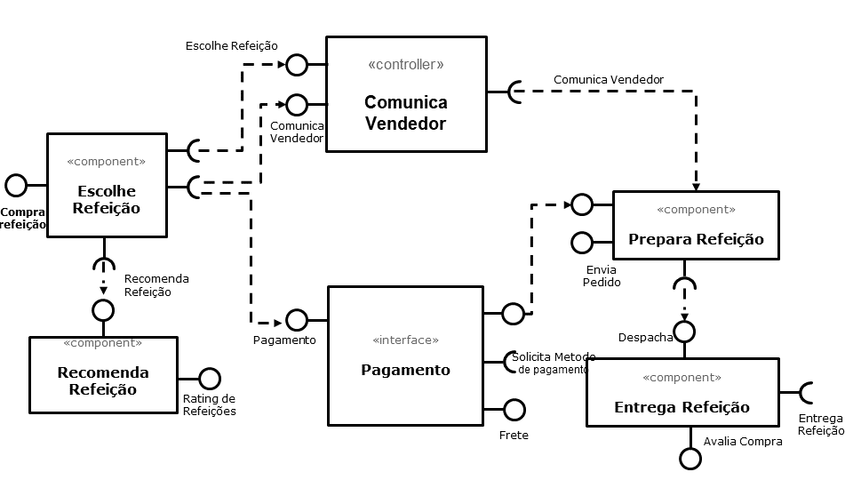

# Apresentação do Lab01 - Data Flow

Estrutura de pastas:

~~~
├── README.md  <- arquivo apresentando a tarefa
│
├── images     <- arquivos de imagens usadas no documento
│
└── orange     <- arquivos do Orange
~~~

# Aluno
* `Luis Guilherme Piovan Costa - EX150351`

# Tarefa 1 - Workflow para Recomendação de Zombie Meals

## Imagem do Projeto
> Imagem da captura de tela com o projeto do Orange.

## Arquivo do Projeto
> [Arquivo Orange Aluno Luis Piovan](zombie-meals-luis-piovan.ows)

# Tarefa 2 - Projeto de Composição para Venda e Recomendação

## Diagrama de Componentes

> Imagem (`PNG`) do diagrama de componentes.

## FLuxo do pedido de Refeição Market Place

1. Usuario entra no aplicativo;
2. Escolhe a refeição;
3. Aplicativo mostra avaliação dos pratos disponíveis; 
4. Aplicativo fornece uma sugestão baseado nas últimas compras;
5. Aplicativo comunica vendedor;
6. Aplicativo calcula o pedido com frete;
7. Aplicativo solicita método de pagamento;
8. Aplicativo envia pedido após pagamento;
9. Vendedor prepara refeição;
10. Vendedor envia preparo pronto para entrega
11. Vendedor envia o pedido para entrega;
12. Vendedor comunica aplicativo;
13. Entrega refeição;
14. Avalia compra.
