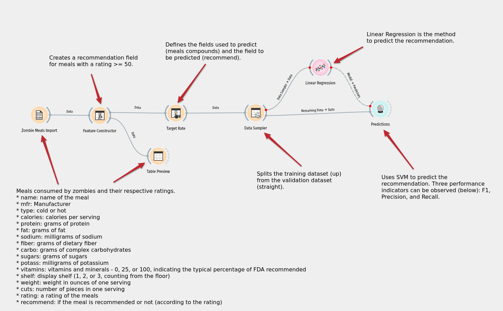
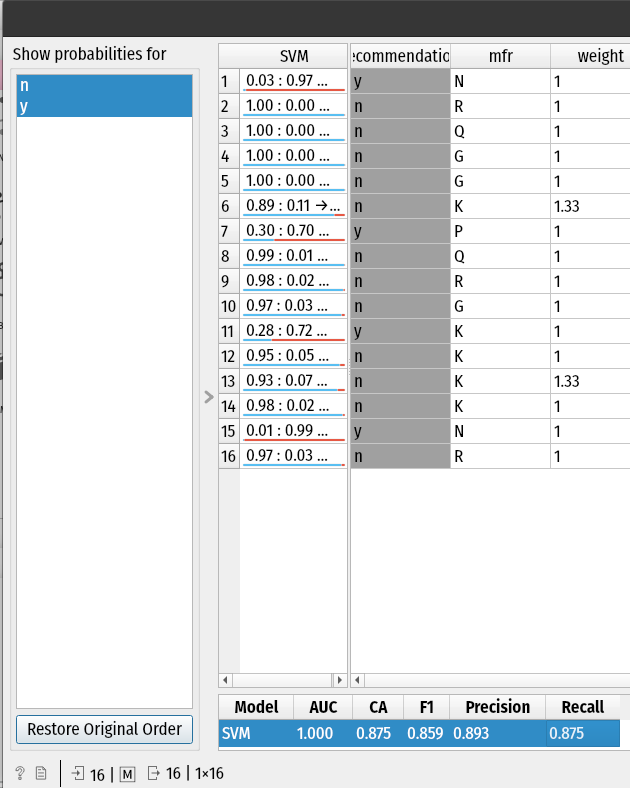
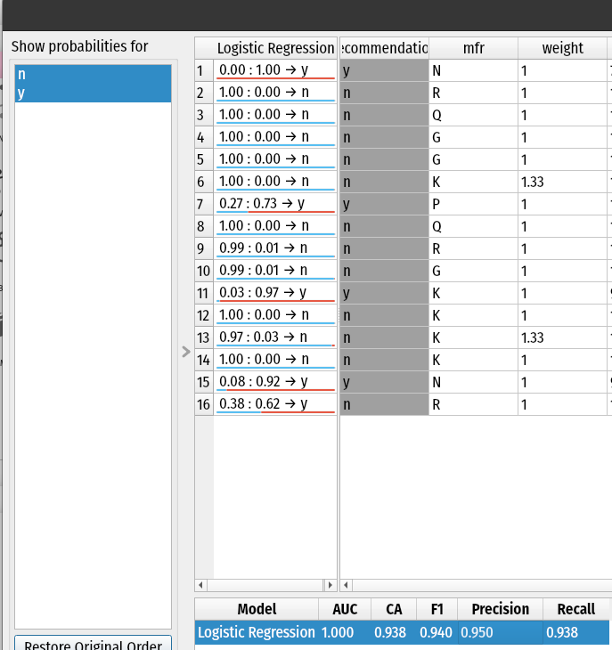
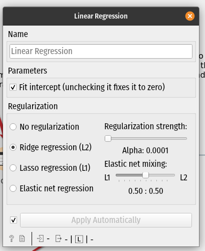
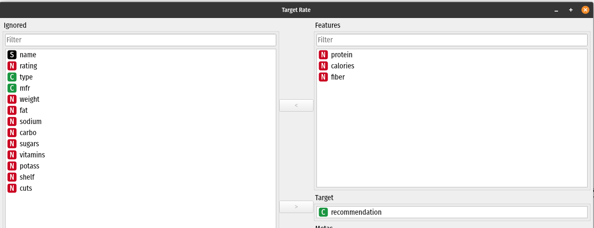
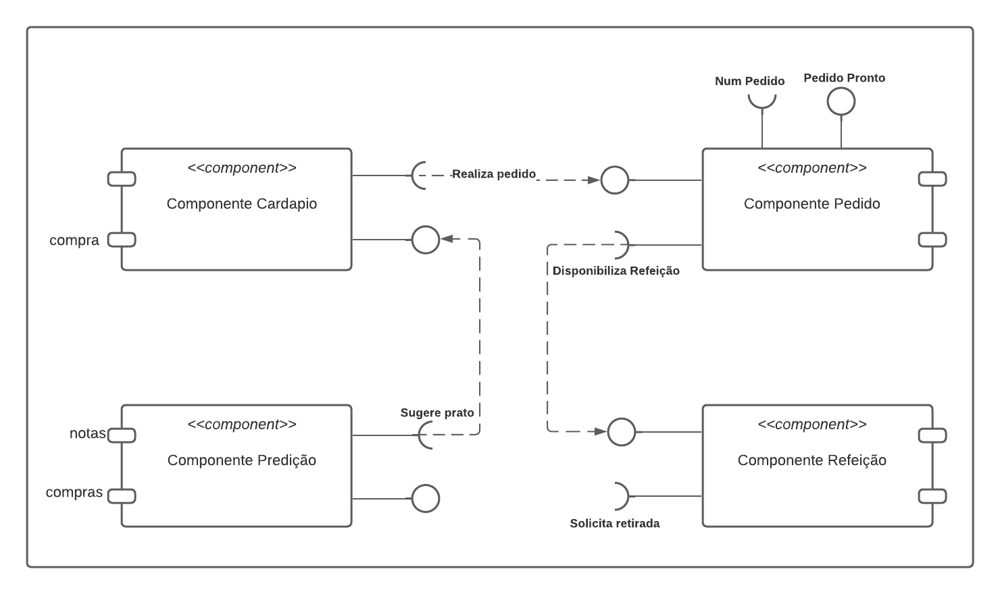

# Aluno
* `Paulo Sérgio do Nascimento RA: 150352`

# Tarefa 1 - Workflow para Recomendação de Zombie Meals

## Imagem do Projeto
> Novo projeto desenvolvido no app Orange

## Arquivo do Projeto
link do arquivo gerado pelo orange após as mudanças realizadas: [arquivo](https://github.com/paulobazooka/component2learn/blob/master/labs/2021/01-data-flow/solucoes/PauloSergioNascimento/zombie-meals.ows).

## Detalhamento da tarefa 1
Foi alterado do projeto inicial o novo model para teste de recomendação, foi escolhido a logistic regression. É possível observar que o valor de F1 teve uma melhora considerável como pode ser visto nas imagens abaixo:

***Figura 1.** Valor de F1 com SVM*

***Figura 2.** Valor de F1 com Linear Regression*

As cofigurações utilizadas foram:

***Figura 3.** Configuração*

As features utilizadas para predição foram:

***Figura 4.** Features*

---

# Tarefa 2 - Projeto de Composição para Venda e Recomendação

## Diagrama de Componentes

***Figura 5.** Diagrama de componentes*

## Texto Explicativo

O componente de predição realiza a busca de pratos que possivelmente o cliente irá solicitar com base em um dataset com informações obtidas de pedidos anteriores e suas notas, nesse caso, sugerindo um prato(s) que o consumidor poderá ter maior predilição. 

O componente de cardápio irá disponibilizar a lista de pratos para o consumidor e posteriormente irá solicitar um pedido com o prato selecionado.

O componente de pedido irá receber o prato solicitado.

O componente de refeição irá disponibilizar a refeição com o prato disponibilizado pelo componente pedido.