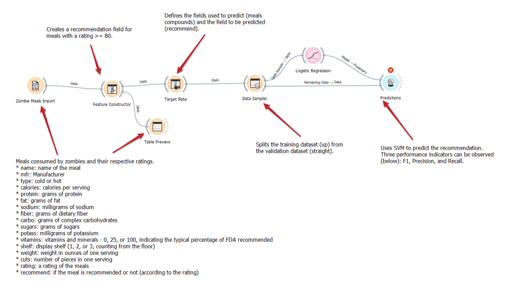
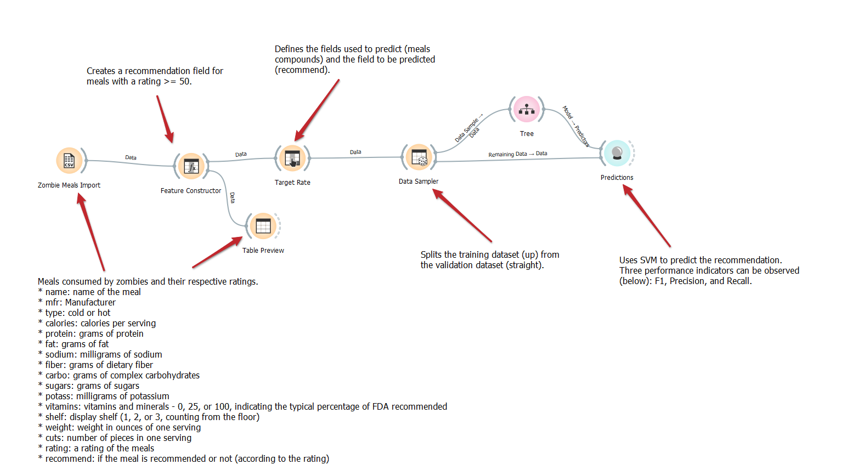

# Modelo para Apresentação do Lab01 - Data Flow

# Aluno
* `Vinicius Del Padre`

# Tarefa 1 - Workflow para Recomendação de Zombie Meals

## Imagem do Projeto
> Utilização do método preditivo Logistic Regression

> Utilização do método preditivo SVM 

> Utilização do método preditivo Tree 

## Arquivo do Projeto
> Coloque um link para o arquivo em Orange.

# Tarefa 2 - Projeto de Composição para Venda e Recomendação

## Diagrama de Componentes

> Imagem (`PNG`) do diagrama de componentes (veja exemplo abaixo).

## Texto Explicativo

> Texto explicando diagrama, conforme especificação do laboratório.
