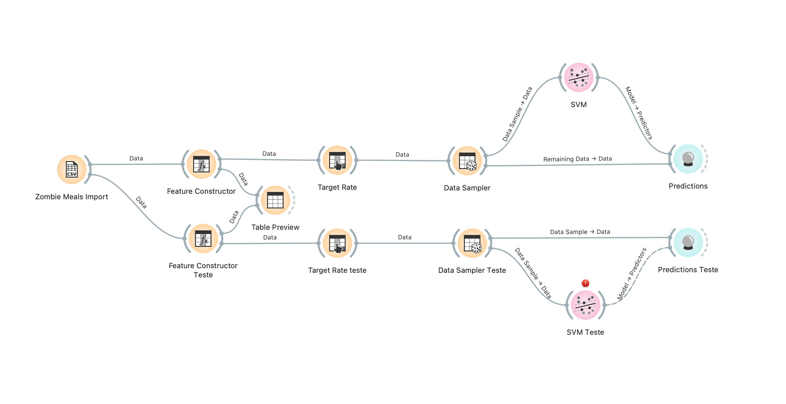
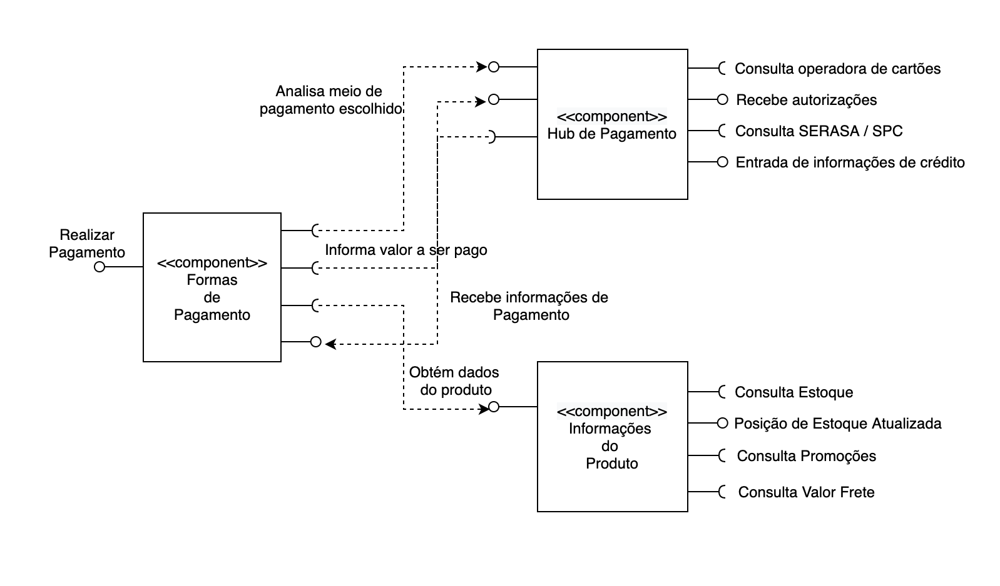

# INF331 - Componentização e Reuso de Software: Conceitos e Práticas (2021)

#Aluno              
 Marcelo da Cruz Salvador | ex25564

#Tarefa 1 - Workflow para Recomendação de Zombie Meals com fluxo Alternativo
  
  

#Tarefa 2 - Projeto de Componentes de Formas de Pagamento
   
  

### Componentes para Forma de Pagamento

 Os componentes aqui apresentados devem ter a função de apresentar possíveis formas de pagamentos na compra de produtos
 no marketplace.
 
 Ao realizar um pagamento, o fluxo do sistema irá acessar o hub de pagamentos e através deste componente, serão feitas
 as análises em instituições bancárias, administradoras de cartão de crédito e empresas responsáveis pela analise de crédito 
 para o caso de pagamentos parcelados.
 
 Também teremos um componente que irá responder pelas informações como valor de frete, disponibilidade de estoque, valores 
 de desconto e promoções.
 
 Com base nestas informações, deveremos ter condições para propor ao cliente opções de pagamento baseado nas analises feitas 
 através dos componentes.