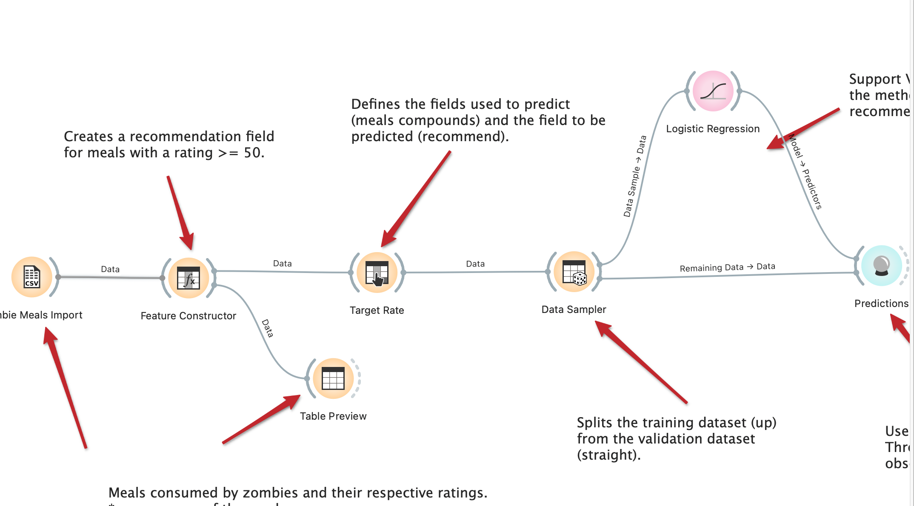

#Lab01 - Data Flow

Estrutura de pastas:

~~~
├── README.md  <- arquivo apresentando a tarefa
│
├── images     <- arquivos de imagens usadas no documento
│
└── orange     <- arquivos do Orange
~~~

# Aluno
* `Rodrigo Leonel Sartotato 37.964.956-1`

# Tarefa 1 - Workflow para Recomendação de Zombie Meals

## Imagem do Projeto
> Coloque uma imagem da captura de tela com o projeto do Orange (veja exemplo abaixo).

## Arquivo do Projeto
> Coloque um link para o arquivo em Orange.

# Tarefa 2 - Projeto de Composição para Venda e Recomendação

## Diagrama de Componentes

## Texto Explicativo

Tarefa 1:

Seguindo as recomendações da tarefa, foram feitas modificações tanto no método de predição quanto no critério de recomendação, buscando-se aumentar os valores de f1, precision e recall. Utilizou-se dois métodos de predição: Tree e logistic regretion. Os valores máximos foram obtidos para a configuração Ratinng >30 e utilizando a logistic regretion. Abaixo os valores obtidos:

Tree			
	         f1	     precision.   recall
Rating >60	0,907	     0,879        0,938
Rating >50	0,75	     0,75.        0,75
Rating >40	0,937	     0,944.       0,938
Rating >30	0,934	     0,924.       0,938
			
Logistic regretion			
	         f1	precision.       recall
Rating >60	0,907	0,879	        0,938
Rating >50	0,94	0,95	        0,938
Rating >40	0,812	0,817	        0,812
Rating >30	1	1	        1

