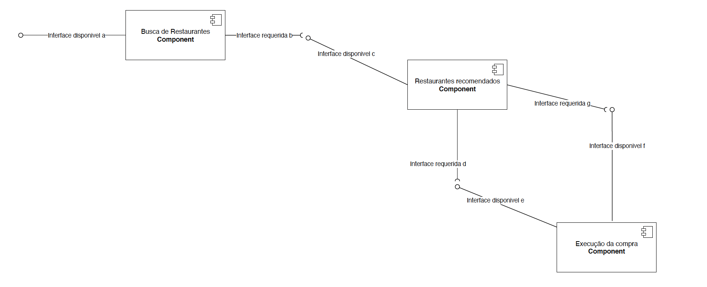

#Lab01 - Data Flow

Estrutura de pastas:

~~~
├── README.md  <- arquivo apresentando a tarefa
│
├── images     <- arquivos de imagens usadas no documento
│
└── orange     <- arquivos do Orange
~~~

# Aluno
* `Rodrigo Leonel Sartotato 37.964.956-1`

# Tarefa 1 - Workflow para Recomendação de Zombie Meals

## Imagem do Projeto

## Arquivo do Projeto

# Tarefa 2 - Projeto de Composição para Venda e Recomendação

## Diagrama de Componentes

## Texto Explicativo

## Tarefa 1:

Seguindo as recomendações da tarefa, foram feitas modificações tanto no método de predição quanto no critério de recomendação, buscando-se aumentar os valores de f1, precision e recall. Utilizou-se dois métodos de predição: Tree e logistic regretion. Os valores máximos foram obtidos para a configuração Ratinng >30 e utilizando a logistic regretion. Abaixo os valores obtidos:

|Tree|f1|precision|recall|
--------------------------
|Rating >60|0,907|0,879|0,938
|Rating >50|0,750|0,75|0,750
|Rating >40|0,937|0,944|0,938
|Rating >30|0,934|0,924|0,938
			
|logistic regretion|f1|precision|recall|
----------------------------------------			
Rating >60|0,907|0,879|0,938
Rating >50|0,94|0,95|0,938
Rating >40|0,812|0,817|0,812
Rating >30|1|1|1

## Tarefa 2:

Conforme enunciado, foi elaborado um fluxo representando a compra no marketplace de comida.
Há 3 componentes que executam as funções de busca de restaurantes, entrega de recomendações e execução da compra. No primeiro componente, há a interface disponível a, que recebe do usuário o tipo de comida que o mesmo quer. Com essa informação, através da interface requerida b, ele passa para o próximo componente a lista de restaurantes que possuem esse comida. O segundo componente é o componente que faz a recomendação dos restaurantes. Ele possui duas interfaces disponíveis. A interface c recebe a lista de restaurantes da interface b, e com base no algoritmo implementado, retorno as sugestões de restaurantes. Esse componente possui uma segunda interface requerida (g) que recebe os dados da compra de refeições, para realimentar a base de dados que faz a predição, através da interface disponível f.
Por fim, existe o terceiro componente, que executa a compra, através da interface disponível e, que recebe as informações dos restaurantes da interface requerida d. 

