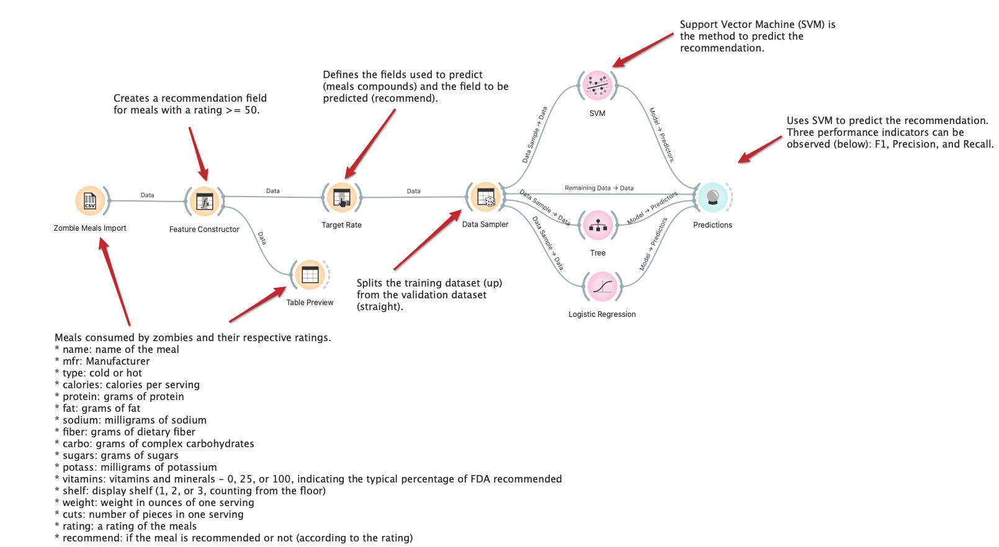
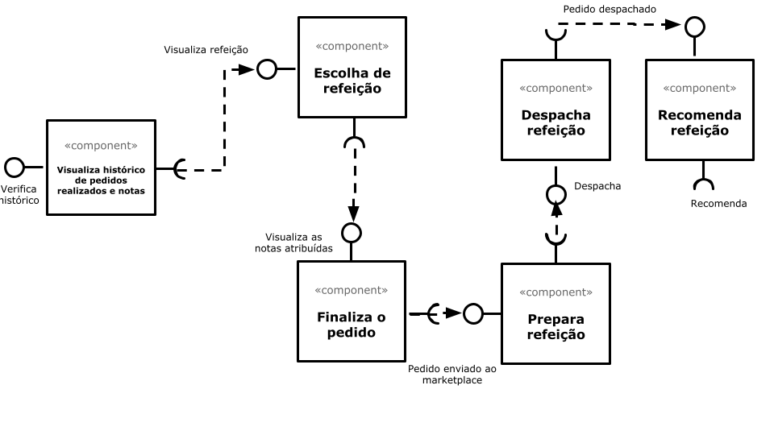

OrO# Modelo para Apresentação do Lab01 - Data Flow

Estrutura de pastas:

~~~
├── README.md  <- arquivo apresentando a tarefa
│
├── images     <- arquivos de imagens usadas no documento
│
└── orange     <- arquivos do Orange
~~~

# Aluno
* `Amanda Souza Macedo Bacelli`

# Tarefa 1 - Workflow para Recomendação de Zombie Meals

## Imagem do Projeto

## Arquivo do Projeto
> [/orange](orange/zombie-meals-amandabacelli.ows).

# Tarefa 2 - Projeto de Composição para Venda e Recomendação

## Diagrama de Componentes

## Texto Explicativo

> O usuário verifica o histórico de pedidos realizados e notas para escolher a refeição que ele mais gostou. O componente retorna a lista de refeições efeturadas pelo cliente. O cliente escolhe a refeição com base na melhor nota atribuida por ele. O componente retorna a refeição com todas as notas atribuídas pelos demais usuário para verificação do cliente. O cliente finaliza o pedido da refeição e retorna o pedido finalizado. O Marketplace recebe o pedido e prepara a refeição e retorna a refeição preparada para o despacho. O despacho é realizado e retorna um pedido despachado. O cliente recebe a refeição e a recomenda no marketplace.
