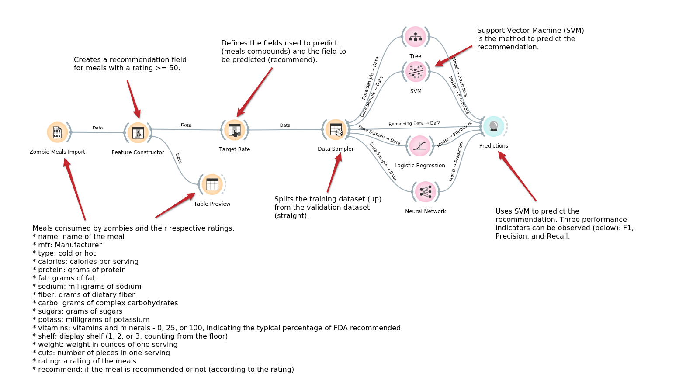
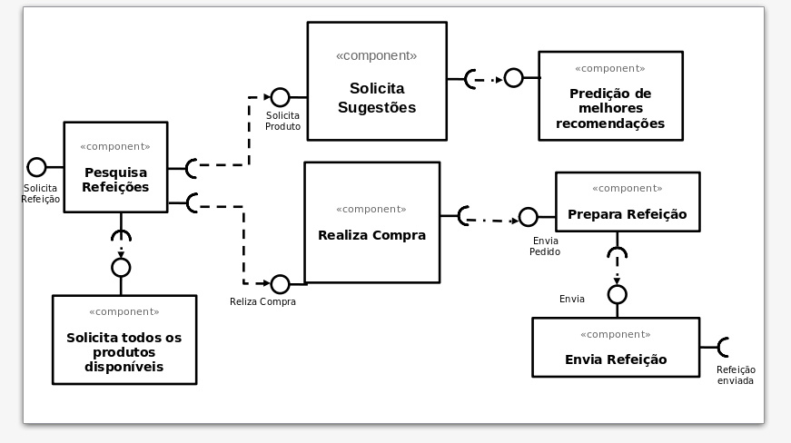

# Modelo para Apresentação do Lab01 - Data Flow

Estrutura de pastas:

~~~
├── README.md  <- arquivo apresentando a tarefa
│
├── images     <- arquivos de imagens usadas no documento
│
└── orange     <- arquivos do Orange
~~~

# Aluno
* `Bernardo Fonseca Andrade de Carvalho`

# Tarefa 1 - Workflow para Recomendação de Zombie Meals

## Imagem do Projeto
> Coloque uma imagem da captura de tela com o projeto do Orange (veja exemplo abaixo).

## Arquivo do Projeto
[Link do Arquivo](orange/zombie-meals.ows)

# Tarefa 2 - Projeto de Composição para Venda e Recomendação

## Diagrama de Componentes

> Imagem (`PNG`) do diagrama de componentes (veja exemplo abaixo).

## Texto Explicativo

> O componente pesquisa refeições é responsavel pela inicialização do fluxo, utilizando das interfaces expostas pelos componentesde solicitação de sugestões e de solicitação de listagem de todas as refeições disponiveis. O componente de sugestões utiliza a interface do componente de predição para trazer as melhores recomendações, enquanto o componente de listagem de produtos, traz todos os produtos disponiveis, caso o cliente não queira selecionar as sugestões. Após selecionar sua refeição, o cliente realiza a compra, o pedido é enviado para processamento, a refeição é preparada e então enviada para o cliente.
