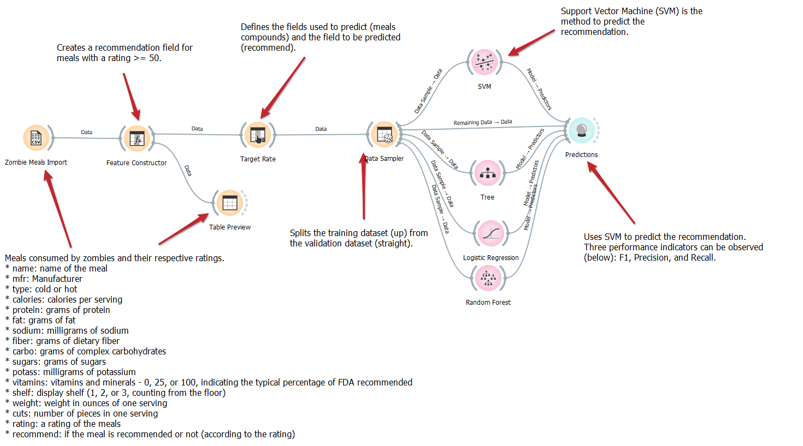
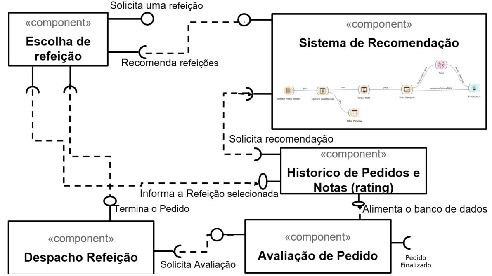

# Modelo para Apresentação do Lab01 - Data Flow

Estrutura de pastas:

~~~
├── README.md  <- arquivo apresentando a tarefa
│
├── images     <- arquivos de imagens usadas no documento
│
└── orange     <- arquivos do Orange
~~~

# Aluno
* `Byron Alejandro Acuña Acurio`

# Tarefa 1 - Workflow para Recomendação de Zombie Meals

## Imagem do Projeto
> Coloque uma imagem da captura de tela com o projeto do Orange (veja exemplo abaixo).

## Arquivo do Projeto
> [Link Orange](https://github.com/byronacunia/component2learn/tree/master/labs/2021/01-data-flow/solucoes/byronacunia/orange/zombie-meals.ows).

# Tarefa 2 - Projeto de Composição para Venda e Recomendação

## Diagrama de Componentes

> Imagem (`PNG`) do diagrama de componentes (veja exemplo abaixo).

## Texto Explicativo

> O usuário primeiro escolhe uma refeição mediante a entrada "Solicita uma refeição" no componente escolha de refeição nesse momento é transmitido para o componente "Historico de pedidos e notas (raing)" a informação da refreição selecionada, esse componente a sua vez passa as informações necesarias para o componente "Sistema de Recomendação", que a sua vez faz uma recomendação de refeições ou complementos para essas reifeições baseadas nos históricos de pedidos e notas. Finalmente quando o usuário termine o pedido, o componente de escolha de refeição passa o pedido para o componente de despacho refeição quem a sua vez solicita uma avaliação ao usuário que será feito no componente avaliação de pedido, quem finalmente alimenta o banco de dado para futuras previsões e recomendações de refeição.
