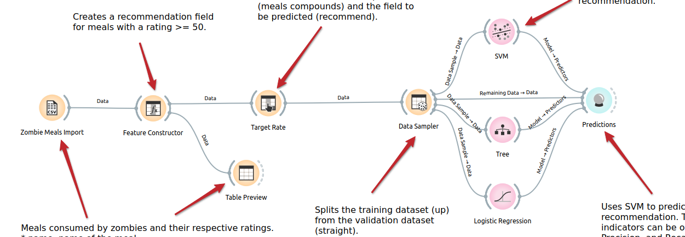

# Modelo para Apresentação do Lab01 - Data Flow

Estrutura de pastas:

~~~
├── README.md  <- arquivo apresentando a tarefa
│
├── images     <- arquivos de imagens usadas no documento
│
└── orange     <- arquivos do Orange
~~~

# Aluno
* `Carlos Eduardo Araujo dos Santos`

# Tarefa 1 - Workflow para Recomendação de Zombie Meals

## Imagem do Projeto
> Coloque uma imagem da captura de tela com o projeto do Orange (veja exemplo abaixo).

## Arquivo do Projeto
> [link para Arquivo](./orange/zombie-meals.ows)

# Tarefa 2 - Projeto de Composição para Venda e Recomendação

## Diagrama de Componentes

> Imagem (`PNG`) do diagrama de componentes (veja exemplo abaixo).

## Texto Explicativo

> Texto explicando diagrama, conforme especificação do laboratório.
