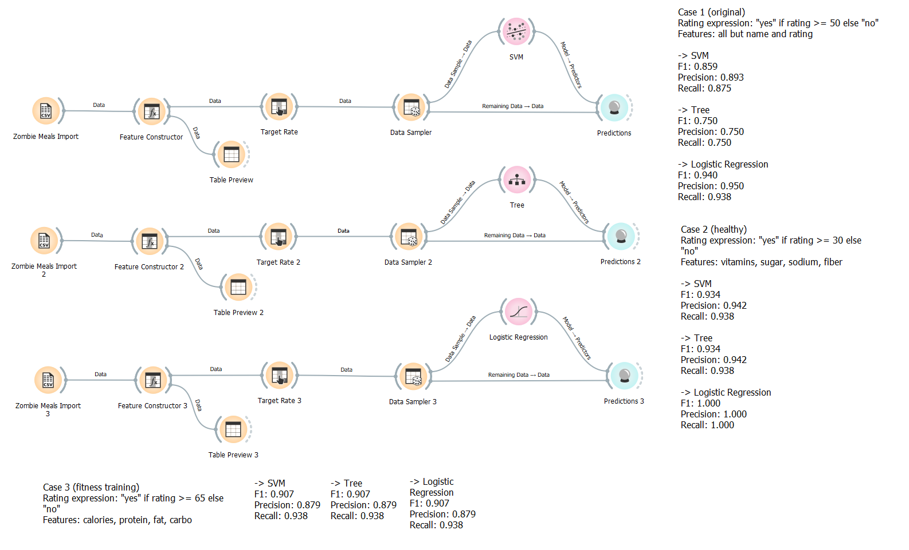
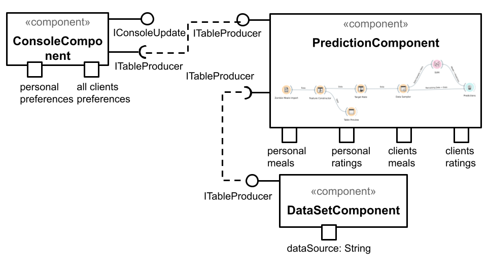

# Aluno
* `Carolina Gonçalves Mira`

# Tarefa 1 - Workflow para Recomendação de Zombie Meals

## Imagem do Projeto
> Imagem da captura de tela com o projeto no Orange.

## Arquivo do Projeto
> Link para o arquivo no Orange: [Arquivo Tarefa 1](https://github.com/carolinamira/component2learn/blob/master/labs/2021/01-data-flow/solucoes/carolinamira/orange/carolina-zombie-meals.ows).

# Tarefa 2 - Projeto de Composição para Venda e Recomendação

## Diagrama de Componentes

> Imagem (`PNG`) do diagrama de componentes.

## Texto Explicativo

> Texto explicando diagrama, conforme especificação do laboratório.

A plataforma Marketplace de alimentação para zumbis possui uma página inicial com a estrutura de cardápio e refeições oferecidas.\
Além disso, duas propriedades estão disponíveis para auxiliar quanto à recomendações: preferências pessoais (que foram registradas a partir 
de compras anteriores do cliente) e preferências gerais (conjunto de dados que considera todas as compras realizadas pelos clientes na plataforma). 
Desta forma, no momento da compra o cliente deve escolher uma das opções para receber sugestões personalizadas com base em seu histórico ou nas compras gerais do site.\
A partir desta propriedade setada através do ConsoleComponent (interface IConsoleUpdate), o cliente receberá o tipo de informação escolhida, tendo por receptora 
a interface requerida ITableProducer do ConsoleComponent. 
Esta interface recebe os dados transmitidos por meio da interface provida ITableProducer do PredictionComponent; este componente realiza os cálculos necessários com os critérios
estabelecidos para definir qual refeição seria uma melhor recomendação, considerando o cenário escolhido (pessoal ou geral).\
O PredictionComponent, por sua vez, tem como fonte o DataSetComponent com todos os dados registrados quanto às seguintes propriedades: refeições pessoais, recomendações pessoais, 
refeições dos clientes e recomendações dos clientes. O fornecimento destes dados é feito com uma interface provida (ITableProducer (DataSetComponent)) e uma interface requerida 
(ITableProducer (PredictionComponent)). 
Após o envio das recomendações, o cliente pode seguir ou não as sugestões apresentadas, e continuar com o fluxo padrão do processo de compra do Marketplace: seleção do pedido, 
inserção dos dados de pagamento, confirmação do pedido e recebimento.

