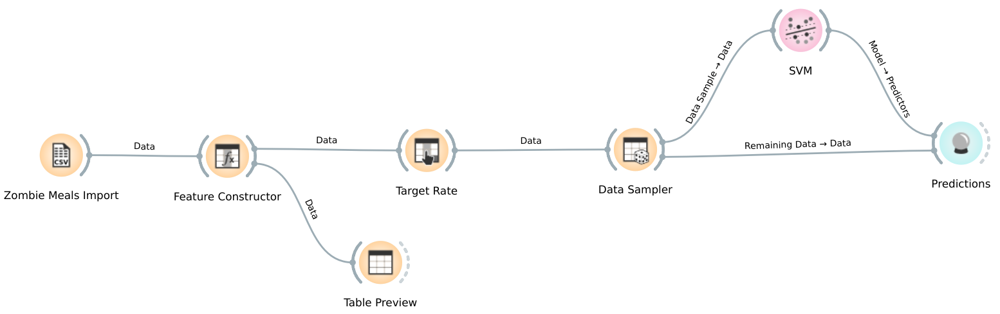
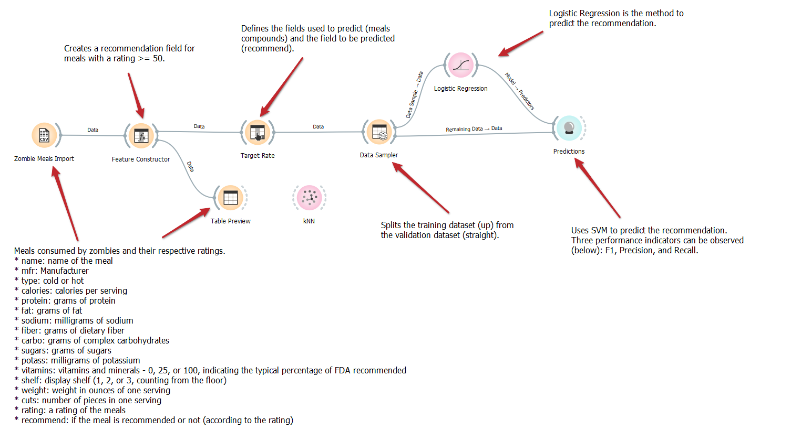
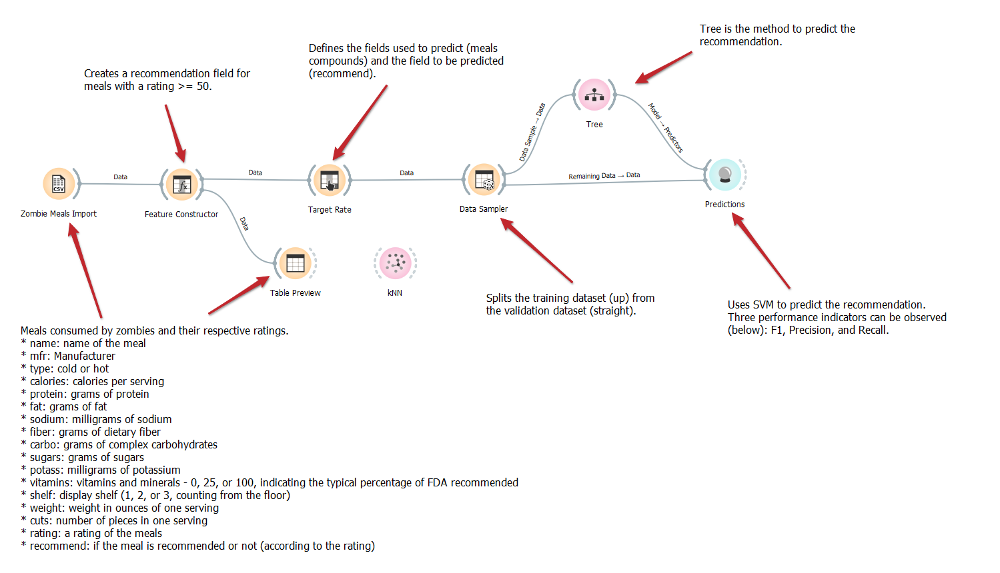
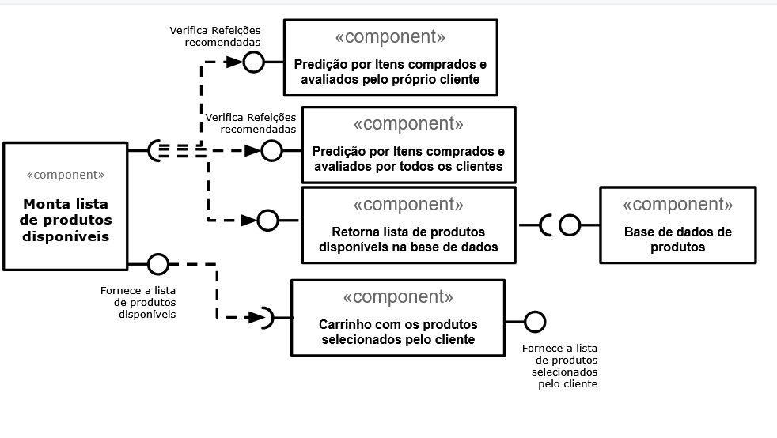

# Aluno
* `André Fagundes Carvalho - ex150375`

# Tarefa 1 - Workflow para Recomendação de Zombie Meals

## Imagem do Projeto
* Comparação do SVM com outros métodos de predição:
	- SVM: F1: 0.859 | Precision: 0.893 | Recall 0.875
	
	
	
	- Logistic Regression: F1: 0.940 | Precision: 0.950 | Recall 0.938
	
	
	
	- Tree: F1: 0.750 | Precision: 0.750 | Recall 0.750
	
	
	
	- KNN: F1: 0.767 | Precision: 0.850 | Recall 0.812
	
	
Comparando os métodos de predição testados, o Logistic Regression possui um melhor desempenho.
	
* Critério de recomendação alterado para a seguinte expressão: "y" if calories > 70 and protein > 2 else "n"

* Features para analise escolhidas foram "calories" e "protein"

## Arquivo do Projeto
Arquivo com o método de predição Logistic Regression e as alterações de critério de recomendação e features atualizado
> [/orange/tarefa1_zombie-meals.ows](orange/).

# Tarefa 2 - Projeto de Composição para Venda e Recomendação

## Diagrama de Componentes

## Texto Explicativo

O primeiro componente de iteração do cliente no marketplace é o componente que monta a lista de produtos disponíveis. Ele possui uma interface de que consome dados e uma interface que produz dados. Ao abrir a página que a lista de produtos, o componente consome dados de 3 componentes:
- Componente por Predição por Itens comprados e avaliados pelo próprio cliente. Esse componente gera dados de recomendação baseado em itens já comprados e avaliados pelo cliente.
- Componente por Predição por Itens comprados e avaliados por todos os clientes. Esse componente gera dados de recomendação baseado em itens já comprados e avaliados por todas os clientes na base do marketplace.
- Componente que retorna lista de produtos disponíveis no marketplace. Esse componente consome dados de um outro componente, que fornece os produtos disponíveis no marketplace.

A interface fornecida pelo componente gera uma lista de produtos disponíveis para o cliente. O componente "Carrinho com os produtos selecionados pelo cliente" consome esses dados e gera a lista dos produtos selecionados pelo cliente para a finalização da compra
