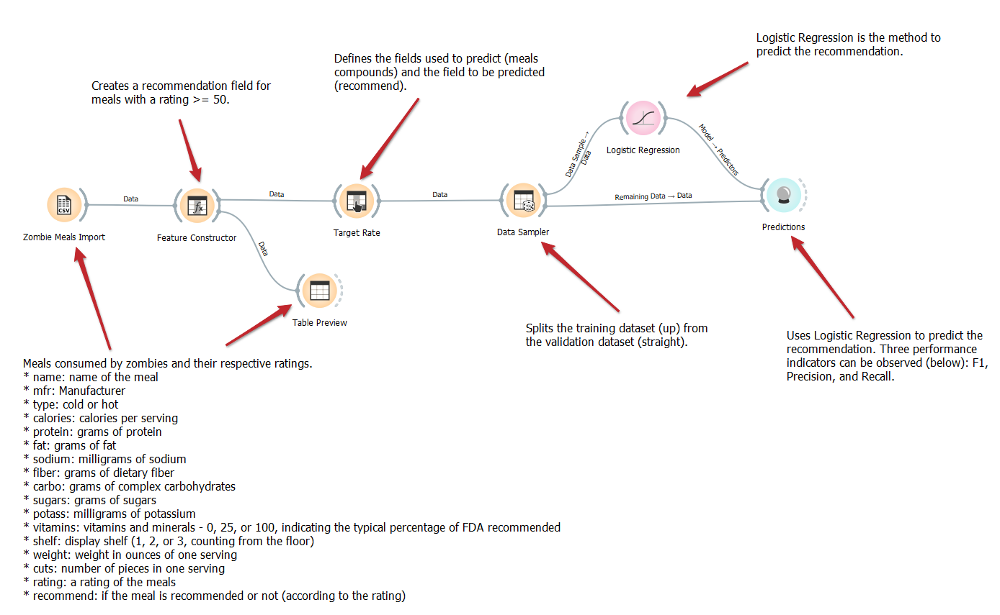

# Aluno
* Daniela Bouwman Codeceira

# Tarefa 1 - Workflow para Recomendação de Zombie Meals

## Imagem do Projeto

## Arquivo do Projeto
[Arquivo Orange](https://github.com/danibouw/component2learn/blob/master/labs/2021/01-data-flow/solucoes/danibouw/orange/zombie-meals-solucao.ows)

# Tarefa 2 - Projeto de Composição para Venda e Recomendação

## Diagrama de Componentes

> Imagem (`PNG`) do diagrama de componentes

## Texto Explicativo

> O componente de recomendação funciona a medida de o cliente faz compras no aplicativo de refeição e gera dados para o componente de predição, que por sua vez, através de critérios como notas e avaliações dos clientes, gera recomendações que são então enviadas para o aplicativo de refeições.
