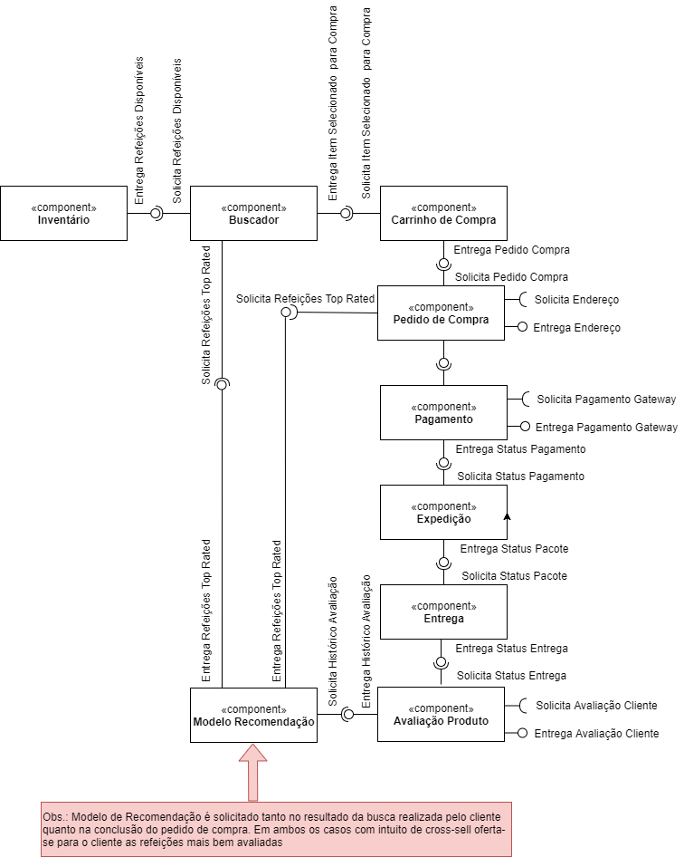

# Modelo para Apresentação do Lab01 - Data Flow

Estrutura de pastas:

~~~
├── README.md  <- arquivo apresentando a tarefa
│
├── images     <- arquivos de imagens usadas no documento
│
└── orange     <- arquivos do Orange
~~~

# Aluno
* `Felipe Starling Medeiros`

# Tarefa 1 - Workflow para Recomendação de Zombie Meals

## Imagem do Projeto
> Coloque uma imagem da captura de tela com o projeto do Orange (veja exemplo abaixo).

## Arquivo do Projeto
> Coloque um link para o arquivo em Orange.

# Tarefa 2 - Projeto de Composição para Venda e Recomendação

## Diagrama de Componentes

> Imagem (`PNG`) do diagrama de componentes (veja exemplo abaixo).

## Texto Explicativo

> Foram criados componentes para uma compra de uma refeição em um marketplace
 onde o cliente realiza a busca da refeição desejada, o inventário é checado
 para verificar disponibilidade e além disso o sistema sugere opções de refeições
 com Top Rated na plataforma baseada em pesquisas com usuários. Essas opções de 
 potencial cross-sell são ofertadas tanto no resultado da busca quanto no fechamento
 do pedido de compra

