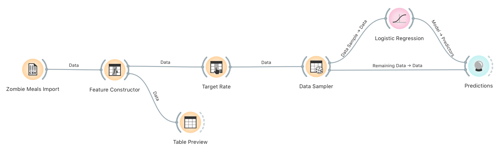
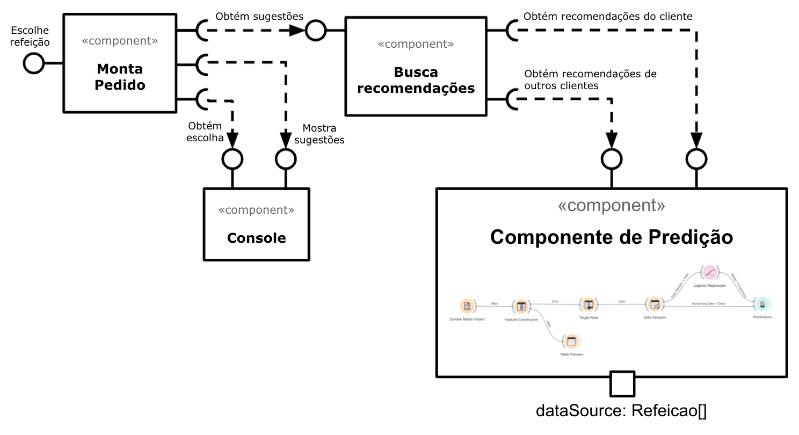

# Lab01 - Data Flow

# Aluno
* `Juliana Fernandes`

# Tarefa 1 - Workflow para Recomendação de Zombie Meals

## Imagem do Projeto

## Arquivo do Projeto
[Arquivo em orange/zombie-meals.ows](orange/zombie-meals.ows)

# Tarefa 2 - Projeto de Composição para Venda e Recomendação

## Diagrama de Componentes

## Texto Explicativo
> O componente Monta Pedido obtém as recomendações de refeição com o componente Busca Recomendações. Este utiliza o Componente de Predição para obter as recomendações de refeições avaliadas pelo próprio cliente e as recomendações de refeições avaliadas por outros clientes. O Componente de Predição define como recomendadas as refeições avaliadas com as melhores notas, sendo que, a nota de corte é definida dentro do próprio componente. Essas recomendações são devolvidas para o Monta Pedido, que as mostra para o usuário através do componente Console. Com o Console, o cliente conclui a escolha da sua refeição e essa informação é devolvida para o componente Monta Pedido.