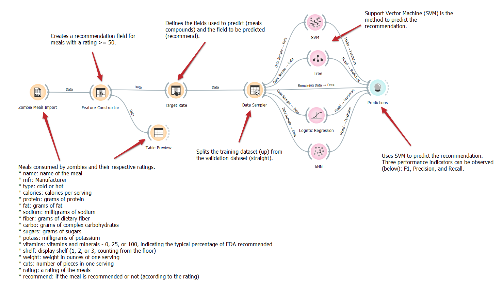
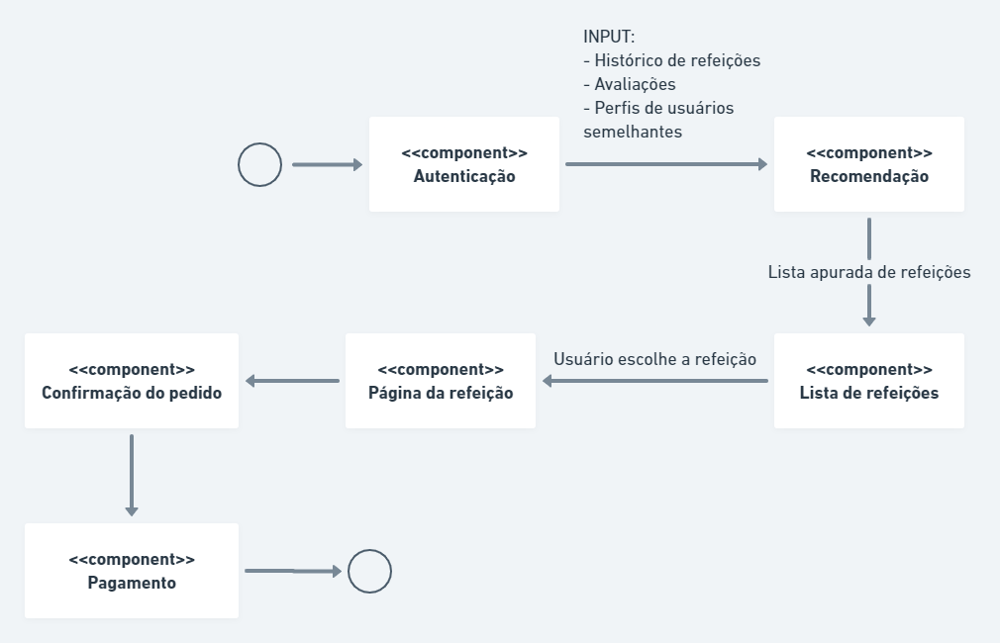

# Modelo para Apresentação do Lab01 - Data Flow

Estrutura de pastas:

~~~
├── README.md  <- arquivo apresentando a tarefa
│
├── images     <- arquivos de imagens usadas no documento
│
└── orange     <- arquivos do Orange
~~~

# Aluno
* Filipe Seidi Ishida Veronezi (EX150364)

# Tarefa 1 - Workflow para Recomendação de Zombie Meals

## Imagem do Projeto
> 

## Arquivo do Projeto
> [zombie-meals.ows](orange/zombie-meals.ows)

# Tarefa 2 - Projeto de Composição para Venda e Recomendação

## Diagrama de Componentes

> Imagem (`PNG`) do diagrama de componentes (veja exemplo abaixo).

## Texto Explicativo

1. Usuário efetua *login* através do componente de **Autenticação**;
2. A partir das informações do usuário, são estabelecidos alguns inputs para uma lista de recomendações, gerada pelo componente **Recomendação**. Caso o usuário seja novo, a lista poderá ser gerada com base nas refeições mais populares;
3. Um componente visual **Lista de refeições** fornece uma interface para escolha da refeição desejada;
4. Ao escolher a refeição, o usuário pode observar mais detalhes na **Página da refeição**;
5. O usuário pode confirmar os dados do pedido no componente visual **Confirmação do pedido**;
6. O usuário prossegue para o pagamento no componente **Pagamento**.
