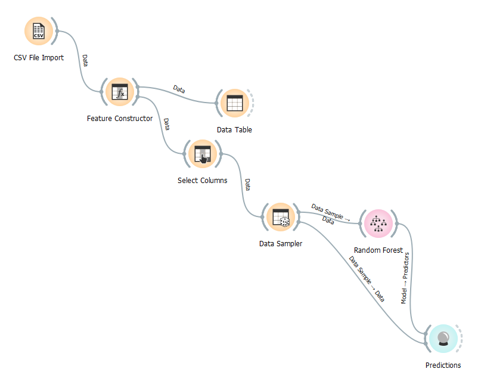
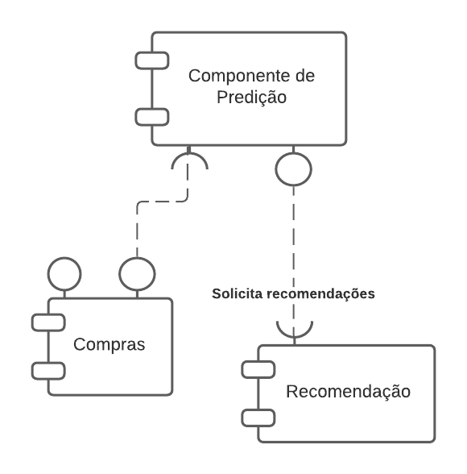

# Aluno
* `Matheus Raposo Frauches Vieira Sias`

# Tarefa 1 - Workflow para Recomendação de Zombie Meals

## Imagem do Projeto

## Arquivo do Projeto
[Orange File](orange/zombie-meals-recommendation.ows)

# Tarefa 2 - Projeto de Composição para Venda e Recomendação

## Diagrama de Componentes

## Texto Explicativo

> O mecanismo de funcionamento das recomendações baseia-se a partir da listagem de compras e suas avaliações pelos clientes, estas servem como base para o componente de predição preparar recomendações considerando determinados critérios para analisar os dados de compras.
