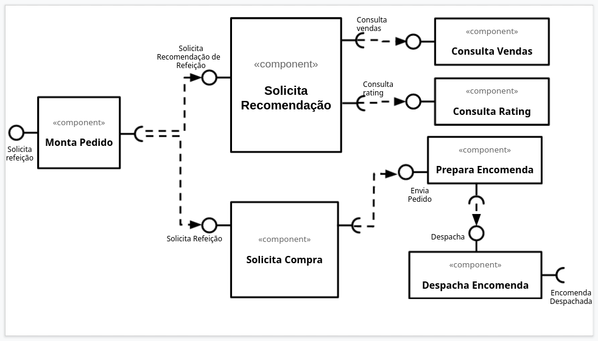

# Lab01 - Data Flow

Estrutura de pastas:

~~~
├── README.md  <- arquivo apresentando a tarefa
│
├── images     <- arquivos de imagens usadas no documento
│
└── orange     <- arquivos do Orange
~~~

# Aluno
* `Felipe Iada Tomitar Vilar`

# Tarefa 1 - Workflow para Recomendação de Zombie Meals

## Imagem do Projeto

## Arquivo do Projeto
[Link do projeto do Orange](orange/atividade1_ftomitar.ows)

# Tarefa 2 - Projeto de Composição para Venda e Recomendação

## Diagrama de Componentes

## Texto Explicativo

> 
O seguinte diagrama demostra o fluxo de pedidos de uma refeição. Inicialmente o componente "Monta Pedido" solicita uma recomendação de refeição para o módulo "Solicita Recomendação". O Cliente pode aceitar a recomendação ou escolher outra refeição disponibilizada pelo componente "Monta Pedido".

O módulo "Solicita Recomendação" utiliza um modelo de predição que usa os dados obtidos das vendas realizadas pelo próprio cliente e dos demais clientes, fornecidos pelo módulo "Consultar Vendas" e as notas atribuidas as compras relizadas, disponibilizadas pelo módulo "Consulta Rating".
	
Escolhida a refeição, a refeição é enviada para o módulo "Solicita compra", que será responsável pelos meios de pagamento. Com o pedido pago, o módulo solicita o envio do pedido para o módilo "Prepara encomenda".

Por sua vez, "Prepara Encomenda" despacha o pedido para o módulo "Despacha Encomenda", que realiza o envio do pedido.
