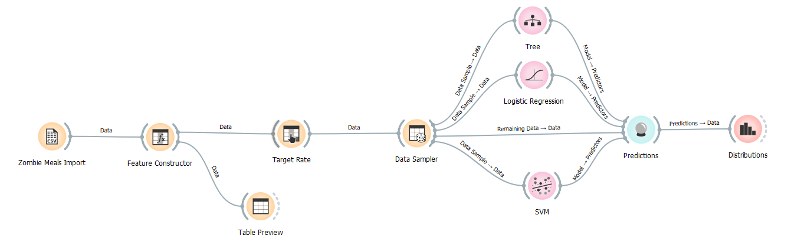
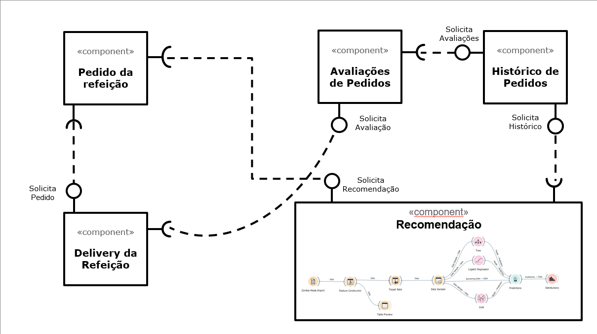

# Data Flow, Componentes e Regras de Associação
*Lab de Componentização e Reúso de Software 31/07/2021*

# Aluno
* `<Gustavo Gini>`

# Tarefa 1 - Workflow para Recomendação de Zombie Meals

## Imagem do Projeto

## Arquivo do Projeto
> Coloque um link para o arquivo em Orange.

# Tarefa 2 - Projeto de Composição para Venda e Recomendação

## Diagrama de Componentes

## Texto Explicativo

> No momento em que o cliente realiza a busca de uma refeição via componente "Pedido de Compra", o mesmo solicita recomendações ao componentes de Recomendações que necessita de informações do histórico de pedidos e recomendações do cliente.

