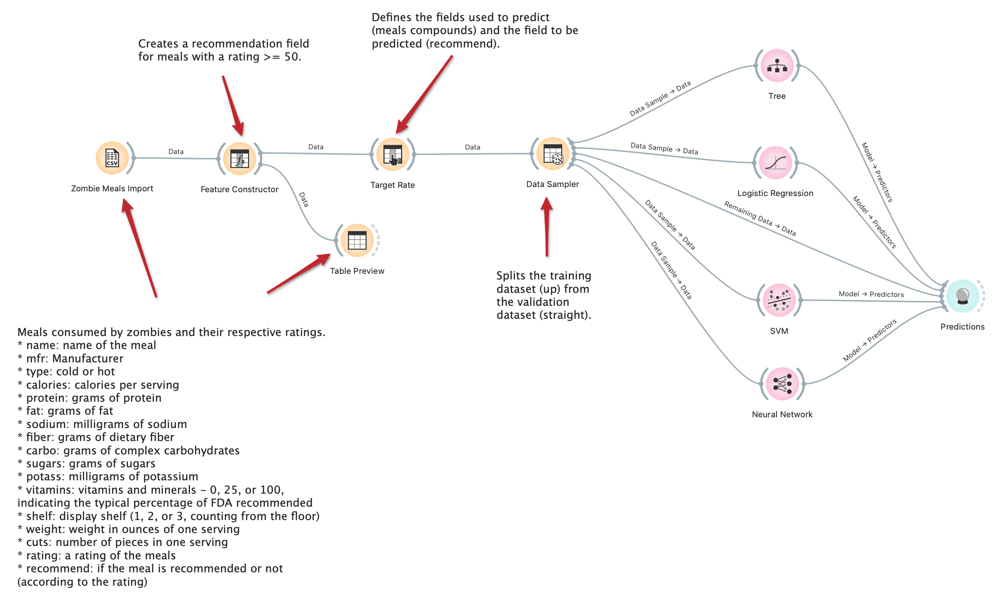
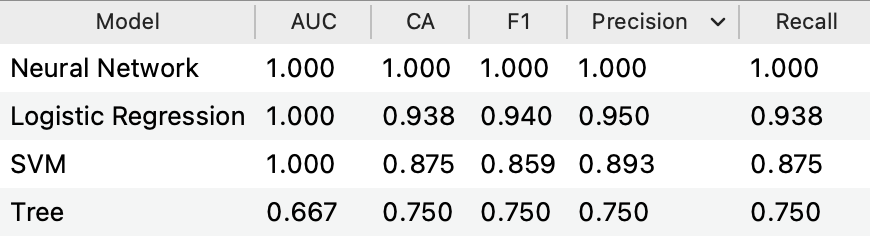
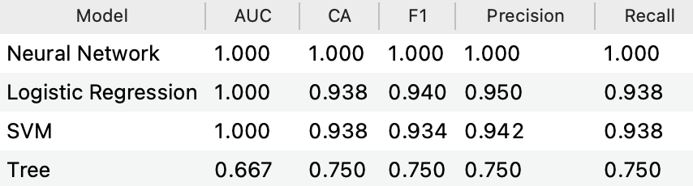
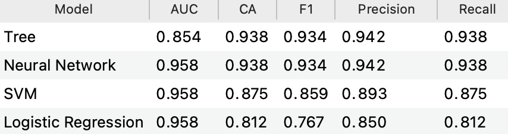

# Modelo para Apresentação do Lab01 - Data Flow

Estrutura de pastas:

~~~
├── README.md  <- arquivo apresentando a tarefa
│
├── images     <- arquivos de imagens usadas no documento
│
└── orange     <- arquivos do Orange
~~~

# Aluno
* `Hélio De Rosa Junior`

# Tarefa 1 - Workflow para Recomendação de Zombie Meals

## Imagem do Projeto

## Resultados

### Campos excluídos: "name" e "rating".

  

### Campos excluídos: "name", "rating" e "shelf".

  

### Campos excluídos: "name", "rating", "calories", "sodium" e "fat".

  

### Campos excluídos: "name", "rating", "calories", "sodium", "fat", "sugars"e "carbo".

  

## Análise
Foram realizadas diversas tentativas de predição utilizando features diferentes para determinar os resultados.

Pôde-se observar que alguns campos possuem impacto direto na eficácia dos resultados, dentre eles: calories, sugars, fat e carbo.

De maneira oposta, alguns campos não impactaram os resultados da análise, por exemplo: cuts, potass e weight.

Foram aplicadas diversas técnicas de análise, e dentre elas a que teve melhores resultados foi a de redes neurais.

Destaca-se também os valores obtidos através da regressão logística. Os resultados oscilaram significativamente de acordo com a seleção das features.

## Arquivo do Projeto
[Arquivo Orange](orange/zombie-meals-heliorosajr.ows)

# Tarefa 2 - Projeto de Composição para Venda e Recomendação

## Diagrama de Componentes

## Texto Explicativo
> TEXT TO BE REPLACED