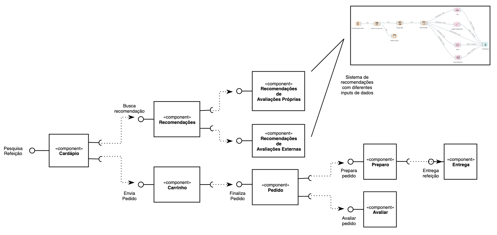

# Modelo para Apresentação do Lab01 - Data Flow

Estrutura de pastas:

~~~
├── README.md  <- arquivo apresentando a tarefa
│
├── images     <- arquivos de imagens usadas no documento
│
└── orange     <- arquivos do Orange
~~~

# Aluno
* `Hélio De Rosa Junior`

# Tarefa 1 - Workflow para Recomendação de Zombie Meals

## Imagem do Projeto

## Resultados

### Campos excluídos: "name" e "rating".

  

### Campos excluídos: "name", "rating" e "shelf".

  

### Campos excluídos: "name", "rating", "calories", "sodium" e "fat".

  

### Campos excluídos: "name", "rating", "calories", "sodium", "fat", "sugars"e "carbo".

  

## Análise
Foram realizadas diversas tentativas de predição utilizando features diferentes para determinar os resultados.

Pôde-se observar que alguns campos possuem impacto direto na eficácia dos resultados, dentre eles: calories, sugars, fat e carbo.

De maneira oposta, alguns campos não impactaram os resultados da análise, por exemplo: cuts, potass e weight.

Foram aplicadas diversas técnicas de análise, e dentre elas a que teve melhores resultados foi a de redes neurais.

Destaca-se também os valores obtidos através da regressão logística. Os resultados oscilaram significativamente de acordo com a seleção das features.

## Arquivo do Projeto
[Arquivo Orange](orange/zombie-meals-heliorosajr.ows)

# Tarefa 2 - Projeto de Composição para Venda e Recomendação

## Diagrama de Componentes

## Texto Explicativo
O diagrama apresentado acima apresenta o fluxo de pedido de uma refeição.

O zumbi acessa a plataforma e realiza uama busca para obter as refeições disponíveis no cardápio.

O componente de cardápio pode interagir com o componente de recomendações e o componente de carrinho, ambos descritos a seguir.

O componente de recomendações interage com dois componentes de predição, que são responsáveis por criar modelos preditivos, que tem como objetivo sugerir refeições para os zumbis de acordo com avaliações do próprio zumbi e também de outros usuários que realizaram outras avaliações.

Por sua vez, o componente de carrinho é responsável por armazenar os itens que foram pedidos pelo usuário até o momento de efetivação do pedido.

O carrinho interage com o componente de pedido, que é responsável por concretizar o pedido do usuário. Após essa etapa o fluxo pode se dividir em duas vertentes. A primeira delas é destinada ao preparo e entrega do pedido do usuário, enquanto que a segunda se refere à avaliação de pedidos.