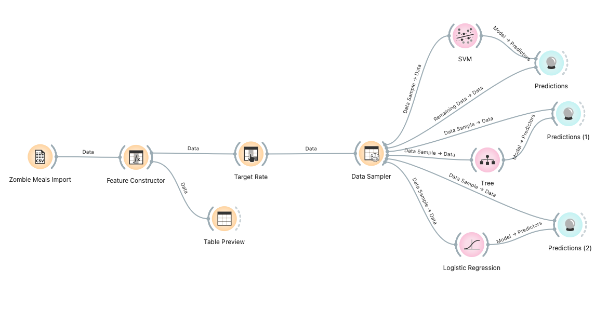
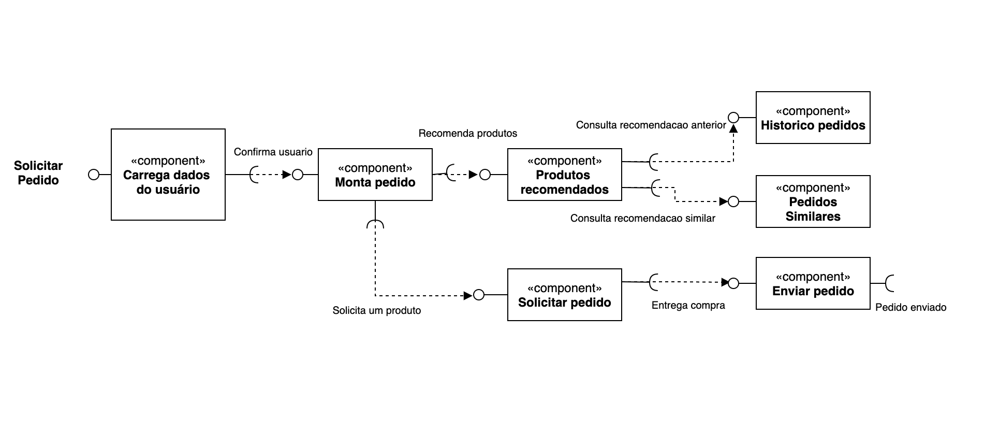

# Lab01 - Data Flow

Estrutura de pastas:

~~~
├── README.md  <- arquivo apresentando a tarefa
│
├── images     <- arquivos de imagens usadas no documento
│
└── orange     <- arquivos do Orange
~~~

# Aluno
* `Tiago Fernandes de Oliveira`

# Tarefa 1 - Workflow para Recomendação de Zombie Meals

## Imagem do Projeto

## Arquivo do Projeto
> [/orange](orange/zombie-meals-issuran.ows)

# Tarefa 2 - Projeto de Composição para Venda e Recomendação

## Diagrama de Componentes

> Imagem do diagrama de componentes.

## Texto Explicativo

> Usuário ao autenticar com a aplicação, carrega os dados que serão utilizados como referencia;

> Ao confirma, o usuario deseja mantar um pedido, este componente é responsável por consultar o componente de recomendação de produtos;

> No componente de recomendação, temos duas abordagens do sistema, onde temos recomendações baseadas pelo histórico e por pedidos similares;

> O componente de historico de pedido, consulta a base do usuario e usando predição dos seus pedidos, data, horário, tipo de comida sugere produtos que o usuario possa querer solicitar;

> O componente de pedidos similares, consulta a base do sistema para ver o que outros usuários tem pedido na mesma data, horário;

> O componente Produtos recomendados consegue distinguir cada recomendação ao usuario assim como cruzar os dados para sugestões dinâmicas;

 > Ao selecionar um produto, a compra usa o componente de solicitar pedido para finalizar a etapa de cobranças;

> Na ultima etapa, o pedido é enviado ao cliente no componente que cuida de enviar os dados ao entregados;
