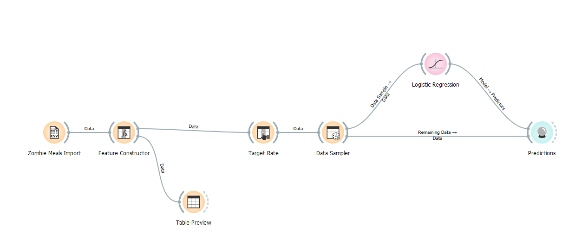
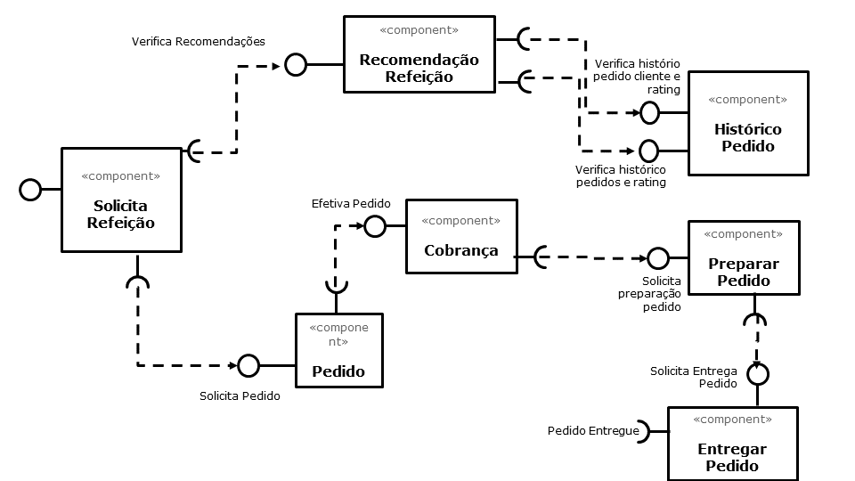

# Aluno
* `Jeferson Luis Michelan`

# Tarefa 1 - Workflow para Recomendação de Zombie Meals

## Imagem do Projeto
> Coloque uma imagem da captura de tela com o projeto do Orange (veja exemplo abaixo).

## Arquivo do Projeto
> Coloque um link para o arquivo em Orange.

 Realizando as duas alterações e comparando o Tree com o Logistic o resultado apresentado mostra que o Logistic apresenta um desempenho melhor que o Tree. 
 O Logistid apresentou CA de 0,938 contra 0,750 do Tree. 
 O Logistic apresentou F1 de 0,907 contra 0,750 do Tree. 
 O Logistic apresentou Presicion de 0,879 contra 0,750 do Tree. 
 O Logistic apresentou Recall de 0,938 contra 0,750 do Tree. 

# Tarefa 2 - Projeto de Composição para Venda e Recomendação

## Diagrama de Componentes

> Imagem (`PNG`) do diagrama de componentes (veja exemplo abaixo).

## Texto Explicativo

> Texto explicando diagrama, conforme especificação do laboratório.
 

 O componente Solicita Refeição irá solicitar ao cliente qual é o tipo de refeição que ele deseja adquirir.  
 Essa informação para o meu componente é obrigatória para continuidade da execução pois caso contrário a aplicação poderá ter um problema grande de performance. 
 Uma vez obtido do cliente o tipo de refeição que ele deseja adquirir, o componente Solicita Refeição irá acionar sua interface requerida que se comunica com a interface provida Verifica Recomendações do componente Recomendação Refeição. Essa interface provida irá receber os parâmetros tipo de refeição e o código do cliente da interface requerida do componente de Solicitação de Compra.  
 Como o componente de Recomendação de Refeição não é a detentora da informação de pedidos já realizados pelos clientes do marketplace este componente então irá invocar o componente histórico de pedidos.  
 A invocação ao componente Histórico  Pedidos é realizada através da interface provida Verifica histórico pedido cliente e rating.  .
 Essa interface receberá como parâmetro o tipo de refeição  e o código do cliente. Esta interface irá devolver uma lista de registros. A lista terá o estabelecimento, refeição, data e nota e sua ordenação será realizada exclusivamente pela nota dada pelo cliente em ordem decrescente 
 Uma vez esta lista devolvida para a interface provida do componente de Recomendação de Refeição o componente verifica a quantidade de registros existentes . 
 Caso a lista possua 50 ou mais registros essa lista é devolvida para a interface requerida do componente de Solicita Refeição.  
 Caso a lista ainda não tenha atingido 50 registros o componente Recomendação de Refeição invoca novamente o componente Histórico Pedido usando a interface provida Verifica histórico pedido rating, essa interface recebe como parâmetro somente o tipo de refeição e devolve as mesmas informações e com os mesmos critérios que a interface a Verifica histórico pedido cliente e rating.  
 Enquanto o cliente não escolher um item retornado pela recomendação essa lista fica sendo montada.  
 Uma vez escolhido  um item da lista o componente Solicita Refeição aciona o componente Pedido através da interface provida Solicita Pedido. A interface provida receberá o código do cliente, o endereço, o estabelecimento e a refeição escolhida.  
 Uma vez o pedido é concluído o componente Pedido aciona o componente de Cobrança através da interface provida Efetiva Pedido ele recebe como parâmetro o código do cliente, endereço, estabelecimento, valor total da compra, pedido.  
 Uma vez a transação de compra concluída com sucesso o componente de Cobrança aciona o componente Preparar Pedido através da interface provida Solicita preparação pedido. Esta interface recebe como parâmetro a refeição, o código do cliente e o endereço do cliente.  
 Uma vez a o preparo concluído o componente  Preparar Pedido aciona o componente Entregar Pedido através da interface provida Solicita Entrega Pedido que recebe como parâmetro o cliente e o endereço do cliente 

