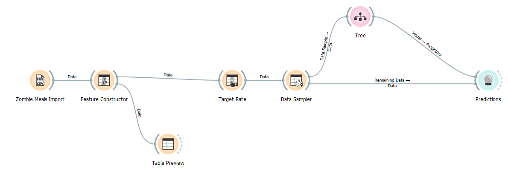
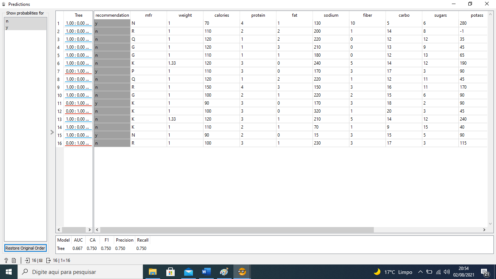
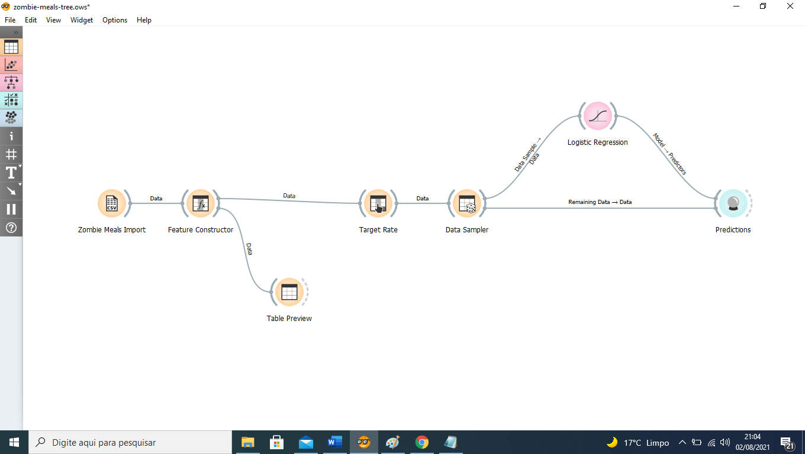
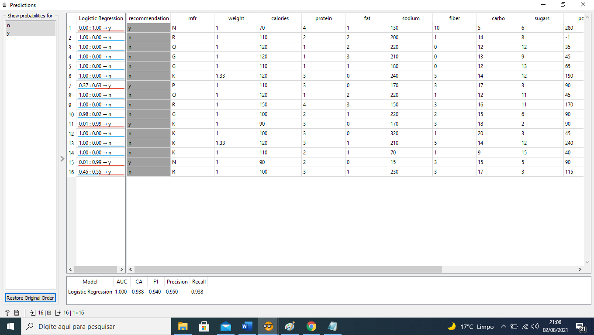
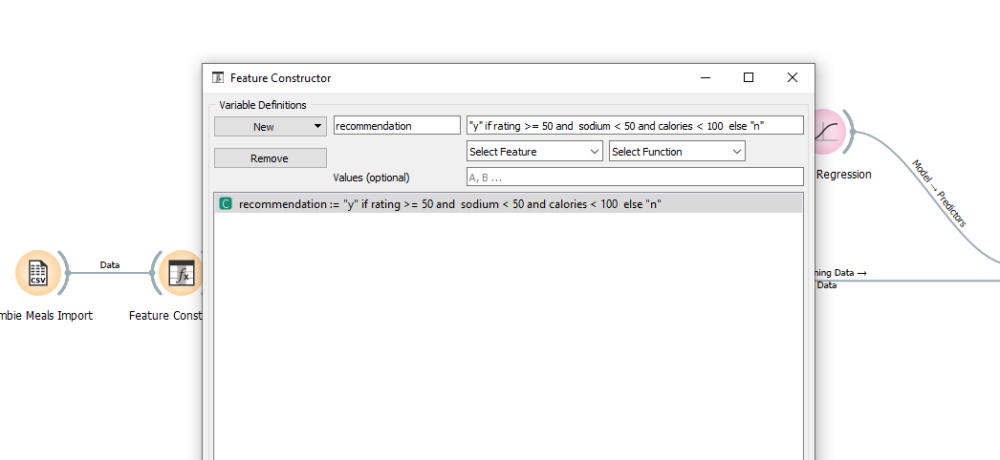
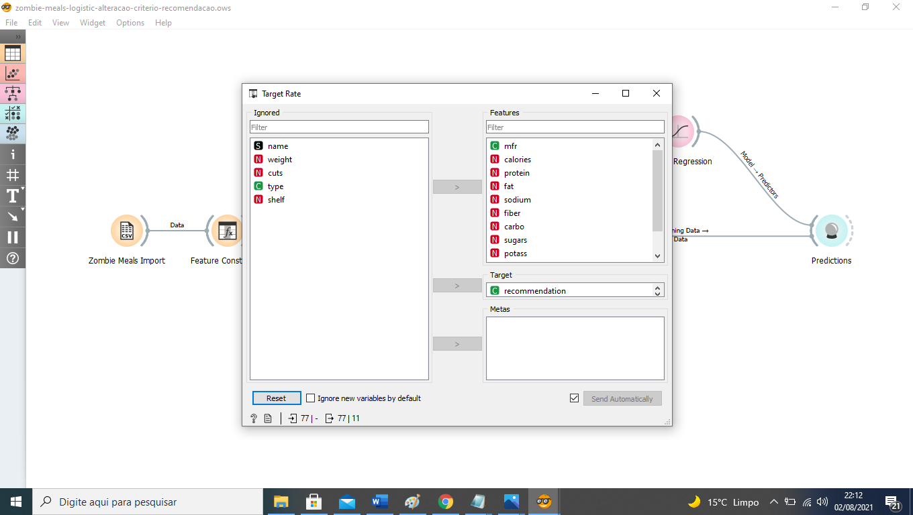

# Aluno
* Jeferson Luis Michelan

# Tarefa 1 - Workflow para Recomendação de Zombie Meals

## Modificar o método de predição - atualmente é o Support Vector Machine (SVN)
 
> Modificação para o tree e a avaliação da alteração da modificacao

> Modificação para o Logistic Regression e a avaliação da alteração da modificacao

## Analise do Desempenho
 ### Pelos resultados apresentados entre o método de predição Tree e o Logistic Regression o método de predição Logistic Regression apresentou melhor resultado

## Mude o critério de recomendação mudando a expressão

## Modifique as features que você vai analisar para recomendação

## Arquivo do Projeto
> Coloque um link para o arquivo em Orange.

# Tarefa 2 - Projeto de Composição para Venda e Recomendação

## Diagrama de Componentes

> Imagem (`PNG`) do diagrama de componentes (veja exemplo abaixo).

## Texto Explicativo

> Texto explicando diagrama, conforme especificação do laboratório.
O Componente Escolhe Refeição solicita através do código do cliente os históricos de pedidos do cliente ordenado pela avaliação dada pelo mesmo através do método Verifica Pedido Cliente.
Esse mesmo componente faz solicita ao componente de histórico as melhores avaliações dadas pelos demais clientes de acordo com o tipo de refeição escolhido pelo cliente através do método Verifica todos os pedidos.
A lista de opções de refeição é montada através das melhores notas tendo como preferência as notas dadas pelo cliente.
Uma vez escolhido a refeição o Componente Escolhe Refeição aciona o Componente Efetiva Compra passando a refeição escolhida do qual foi gerada um pedido para o método Efetiva Pedido.
Uma vez efetivado com sucesso a compra o Componente Efetiva Compra aciona o Componente Prepara Pedido passando o pedido do cliente para o método Solicita Preparo Pedido.
Uma vez o peido pronto o Componente Prepara Pedido invoca o componente Entrega Pedido através do método Solicita Entrega Pedido. 