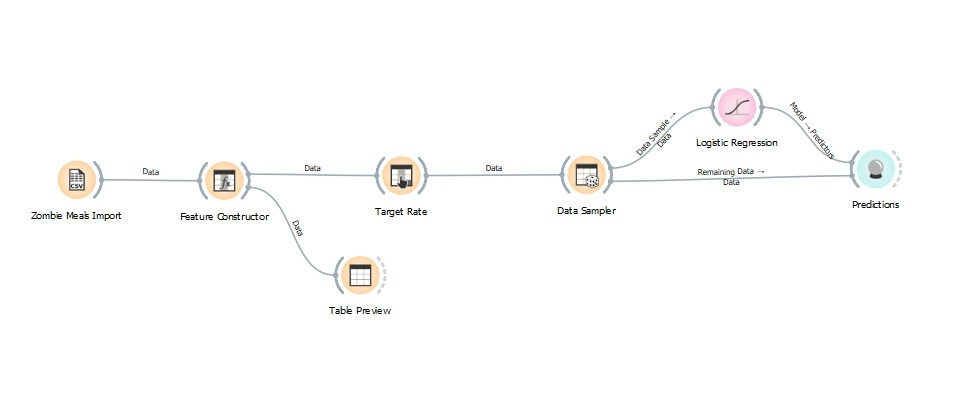
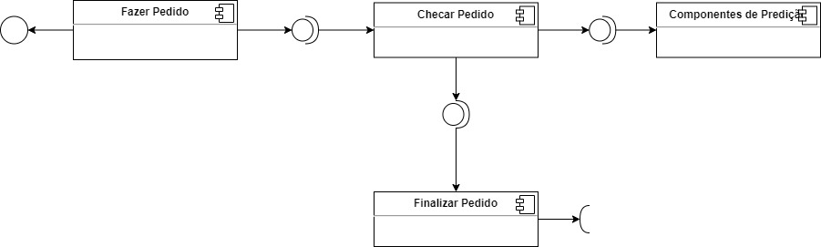

# Lab01 - Data Flow

# Aluno
* `Juliana Cardoso Malton`

# Tarefa 1 - Workflow para Recomendação de Zombie Meals

## Imagem do Projeto
> Projeto do Orange.

## Arquivo do Projeto
> [Link OWS](orange/zombie-meals-solucao.ows)

# Tarefa 2 - Projeto de Composição para Venda e Recomendação

## Diagrama de Componentes

> Imagem (`JPEG`) do diagrama de componentes.

## Texto Explicativo

> Na primeira interface será realizado a criação do pedido, e então será passado a número do pedido para o componente checar pedido que verificará se o pedido ainda pode ser realizado e se está disponível, após isso todos os detalhados do pedido são enviados para o Compenente de Predição e o número do pedido é encaminhado para o compenente Finalizar Pedido.
