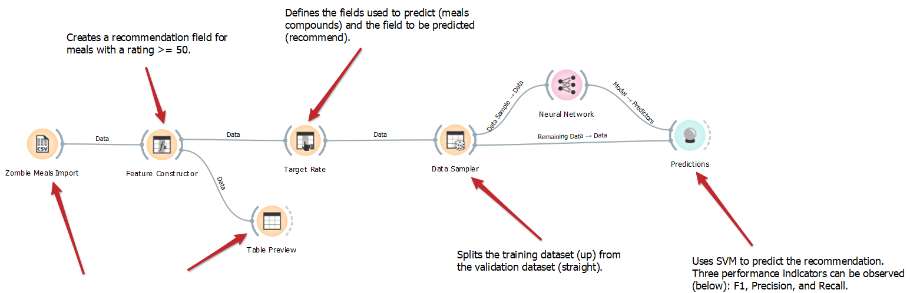

# Aluno `Lucas Franzolin - EX150621`

```
├── images                               // imagens DataFlow + Marketplace
└── zombie-meals-lucas-franzolin.ows     // arquivo do Orange
```

# Tarefa 1 - Workflow para Recomendação de Zombie Meals



[zombie-meals-lucas-franzolin.ows](zombie-meals-lucas-franzolin.ows)

# Tarefa 2 - Projeto de Composição para Venda e Recomendação

## Fluxo do pedido de refeição

1. Usuário acessa a aplicação
2. A aplicação exibe sugestões baseadas no histórico de pedidos
3. Escolher refeição
4. Aplicativo devolve os detalhes com as avaliações
5. Aplicativo calcula o pedido com frete;
6. Aplicativo solicita método de pagamento;
7. Aplicativo comunica vendedor do registro do pedido;
8. Vendedor prepara refeição;
9. Vendedor disponibiliza para entrega
10. Vendedor envia o pedido para entrega;
11. Vendedor comunica aplicativo;
12. Entrega refeição;
13. Usuário comunica a entrega efetivada
    15 Usuário envia avaliação do pedido

## Diagrama de Componentes
