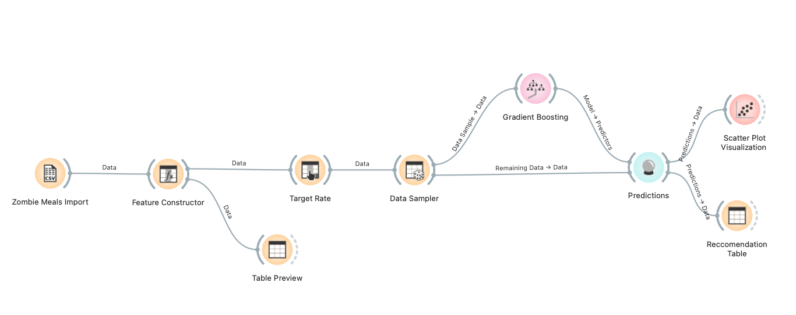
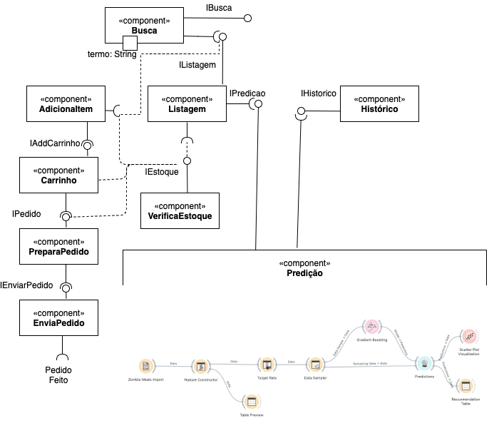

# Modelo para Apresentação do Lab01 - Data Flow

Estrutura de pastas:

~~~
├── README.md  <- arquivo apresentando a tarefa
│
├── images     <- arquivos de imagens usadas no documento
│
└── orange     <- arquivos do Orange
~~~

# Aluno
* `MARINA AZEVEDO FERREIRA SOARES`

# Tarefa 1 - Workflow para Recomendação de Zombie Meals

## Imagem do Projeto

## Arquivo do Projeto

# Tarefa 2 - Projeto de Composição para Venda e Recomendação

## Diagrama de Componentes

## Texto Explicativo

Pensando na recomendação,  a fonte de dados do sistema de predição (para gerar as recomendações) idelamente usaria o histórico de buscas e compras do usuário do marketplace.
Ao buscar um item (por exemplo, "Zombie Meals"), a recomendação idelamente seria pelo histórico de compas e buscas do cliente. O 'default' é a quantidade de açúcar do alimento.
No sistema do marketplace, após buscar, o componente de busca chama o de listagem, que por sua vez consulta as predições. Como já comentamos, as predições usam o histórico e o valor padrão
para retornar uma listagem de produtos, e o módulo de listagem teria a capacidade de ordenar por remomendados primeiro.
A partir da Listagem, é possível adicionar um item ao carrinho, preparar um pedido - que envolve endere;co e pgamento -  e enviar um pedido.
Tanto os componentes de Listagem, AdicionaItem, Carrinho e PreparaPedido consultam o componente VerificaEstoque para garantir que exista estoque do produto.
