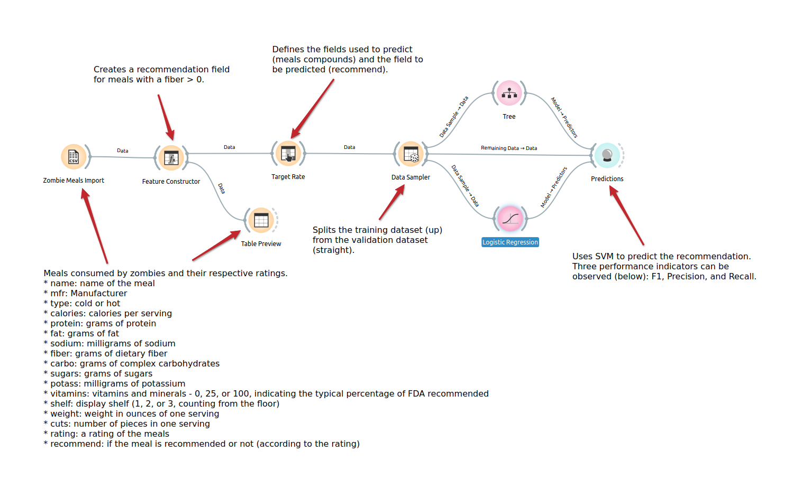
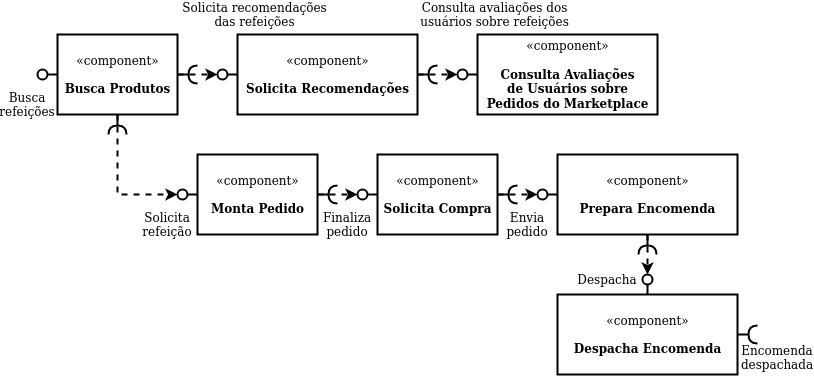

# Modelo para Apresentação do Lab01 - Data Flow

Estrutura de pastas:

~~~
├── README.md  <- arquivo apresentando a tarefa
│
├── images     <- arquivos de imagens usadas no documento
│
└── orange     <- arquivos do Orange
~~~

# Aluno
* `Pablo Gabriel Rodrigues Neves Bedoya`

# Tarefa 1 - Workflow para Recomendação de Zombie Meals

## Imagem do Projeto

## Arquivo do Projeto
> [Link para o arquivo em Orange](orange/zombie-meals.ows).

# Tarefa 2 - Projeto de Composição para Venda e Recomendação

## Diagrama de Componentes

## Texto Explicativo

O usuário lista as refeições disponíveis por meio do componente "Buscar Produtos". Esse componente leva o fluxo adiante para "Solicitar Recomendações" ou "Montar Pedido".

O componente "Solicitar Recomendações" segue com o fluxo para o componente de predição "Consulta Avaliações de Usuários sobre Pedidos do Marketplace" com o objetivo de fazer sugestões com base em avaliações existentes de outros usuários do Marketplace.

O componente "Montar Pedido", por sua vez, tem a responsabilidade de receber o pedido do usuário, tendo havido recomendação ou não por parte do Marketplace, caminhando com o fluxo para a finalização do pedido com os componentes "Solicita Compra" e "Prepara Encomenda", logo na sequência sendo executado o componente "Despacha Encomenda", para o envio da refeição escolhida pelo usuário.
