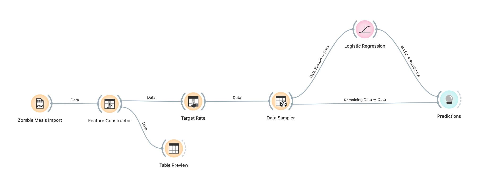
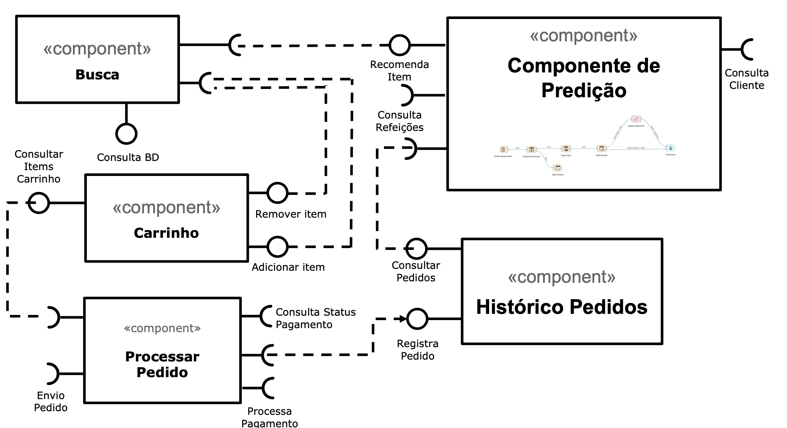

# Modelo para Apresentação do Lab01 - Data Flow

Estrutura de pastas:

~~~
├── README.md  <- arquivo apresentando a tarefa
│
├── images     <- arquivos de imagens usadas no documento
│
└── orange     <- arquivos do Orange
~~~

# Aluno
* `Renato Fernandes Reis`

# Tarefa 1 - Workflow para Recomendação de Zombie Meals

## Imagem do Projeto

## Arquivo do Projeto
> [/component2learn/labs/2021/01-data-flow/solucoes/renato-reis/orange](/component2learn/labs/2021/01-data-flow/solucoes/renato-reis/orange/zombie-meals.ows).

# Tarefa 2 - Projeto de Composição para Venda e Recomendação

## Diagrama de Componentes

## Texto Explicativo

* `Componente Busca:` Componente que realiza busca das refeiçoes disponíveis e retorna para o front-end exibir para o usuário. Este componente possui as seguintes interfaces: *Finalizar compra*(Interface com componente Carrinho para finalizar compra), *Consulta Refeições*(Consulta o banco de dados das refeiçoes cadastradas), *Recomenda Item* (Interface com o componente de *Predição* que ira retornar recomendaçoes de refeiçoes para o cliente), *Remover/Adicionar item*(Interface com o componente Carrinho que permite adicionar e remover items do carrinho).

* `Componente Carrinho:` Componente onde usuário mantem os produtos que deseja comprar. Este componente possui as seguintes interfaces: *Remover/Adicionar Item* (Permite que o componente busca insira e remova items do carrinho). *Finalizar compra*(Permite que o componente busca inicie o processo de checkout). *Checkout*(Inicia processo de checkout no componete Processar Pedido).

* `Processar Pedido:` Componente responsável por processar o pedido do cliente. Este componente possui as seguintes interfaces:*Consulta Status Pagamento* (Consulta status do pagamento.). *Registra Pedido*(Registra pedido no componente histórico de pedidos). *Checkout*(Processa pagamento). *Checkout*(Inicia processo de envio do pedido.)

* `Histórico Pedidos:` Componente responsável por manter o histórico de pedidos de cada cliente. Este componente possui as seguintes interfaces: *Consultar Pedidos* (Prove histórico de pedidos para o componente de Predição). *Registra Pedido*(Registra pedido enviados pelo componente Processar Pedido).

* `Componente Predição:` Componente que faz recomendaçoes para o usuário baseado no seu histórico de compras. Este componente possui as seguintes interfaces: *Recomenda Item*(Prove recomendações para o componente Busca). *Consulta Refeições*(Consulta refeiçoes cadastradas no banco de dados.). *Consultar Pedidos*(Dataset dos pedidos utilizados para fazer as prediçoes). *Consulta Cliente*(Consulta dataset do cliente para utilizar nas prediçoes).

