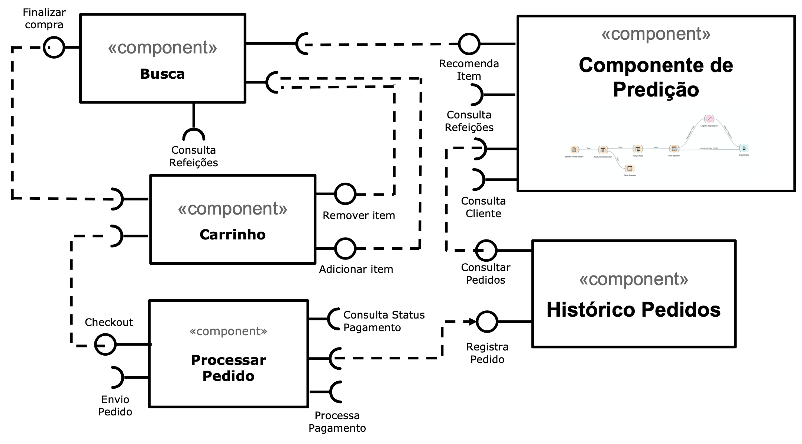

# Modelo para Apresentação do Lab01 - Data Flow

Estrutura de pastas:

~~~
├── README.md  <- arquivo apresentando a tarefa
│
├── images     <- arquivos de imagens usadas no documento
│
└── orange     <- arquivos do Orange
~~~

# Aluno
* `Renato Fernandes Reis`

# Tarefa 1 - Workflow para Recomendação de Zombie Meals

## Imagem do Projeto

## Arquivo do Projeto
> [/component2learn/labs/2021/01-data-flow/solucoes/renato-reis/orange](/component2learn/labs/2021/01-data-flow/solucoes/renato-reis/orange/zombie-meals.ows).

# Tarefa 2 - Projeto de Composição para Venda e Recomendação

## Diagrama de Componentes

## Texto Explicativo

* `Componente Busca:` Componente que realiza busca das refeiçoes disponíveis e retorna para o front-end exibir para o usuário. Este componente possui as seguintes interfaces: Finalizar compra(Interface com componente Carrinho para finalizar compra), Consulta Refeições: Consulta o banco de dados das refeiçoes cadastradas, Recomenda Item (Interface com o componente de Predição que ira retornar recomendaçoes de refeiçoes para o cliente), Remover/Adicionar item(Interface com o componente Carrinho que permite adicionar e remover items do carrinho).

> Texto explicando diagrama, conforme especificação do laboratório.

