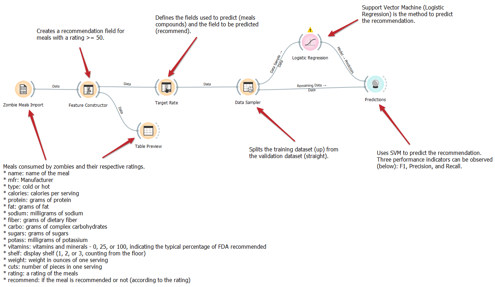
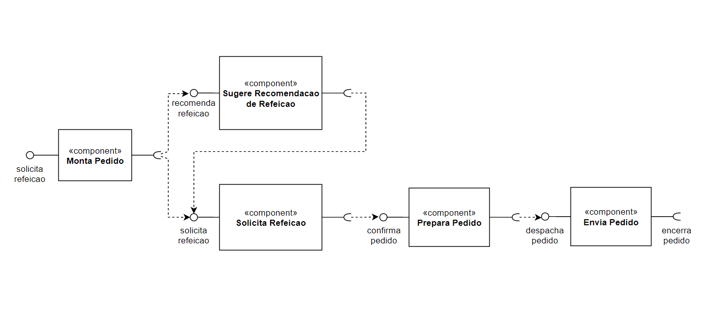

# Modelo para Apresentação do Lab01 - Data Flow

Estrutura de pastas:

~~~
├── README.md  <- arquivo apresentando a tarefa
│
├── images     <- arquivos de imagens usadas no documento
│
└── orange     <- arquivos do Orange
~~~

# Aluno
* `Ronaldo Monteiro Lopes`

# Tarefa 1 - Workflow para Recomendação de Zombie Meals

## Imagem do Projeto
> 

## Arquivo do Projeto
>
[Link para o arquivo em Orange.](orange/zombie-meals-ronaldomonteirolopes.ows)

# Tarefa 2 - Projeto de Composição para Recomendação

## Diagrama de Componentes

>

## Texto Explicativo

>O diagrama representar um fluxo de pedido de uma refeição.

No qual o componente **Montar Pedido** é responsável por fazer recomendação de refeição para o modulo **Sugere Recomendacao de Refeicao**, sendo o cliente responsável por aceitar ou não essa recomendação, caso o cliente aceite a recomendação que utiliza um modelo de predição para prazer as sugestões, o próprio modulo chama o componente **Solicita Refeicao** para preparação da refeição.

Caso o cliente não aceite a recomendação, ele escolhe a refeição e a mesma será enviada para o modulo **Solicita Refeicao**, após essa etapa, será feita a confirmação do pedido e encaminhado uma solicitação para o modulo **Preparar Pedido**.

Finalmente a refeição estando pronto, será despachada através do modulo **Envia Pedido** para realizar o envio do pedido ao cliente e finaliza todo o processo.
