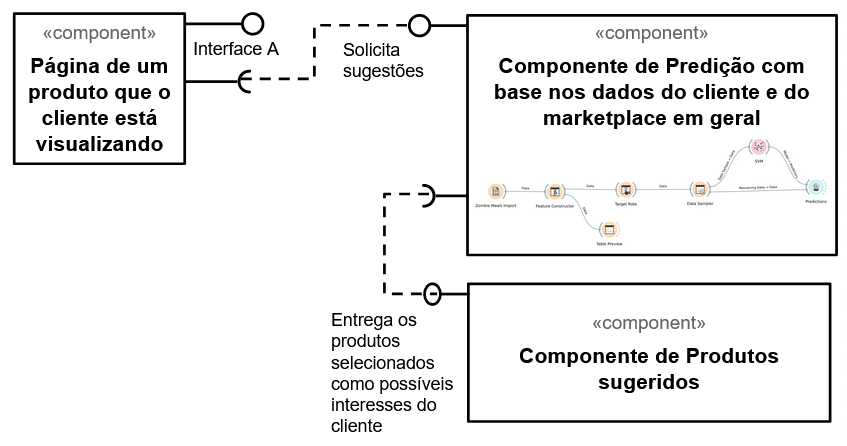

# Lab01 - Data Flow

# Aluno
* `Sophia Carvalho Lancini`

# Tarefa 1 - Workflow para Recomendação de Zombie Meals

## Imagem do Projeto
> Projeto do Orange.

## Arquivo do Projeto
> [Link OWS](orange/zombie-meals.ows)

# Tarefa 2 - Projeto de Composição para Venda e Recomendação

## Diagrama de Componentes

> Imagem (`JPEG`) do diagrama de componentes.

## Texto Explicativo

> Um componente de renderização da página de produto solicita pelos produtos sugeridos a outro componente que levanta possíveis produtos com base nas avaliações do cliente e em avaliações de outros clientes em todos os produtos do marketplace. Do resultado são selecionados os produtos mais prováveis de agradar o cliente e entregues a um componente de renderização das sugestões.