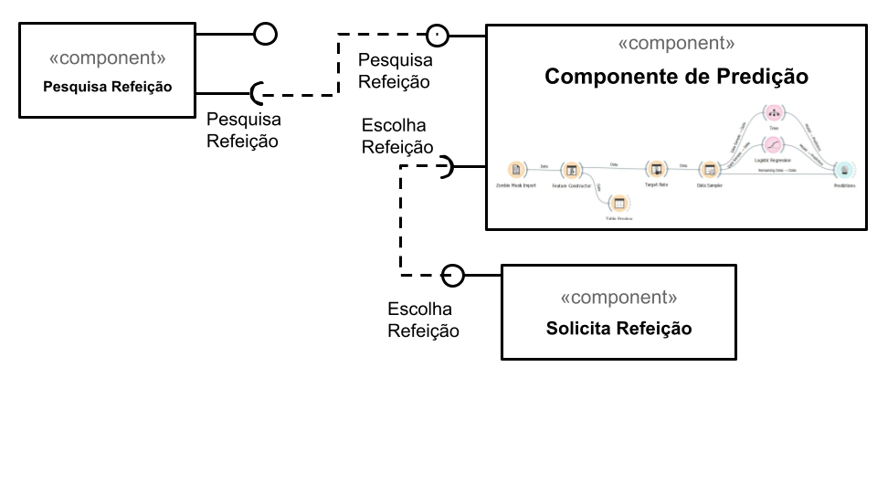

# Apresentação do Lab01 - Data Flow

Estrutura de pastas:

~~~
├── README.md  <- arquivo apresentando a tarefa
│
├── images     <- arquivos de imagens usadas no documento
│
└── orange     <- arquivos do Orange
~~~

# Aluno
* `Thalita Almeida Silva`

# Tarefa 1 - Workflow para Recomendação de Zombie Meals

## Imagem do Projeto

## Arquivo do Projeto
[/thalih/orange/](https://github.com/thalih/component2learn/tree/master/labs/2021/01-data-flow/solucoes/thalih/orange/)

# Tarefa 2 - Projeto de Composição para Venda e Recomendação

## Diagrama de Componentes

## Texto Explicativo

> O processo de aquisição de uma refeição virtualmente: 
Basicamente, O componente "Pesquisa Refeição" está ligado ao componente "Escolha Refeição".
Entre esse processo de ligação, haverá a filtragem e a configuração dos dados.
Finalizando assim, com o componente "Solicita Refeição" que transpõem para os demais componentes a escolha da refeição. .
