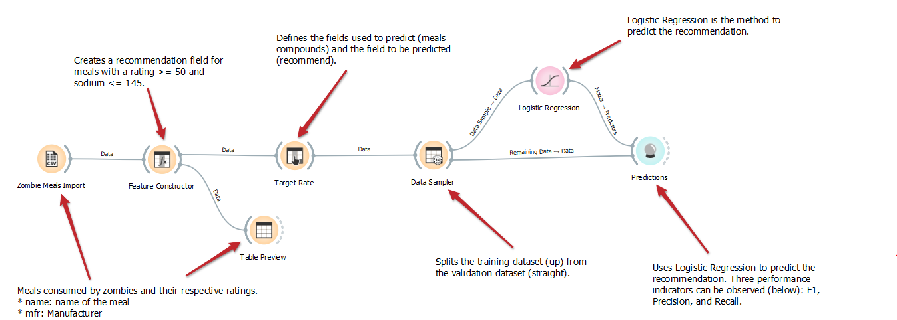
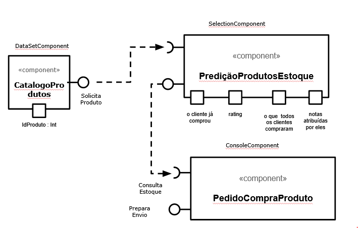

# Modelo para Apresentação do Lab01 - Data Flow

Estrutura de pastas:

~~~
├── README.md  <- arquivo apresentando a tarefa
│
├── images     <- arquivos de imagens usadas no documento
│
└── orange     <- arquivos do Orange
~~~

# Aluno
* `Victor Hugo Gomes de Oliveira`

# Tarefa 1 - Workflow para Recomendação de Zombie Meals

## Imagem do Projeto
> Coloque uma imagem da captura de tela com o projeto do Orange (veja exemplo abaixo).

## Arquivo do Projeto
> Link para o arquivo em Orange: [Arquivo Tarefa 1](https://github.com/victorhugoliveira/component2learn/tree/master/labs/2021/01-data-flow/solucoes/victorhugooliveira/orange).

# Tarefa 2 - Projeto de Composição para Venda e Recomendação

## Diagrama de Componentes

> Imagem (`PNG`) do diagrama de componentes (veja exemplo abaixo).

## Texto Explicativo

> Catálogo de produtos é disponibilizado ao usuário (DataSetComponent) para escolhar de um ou mais produtos. A partir do produto selecionado a "predição" é feita para indicar outros produtos similares e/ou complementares a escolha realizada pelo usuário (SelectionComponent). É realizada a consulta da disponibilidade dos produtos em estoque. E por fim, o pedido é fechado e preparado para envio (ConsoleComponent). 
