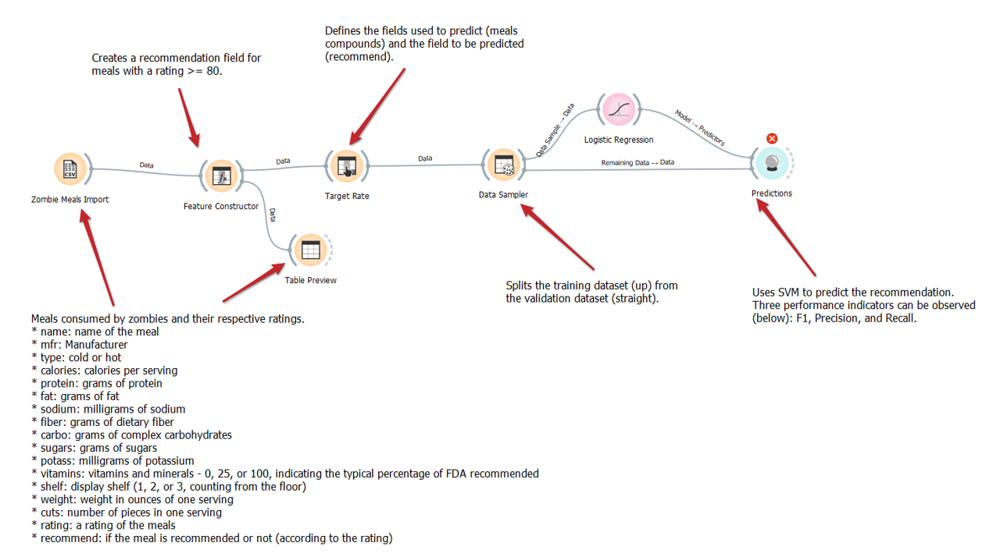
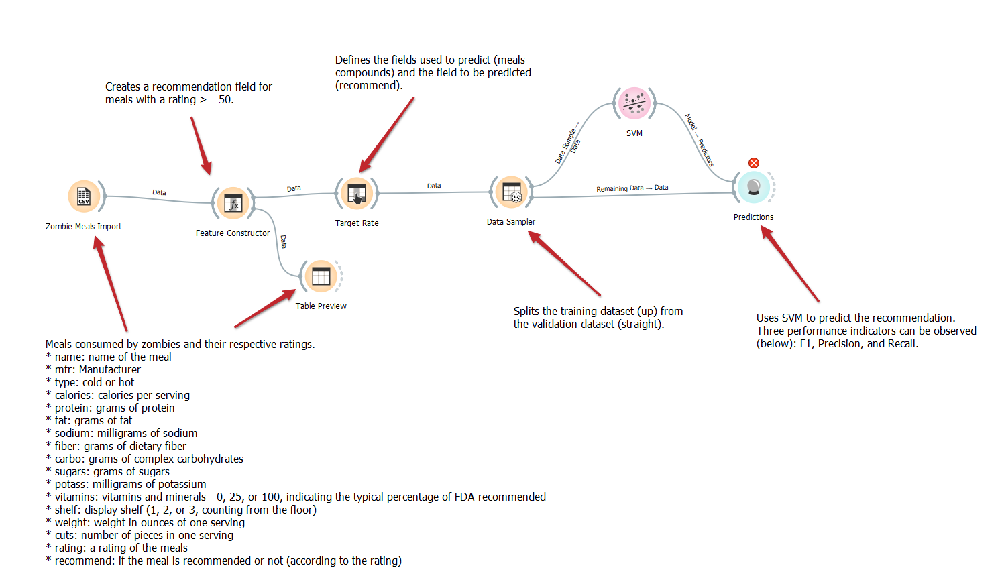
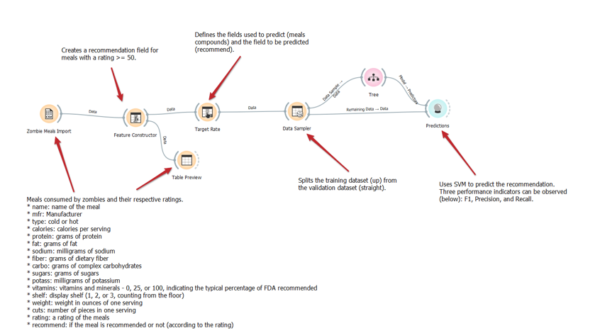
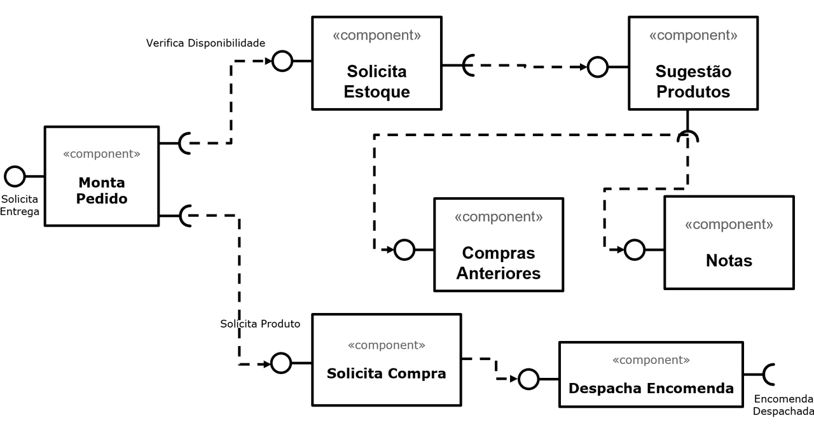

# Modelo para Apresentação do Lab01 - Data Flow

# Aluno
* `Vinicius Del Padre`

# Tarefa 1 - Workflow para Recomendação de Zombie Meals

## Imagem do Projeto
> Utilização do método preditivo Logistic Regression

> Utilização do método preditivo SVM 

> Utilização do método preditivo Tree 

## Arquivo do Projeto
* [Solução com Logistic Regression](orange/zombie-meals-LOGISTIC.ows)
* [Solução com Tree](orange/zombie-meals-TREE.ows)
* [Solução com SVM](orange/zombie-meals-SVM.ows)

# Tarefa 2 - Projeto de Composição para Venda e Recomendação

## Diagrama de Componentes

> Imagem (`PNG`) do diagrama de componentes (veja exemplo abaixo).

## Texto Explicativo

> O sistema verifica o estoque, ordenando os produtos disponíveis de acordo com o gosto do cliente. Isso, levando em consideração as últimas compras e o grau de satisfação do usuário
> Após a seleção dos produtos, o cliente realiza a compra. A compra é despachada e entregue ao usuário.
