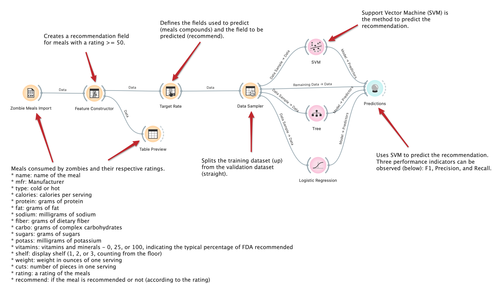
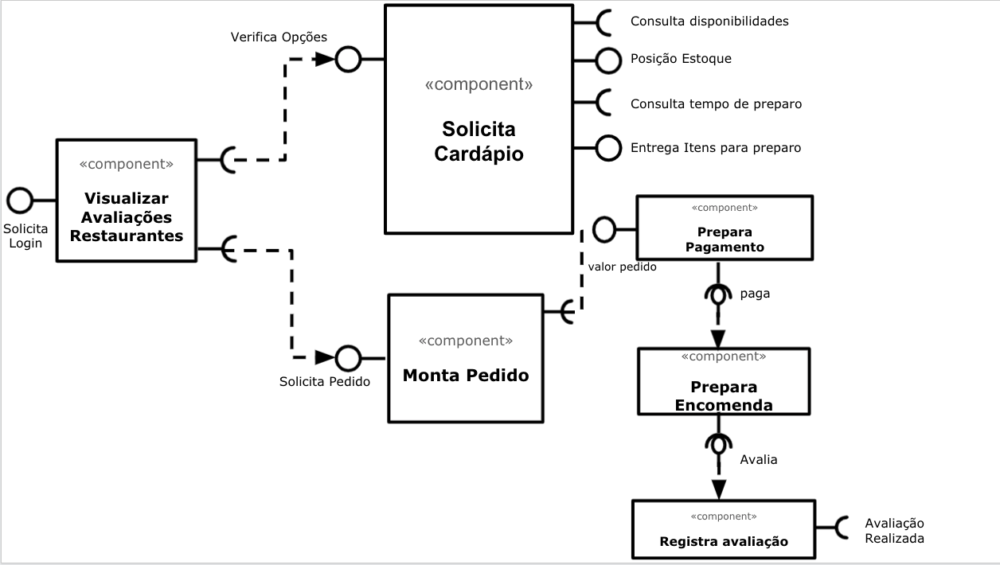

# Modelo para Apresentação do Lab01 - Data Flow

Estrutura de pastas:

~~~
├── README.md  <- arquivo apresentando a tarefa
│
├── images     <- arquivos de imagens usadas no documento
│
└── orange     <- arquivos do Orange
~~~

# Aluno
* `Vitor Correa Oliveira`

# Tarefa 1 - Workflow para Recomendação de Zombie Meals

## Imagem do Projeto
> Coloque uma imagem da captura de tela com o projeto do Orange (veja exemplo abaixo).

## Arquivo do Projeto
> Coloque um link para o arquivo em Orange.
>[Arquivo Orange](orange/zombie-meals-vitor-correa-olivera.ows)

# Tarefa 2 - Projeto de Composição para Venda e Recomendação

## Diagrama de Componentes

> Imagem (`PNG`) do diagrama de componentes (veja exemplo abaixo).

## Texto Explicativo

> Texto explicando diagrama, conforme especificação do laboratório.

Após efetuar o login no sistema, o componente de visualização de avaliações exibirá as melhores notas dos restaurantes de forma automática conforme os critérios definidos no "Feature Constructor". De posse dessas informações o usuário poderá solicitar o cardápio ao restarurante, por meio do componente "Solicita Cardápio", a menssagem recebida pelo componente é a de varicação de opções disponíveis no cardápio. Esse componente por sua vez possui algumas interfaces que são utiliadas para consulta de disponibilidade dos pratos, quantidade em estoque, tempo de preparo e entrada dos itens para produção dos pratos. Depois de escolhido o prato pelo usuário, o sistema deverá montar o pedido através do componente "Monta Pedido" e em seguida invocar o componenente de pagamento onde este será responsável por sumarizar a pedido e receber o valor total da conta por meio da interface valor pedido. Por fim, o componente de encomenta receberá um mensagem de que houve a confirmação do pagamento e poderá preparar a entrega. Quando houver a confirmação da entrega o componente de Avaliação será acionado a fim de registrar a avaliação do usuário. 
