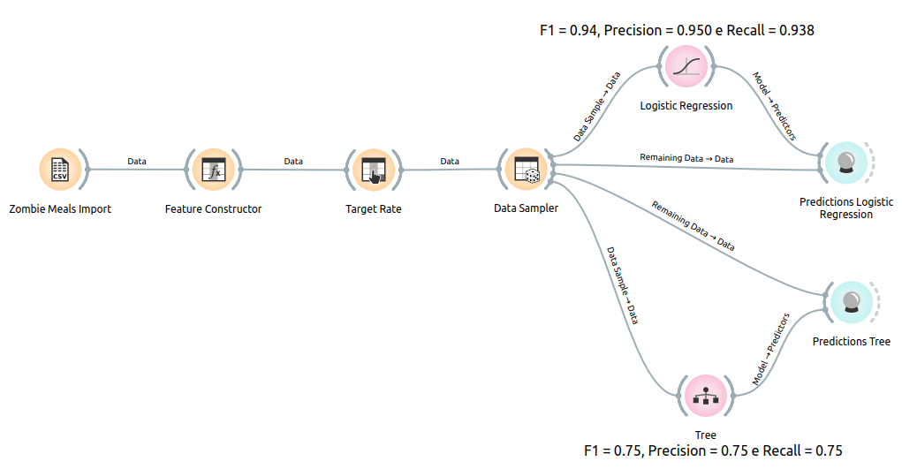
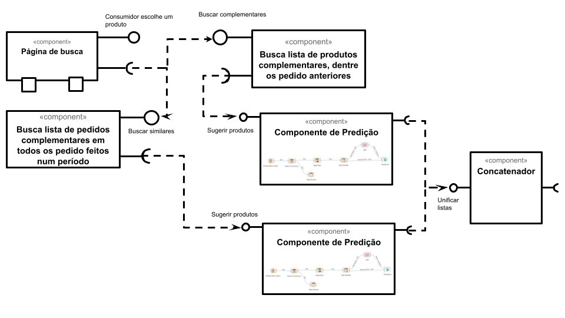

# Aluno
* José Octavio Vitoriano Martines Penna

# Tarefa 1 - Workflow para Recomendação de Zombie Meals
## Imagem do Projeto

## Arquivo do Projeto
[zombie-meals-predictions.ows](orange/zombie-meals-prediction.ows)

# Tarefa 2 - Projeto de Composição para Venda e Recomendação
## Diagrama de Componentes

## Texto Explicativo
O fluxo de dados do diagrama de componentes exposto acima, cumpre a lógica a descrita abaixo:
Inicialmente um cliente escolhe uma refeição no componente `página de busca`, que representa uma página/tela na qual o consumidor tem acesso aos produtos disponíveis; em seguida tal pedido é enviado para as interfaces `buscar similares` nos componentes com nomes iniciados pela palavra `busca`, um dos componentes é responsável por buscar, dentre os pedido já feitos pelo consumidor em questão, uma lista/tabela com a informações dos produtos que foram comprados para complementar refeições (e.g. bebidas, entradas e sobremesas), e o outro componente é responsável por buscar, dentre os pedidos feitos na plataforma marketplace alimentícia em um determinado período de tempo, os produtos mais bem avaliados pelos outros consumidores, que foram comprados para complementar refeições; ambas as tabelas previamente formadas são entregues a componentes de predição de forma que se possa predizer quais produtos complementares melhor harmonizam com a refeição escolhida com base nos dados que ambas as tabelas possuem (e.g. alguns dados que tais tabelas devem agregar são: avalição do cliente, avaliação media da plataforma, refeições e complementos adquiridos conjuntamente, categoria de alimento, etc); por fim, ambas as tabelas são concatenadas para formar uma lista final de produtos que serão sugeridos ao consumidor em questão.