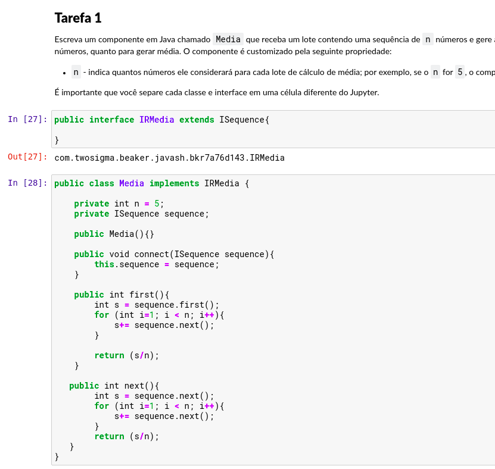

# Aluno
* `Paulo Sérgio do Nascimento RA: 150352`

## Tarefas da parte 1 sobre criação de componentes
> Link para o arquivo da resolução [tarefa 1](https://github.com/paulobazooka/component2learn/blob/master/labs/2021/02-dataflow_mvc/solucoes/PauloSergioNascimento/notebook/tarefa1.ipynb).

## Tarefas da parte 2 sobre composição de componentes do catálogo
> Link para o arquivo da resolução [tarefa 2](https://github.com/paulobazooka/component2learn/blob/master/labs/2021/02-dataflow_mvc/solucoes/PauloSergioNascimento/notebook/tarefa2.ipynb).

## Imagens

***Figura 1.** Tarefa 1 exercício 1*

***Figura 2.** Tarefa 1 exercício 2*

***Figura 3.** Tarefa 2 exercício 1*

***Figura 4.** Tarefa 2 exercício 2*

***Figura 5.** Tarefa 2 exercício 3*

***Figura 6.** Tarefa 2 exercício 4*

***Figura 7.** Tarefa 2 exercício 5*

***Figura 8.** Tarefa 2 exercício 6*