# Laboratório 3 - Componentes e Reutilização de Código INF321/2021

# Aluno

* `Carlos Nihelton Santana de Oliveira | ex150295`

# Tarefa 1 - App no MIT App Inventor

Screenshots das telas do app rodando num emulador de Android API 29:

*Tela 1 - captura da tela completa de design de interface*

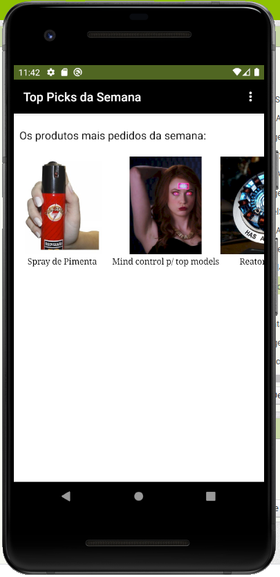

*Tela 2 - captura de tela do app com nenhum produto selecionado*

*Tela 3 - captura de tela do app com primeiro produto selecionado*

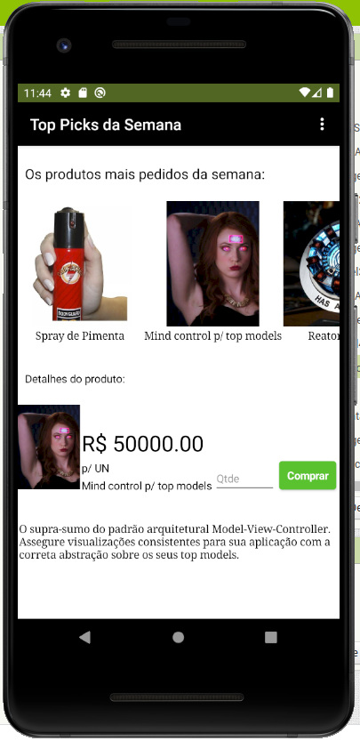

*Tela 4 - captura de tela do app com segundo produto selecionado*

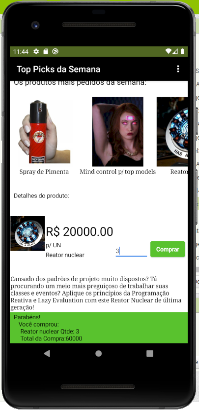

*Tela 5 - compra de um dos produtos efetivada*

*Tela 6 - diagrama de blocos do aplicativo*

O arquivo do projeto no modelo do MIT App Inventor está [disponível neste link](./app/ComponentStore-Tarefa1.aia)

# Tarefa 2 - Diagrama de Componentes dirigida a Eventos

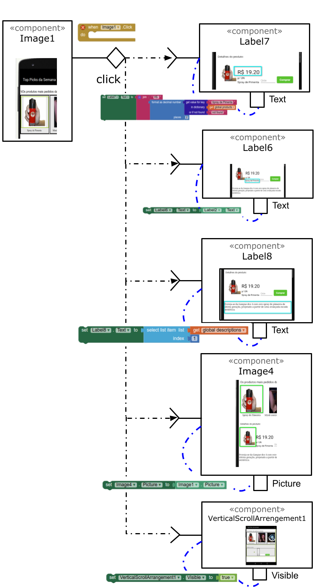

*Sequência de ações em resposta ao evento click da Imagem 1 - selecionar produto 1.*

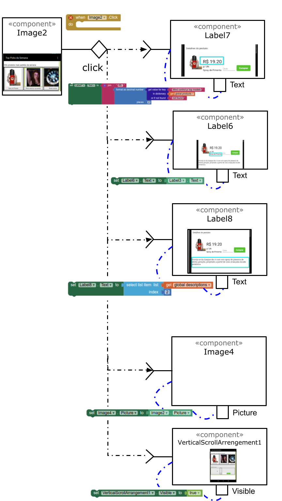

*Sequência de ações em resposta ao evento click da Imagem 2 - selecionar produto 2.*

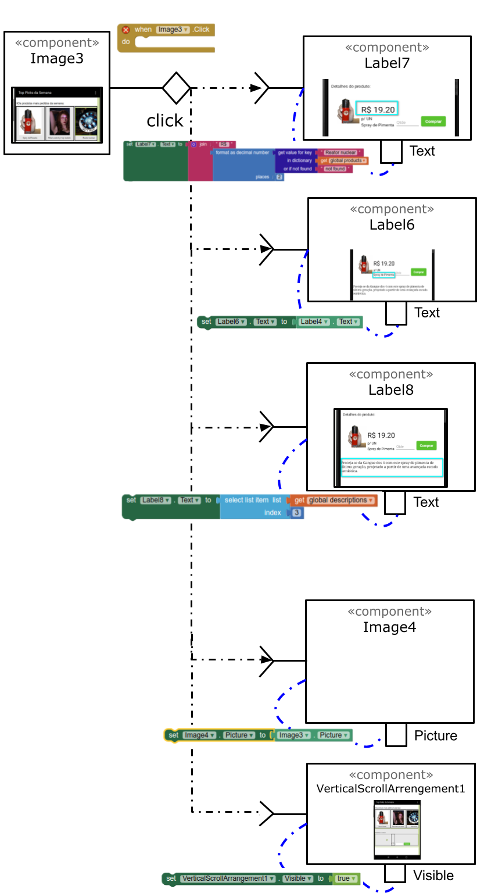

*Sequência de ações em resposta ao evento click da Imagem 3 - selecionar produto 3.*

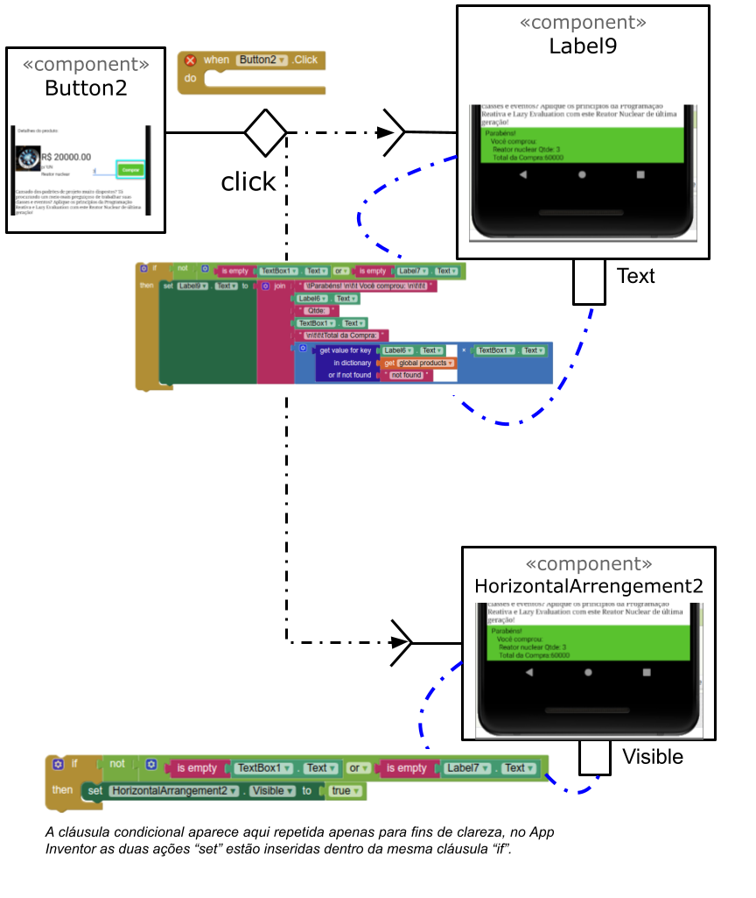

*Sequência de ações em resposta ao evento click do Botão 2 - efetuar compra do produto selecionado.*

# Tarefa 3 - App com CloudDB

Após a inserção da conexão com o CloudDB, assim ficou o app:

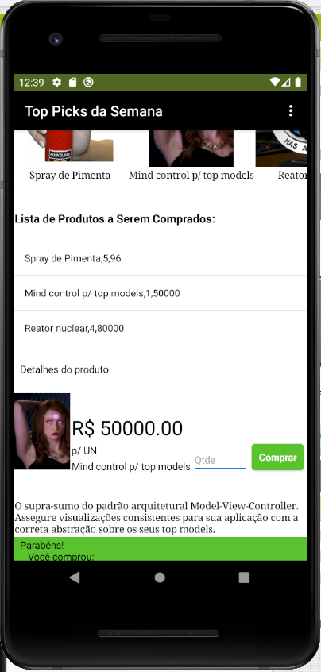

*Tela 1 - captura da tela completa de design de interface após edições da Tarefa 3.*

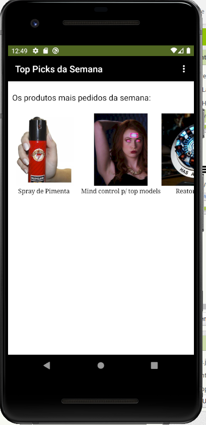

*Tela 2 - Captura da tela do app com nenhum produto selecionado.*

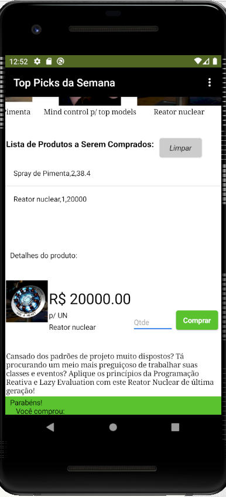

*Tela 3 - Captura de tela do app com dois com compra efetivados e aparecendo na **Lista de Produtos a Serem Comprados**.*

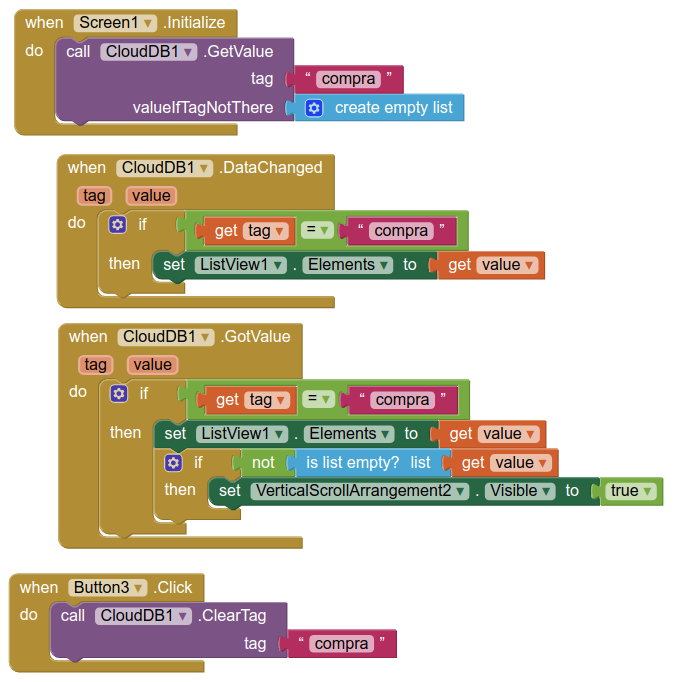

*Tela 4 - Diagrama de blocos do aplicativo mostrando apenas aqueles relacionados com o CloudDB.*

A versão editada do app no formato .aia exportado do MIT App Inventor [pode ser encontrada neste link](./app/ComponentStore-Tarefa3.aia).

