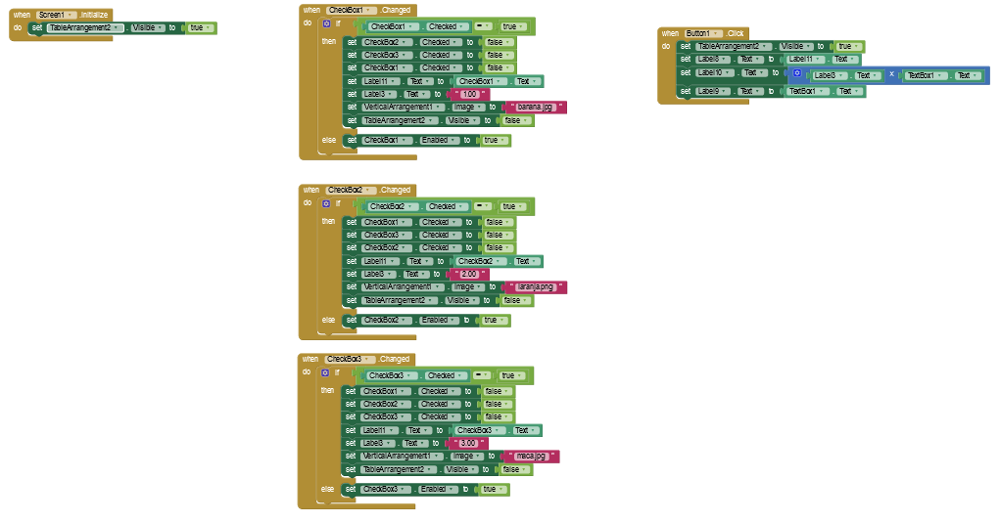
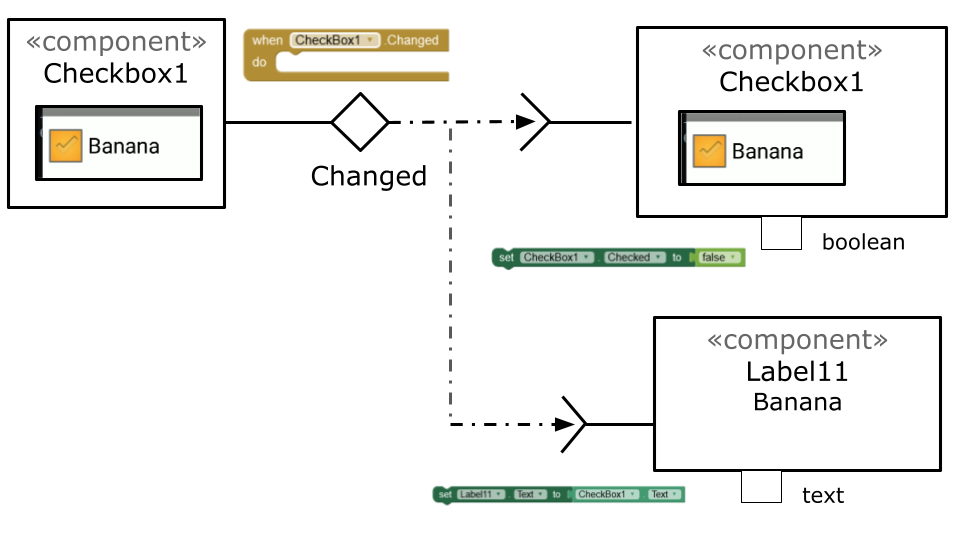
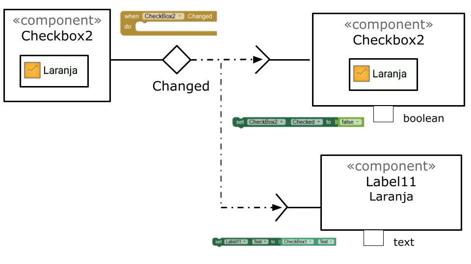
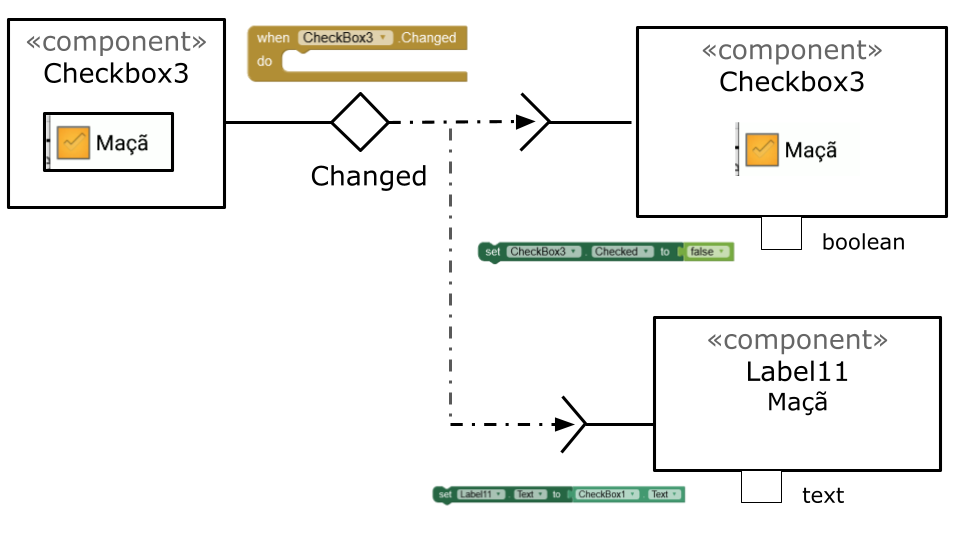
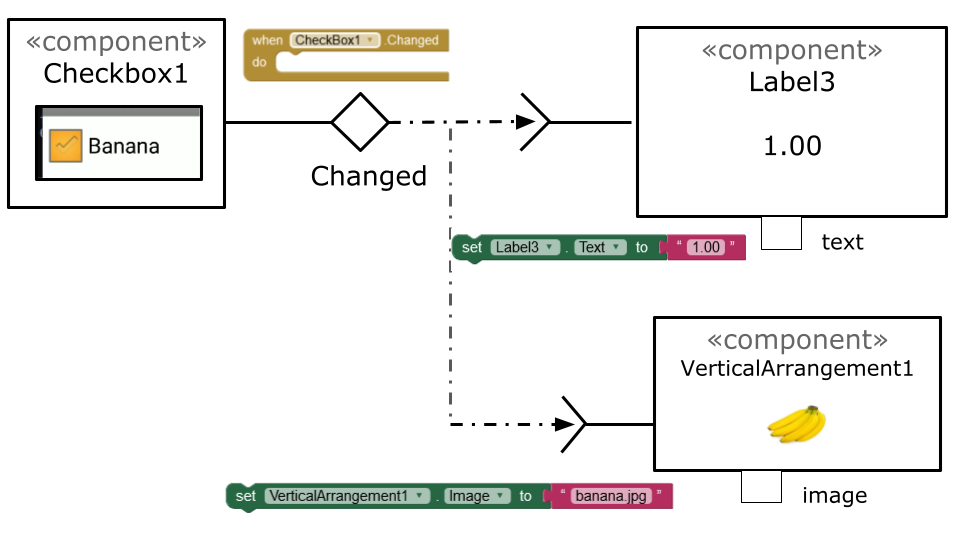
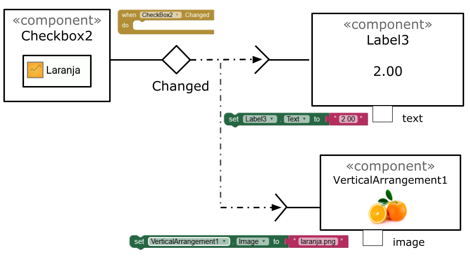
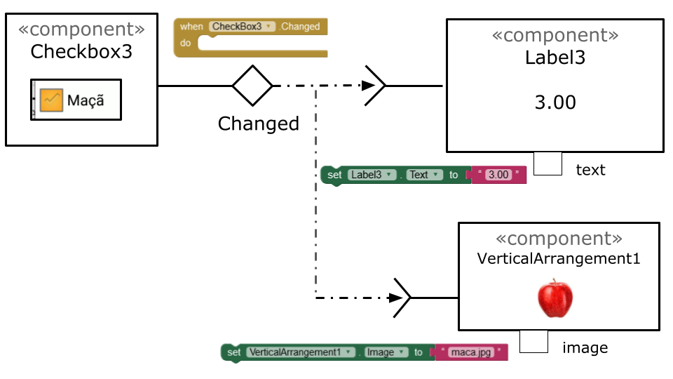
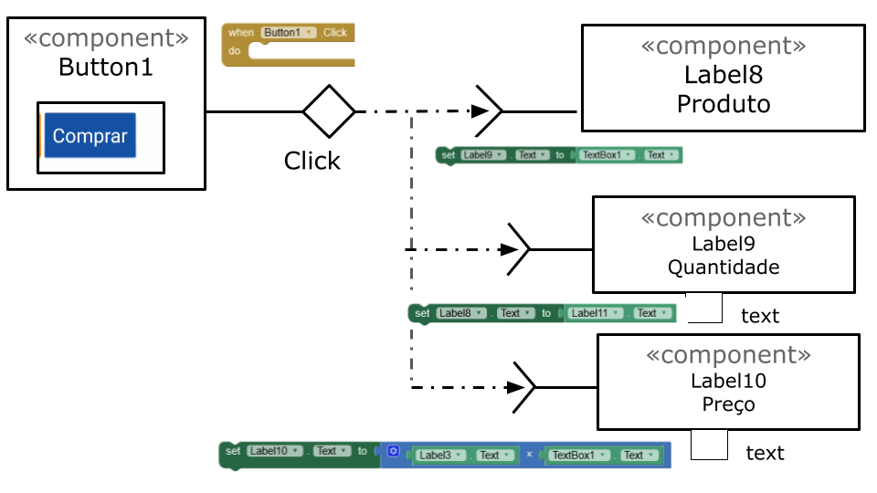

# Modelo para Apresentação do Lab03 - MVC

Estrutura de pastas:

~~~
├── README.md  <- arquivo apresentando a tarefa
│
├── images     <- arquivos de imagens usadas no documento
│
└── app        <- apps do MIT App Inventor exportados em formato `aia`
~~~

# Aluno
* `Gabriel Rodrigues Modesto - 150365`

# Tarefa 1 - App no MIT App Inventor

> Tela 1 

> Tela 2

> Tela 3

> Tela 4

> Tela 5

> Tela 6

> Link para arquivo `aia`.
[App link](app/Lab3_1.aia)

# Tarefa 2 - Diagrama de Componentes dirigida a Eventos

> 

> 

> 

> 

> 

> 

> 

# Tarefa 3 - App com CoudDB

> * tela 1 - captura da tela completa de design de interface

> * tela 2 - captura de tela do app com nenhum produto selecionado

> * tela 3 - captura de tela do app com dois com compra efetivados e aparecendo na **Lista de Produtos a Serem Comprados**

> * tela 4 - diagrama de blocos do aplicativo mostrando apenas aqueles relacionados com o CloudDB

> Link para arquivo `aia`. 
[App link](app/Lab3_2.aia)
