# Aluno
* `Leonardo Martins de Oliveira (ex150339)`

# Tarefa 1 - App no MIT App Inventor

> * Tela 1 - captura da tela completa de design de interface
> 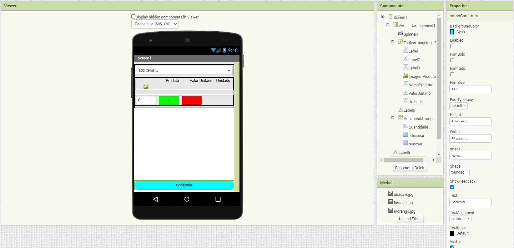
>
> * Tela 2 - captura de tela do app com nenhum produto selecionado
> 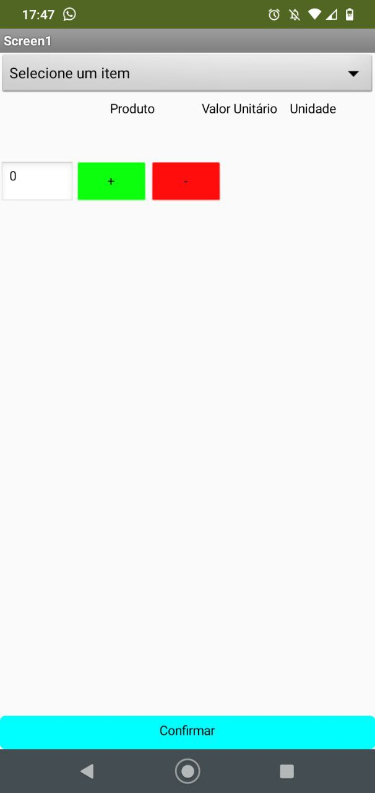
>
> * Tela 3 - captura de tela do app com primeiro produto selecionado
> 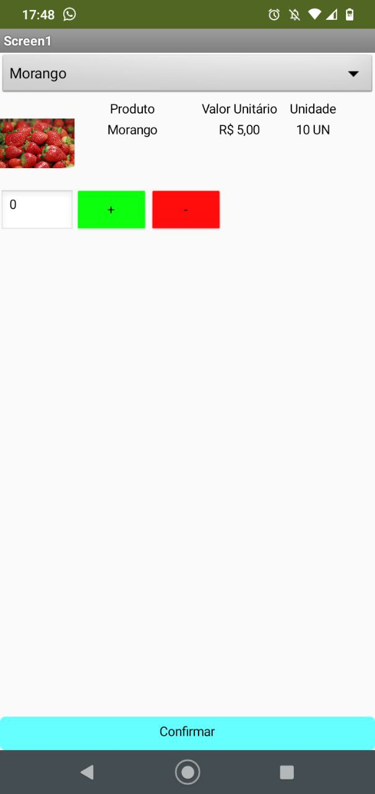
>
> * Tela 4 - captura de tela do app com segundo produto selecionado
> 
>
> * Tela 5 - compra de um dos produtos efetivada  
> 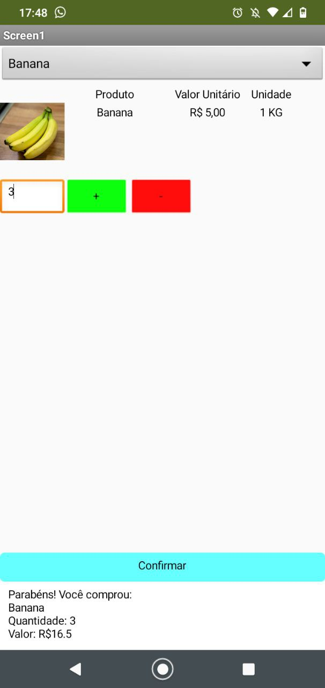
>
> * Tela 6 - diagrama de blocos do aplicativo
> 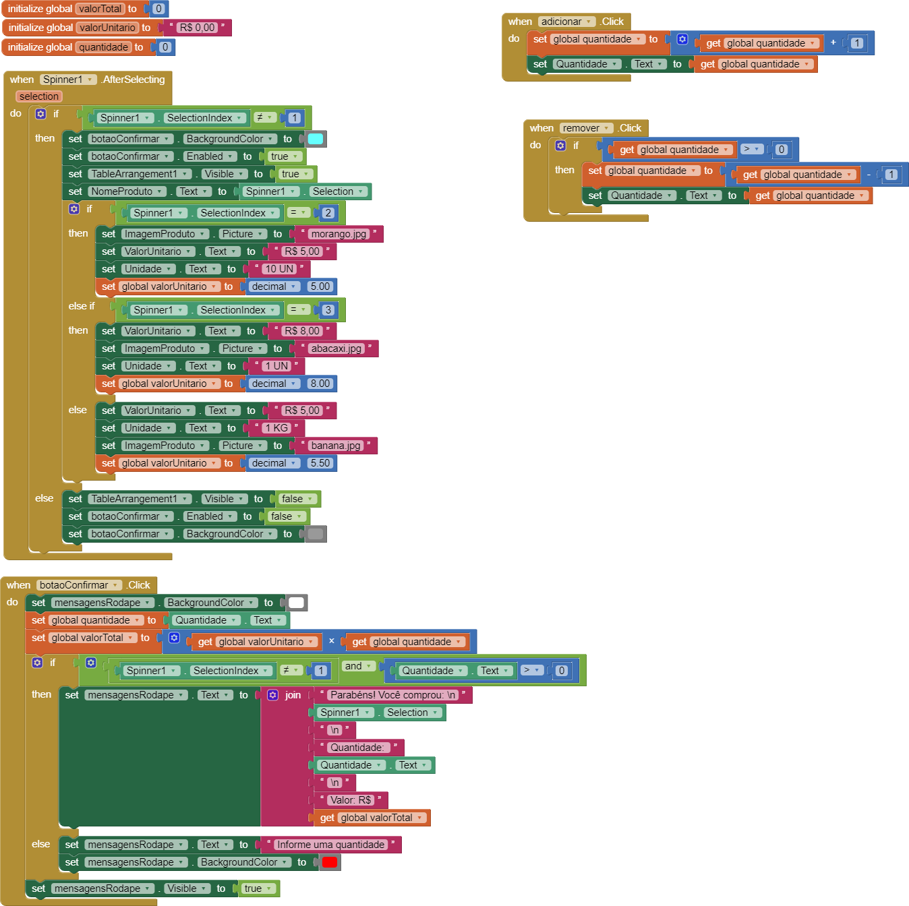
>
> Link para o [Arquivo .aia](app/lab03.aia)

# Tarefa 2 - Diagrama de Componentes dirigida a Eventos

> 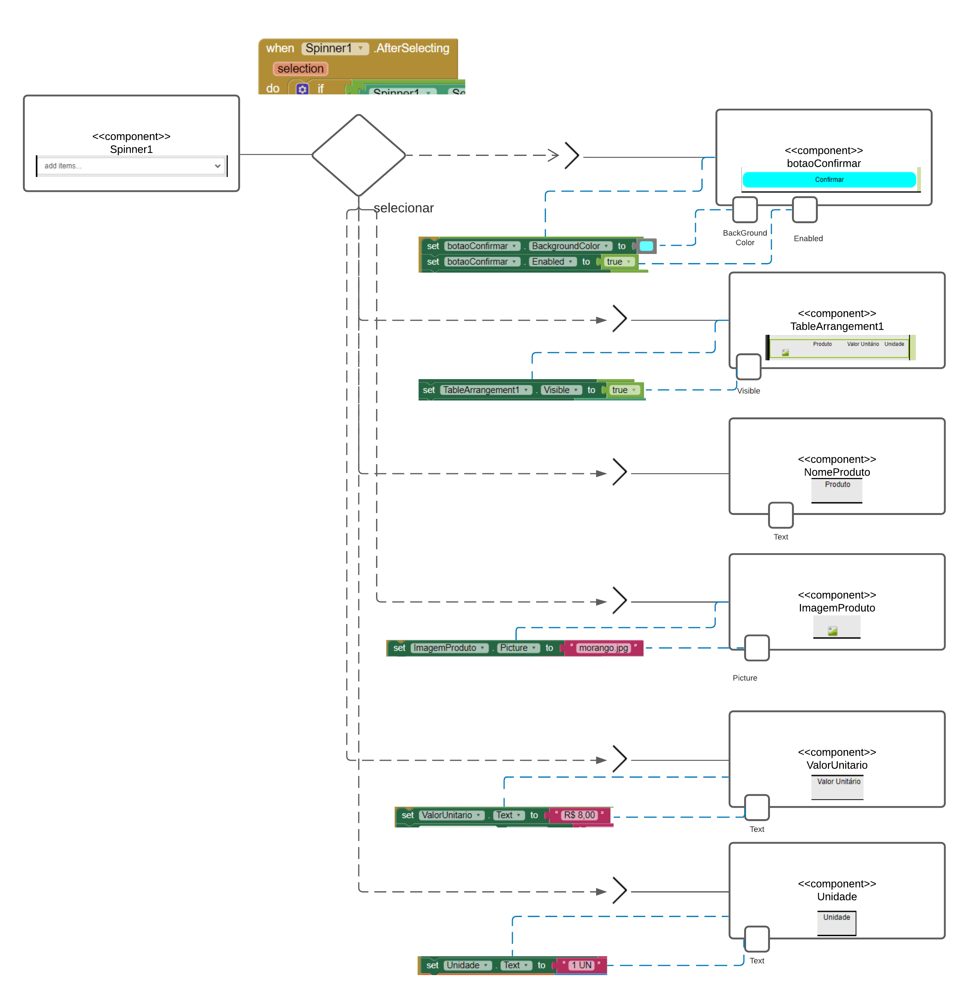
>
> 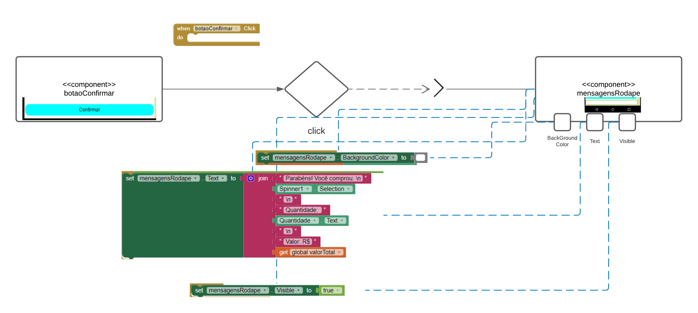
>
> 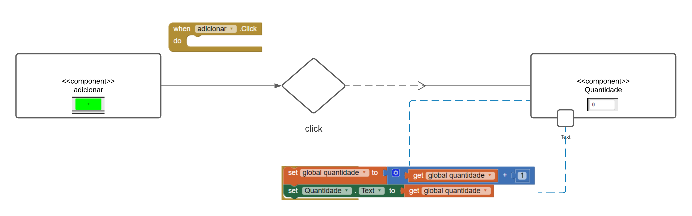
>
> 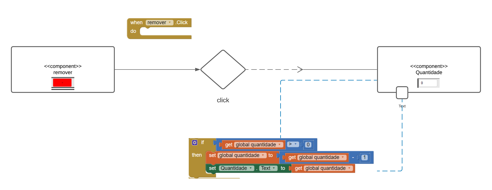

# Tarefa 3 - App com CoudDB

> * Tela 1 - captura da tela completa de design de interface
> 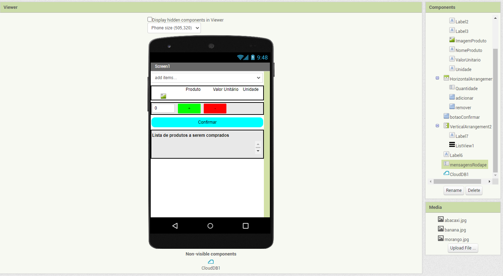

> * Tela 2 - captura de tela do app com nenhum produto selecionado
> 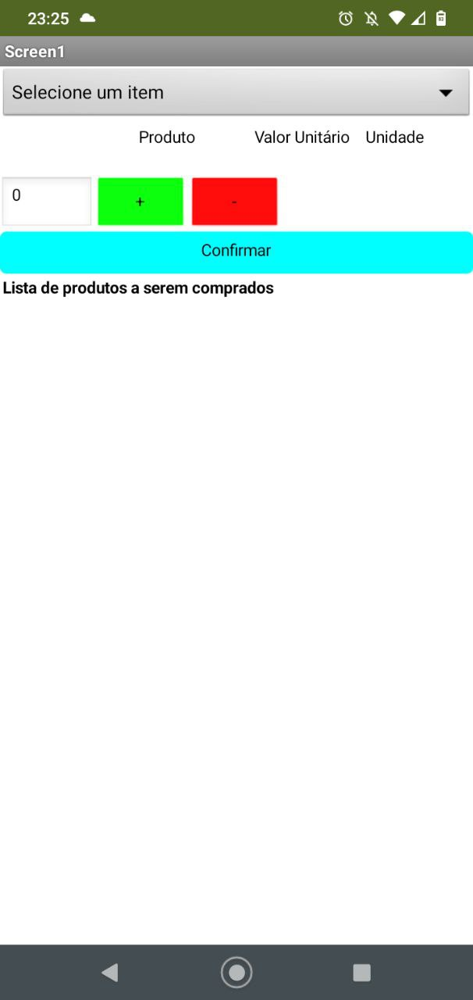

> * Tela 3 - captura de tela do app com dois com compra efetivados e aparecendo na **Lista de Produtos a Serem Comprados**
> 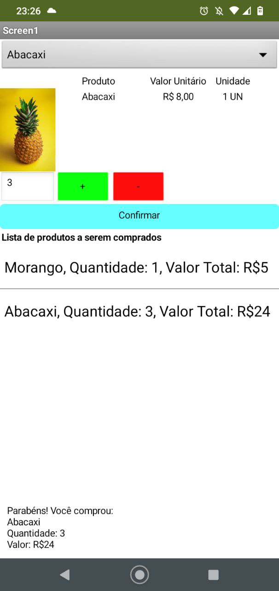

> * Tela 4 - diagrama de blocos do aplicativo mostrando apenas aqueles relacionados com o CloudDB
> 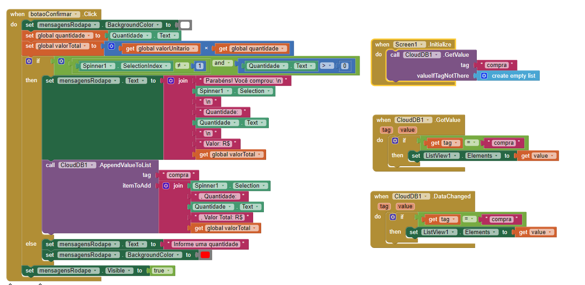

>
> Link para o [Arquivo .aia Tarefa 3](app/lab03_tarefa3.aia)

