# Aluno
* `Paulo Sérgio do Nascimento RA: 150352`

# Tarefa 1 - App no MIT App Inventor

> * tela 1 - captura da tela completa de design de interface
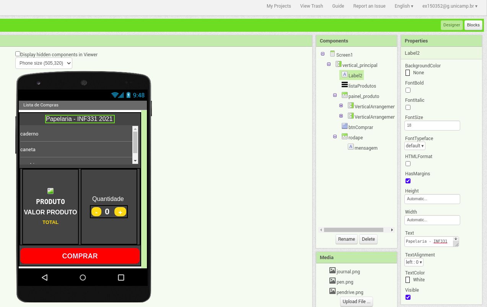

> * tela 2 - captura de tela do app com nenhum produto selecionado
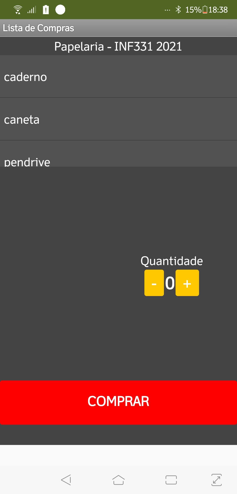

> * tela 3 - captura de tela do app com primeiro produto selecionado
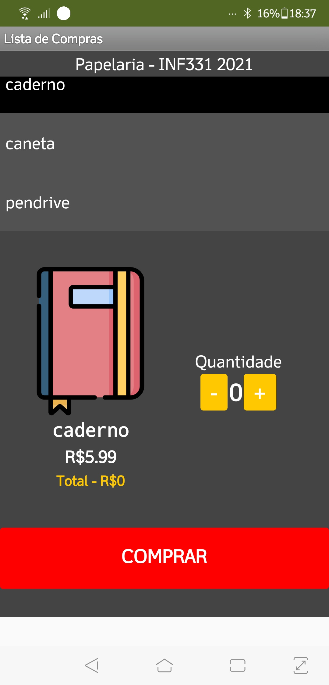

> * tela 4 - captura de tela do app com segundo produto selecionado
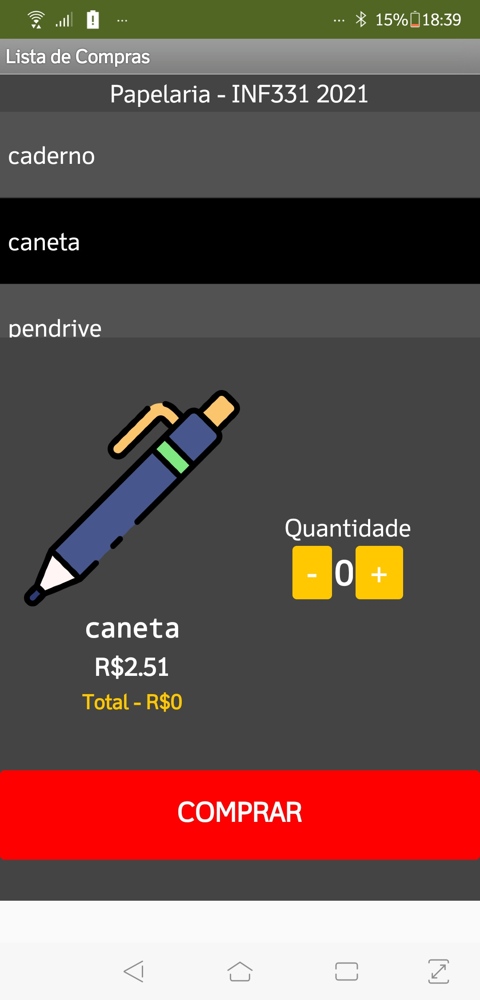

> * tela 5 - compra de um dos produtos efetivada
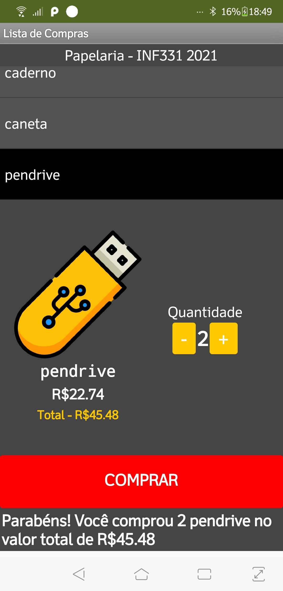

> * tela 6 - diagrama de blocos do aplicativo
- Bloco de Inicialização
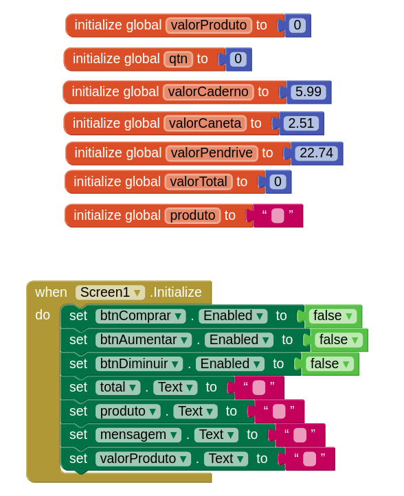

- Bloco da lista
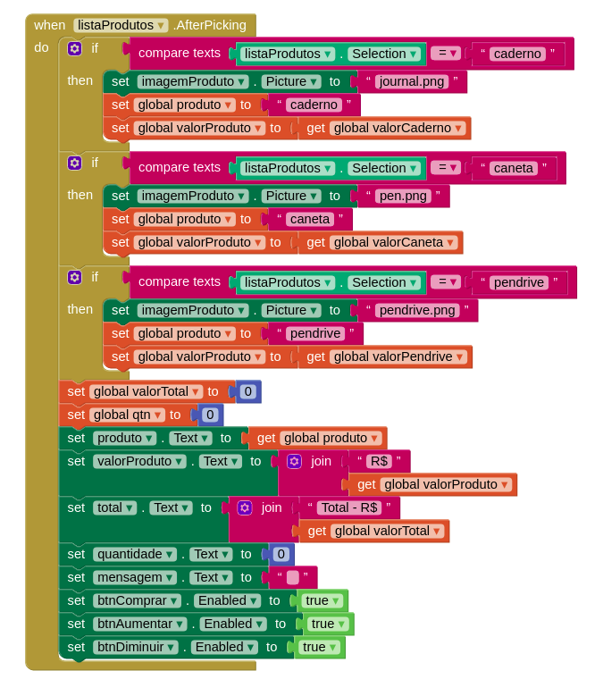

- Bloco do botão comprar
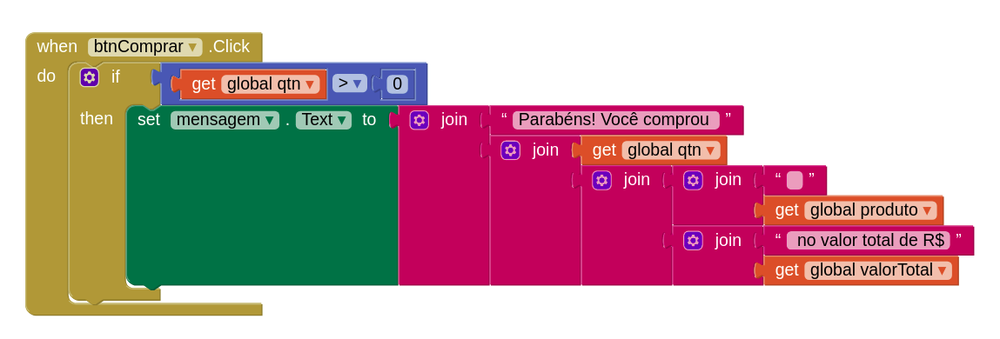

- Bloco dos botões de quantidade
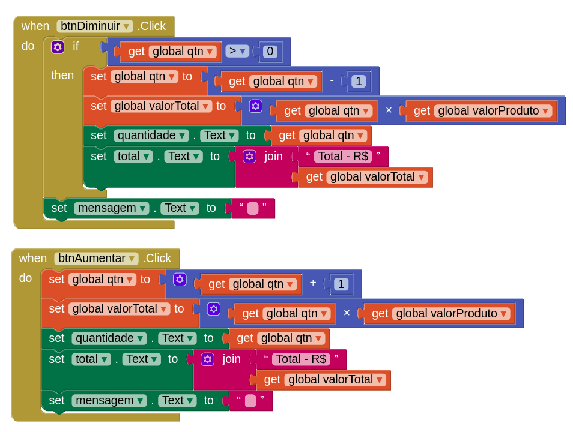

> Link para o arquivo *.aia do projeto MIT App Inventor: [ex125352_app_componentes.aia](https://github.com/paulobazooka/component2learn/blob/master/labs/2021/03-mvc/solucoes/PauloSergioNascimento/app/ex125352_app_componentes.aia)

# Tarefa 2 - Diagrama de Componentes dirigida a Eventos

- ### botão de aumentar
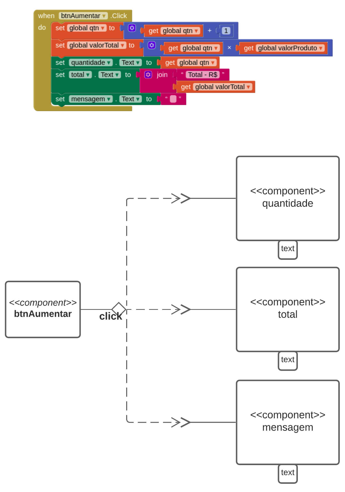

- ### botão de diminuir
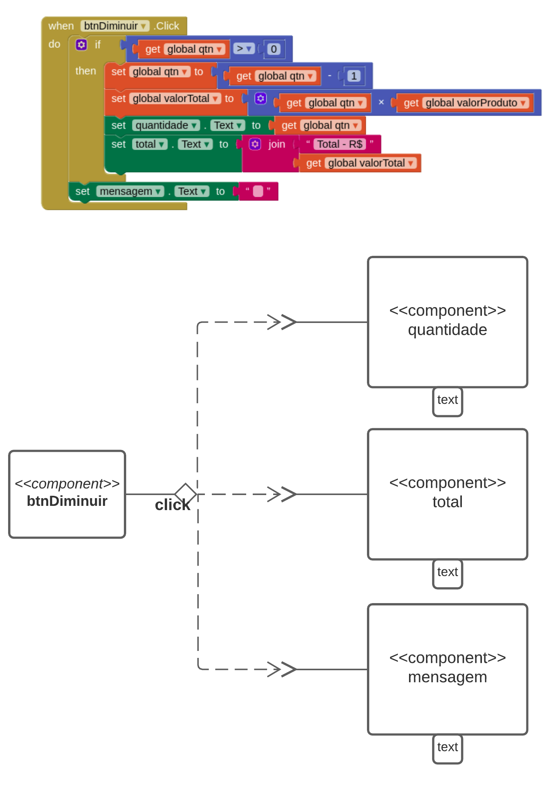

- ### botão de comprar
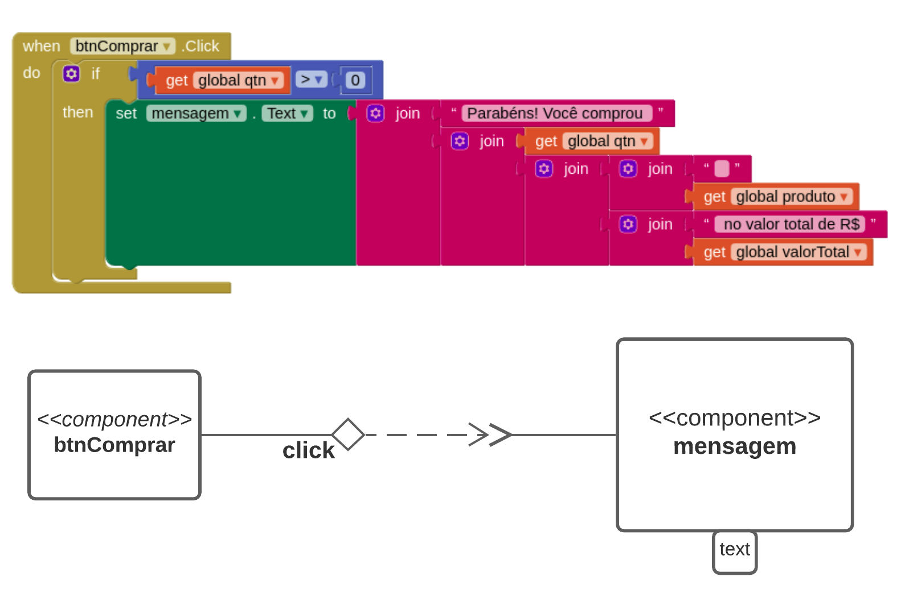

- ### lista de produtos
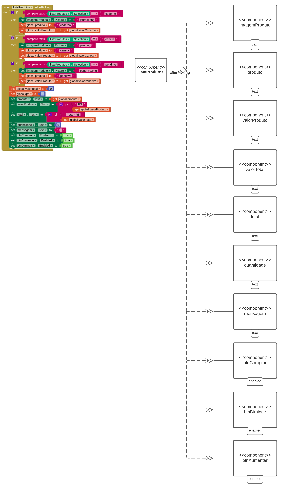

# Tarefa 3 - App com CoudDB

- ### Design com lista de produtos DBCloud
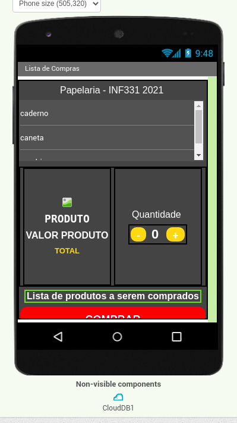

- ### Tela inicial sem nenhum produto selecionado
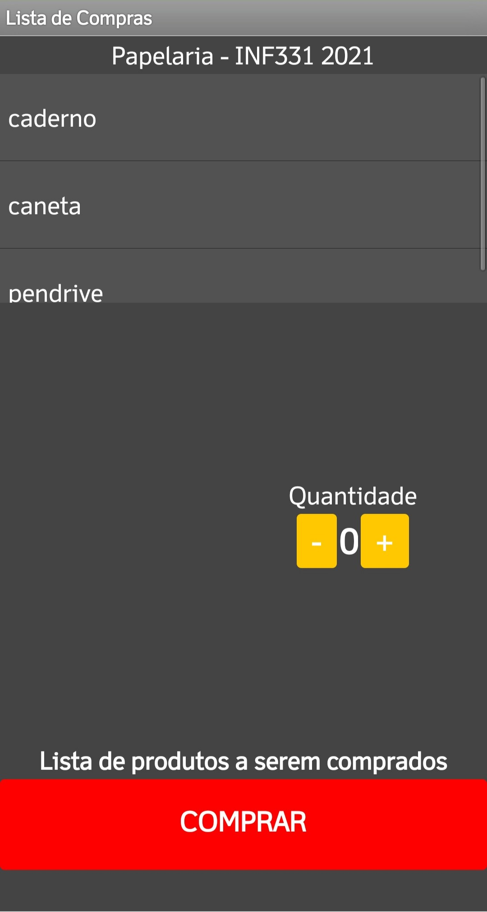

- ### Tela inicial sem nenhum produto selecionado
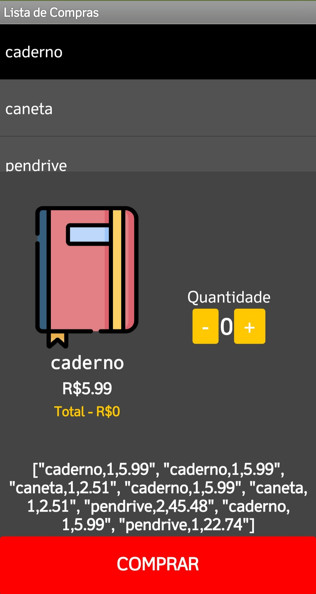

- ### Diagrama de Blocos
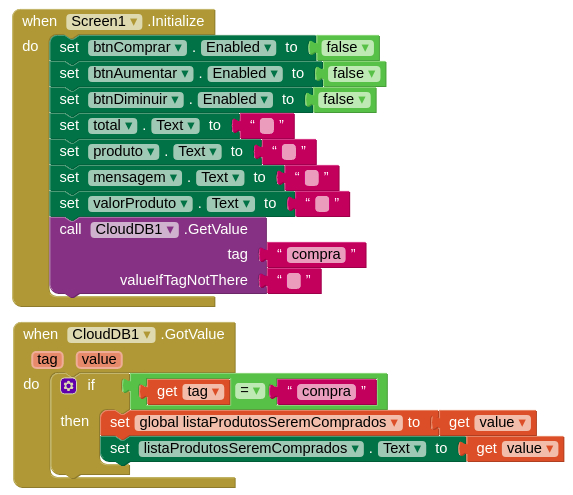
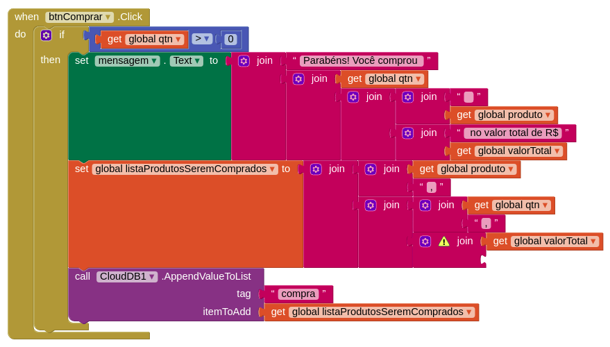

### Arquivo 'aia'
> Link para o arquivo *.aia do projeto MIT App Inventor: [ex125352_app_componentes_cloud.aia](https://github.com/paulobazooka/component2learn/blob/master/labs/2021/03-mvc/solucoes/PauloSergioNascimento/app/ex125352_app_componentes_cloud.aia) 
